# Matter Thermal Mesh — Complete Setup Guide

Build a Matter/Thread sensor network with thermal presence detection, powered by Silicon Labs hardware and Home Assistant.

<!-- TODO: Add hero photo of finished system -->

---

<details>
<summary><strong>Table of Contents</strong></summary>

- [What You'll Build](#what-youll-build)
- [Prerequisites](#prerequisites)
  - [Hardware](#what-you-need-hardware)
  - [Software](#what-you-need-on-your-computer)
- [Part 1: Prepare the Raspberry Pi](#part-1-prepare-the-raspberry-pi)
  - [1.1 Download Raspberry Pi Imager](#11-download-and-install-raspberry-pi-imager)
  - [1.2 Flash RPi OS](#12-flash-rpi-os-to-the-sd-card)
  - [1.3 Boot the Raspberry Pi](#13-boot-the-raspberry-pi)
  - [1.4 Connect via SSH](#14-connect-via-ssh)
  - [1.5 Update the System](#15-update-the-system)
  - [1.6 Install Docker](#16-install-docker)
  - [1.7 Test Docker](#17-quick-test--run-hello-world)
- [Part 2: Install Arduino IDE](#part-2-install-arduino-ide-and-silicon-labs-board-support)
  - [2.1 Download Arduino IDE](#21-download-and-install-arduino-ide)
  - [2.2 Add Silicon Labs Board Support](#22-add-silicon-labs-board-support)
  - [2.3 Install Required Libraries](#23-install-required-libraries)
- [Part 3: Flash XIAO MG24 Sense as Thread Radio](#part-3-flash-xiao-mg24-sense-as-thread-radio)
  - [3.1 Why custom firmware?](#31-why-custom-firmware)
  - [3.2 The firmware files](#32-the-firmware-files)
  - [3.3 Connect XIAO to computer](#33-connect-the-xiao-mg24-sense-to-your-computer)
  - [3.4 Burn Bootloader](#34-prepare-the-board-in-arduino-ide-burn-bootloader)
  - [3.5 Flash RCP firmware](#35-flash-the-rcp-firmware-terminal)
  - [3.6 Verify firmware](#36-verify-the-firmware)
  - [3.7 Move XIAO to Raspberry Pi](#37-move-the-xiao-to-the-raspberry-pi)
- [Part 4: Deploy Home Assistant (Docker)](#part-4-deploy-home-assistant-docker)
  - [4.1 Connect to Raspberry Pi](#41-connect-to-the-raspberry-pi)
  - [4.2 Create project directory](#42-create-the-project-directory)
  - [4.3 Create Docker Compose file](#43-create-the-docker-compose-file)
  - [4.4 Start the Docker stack](#44-start-the-docker-stack)
  - [4.5 Verify containers running](#45-verify-all-containers-are-running)
  - [4.6 Verify Thread radio](#46-verify-the-thread-radio-is-working)
- [Part 5: Set Up Home Assistant](#part-5-set-up-home-assistant)
  - [5.1 Open Home Assistant](#51-open-home-assistant-in-your-browser)
  - [5.2 Create your account](#52-create-your-account)
  - [5.3 Onboarding wizard](#53-complete-the-onboarding-wizard)
  - [5.4 Add Matter integration](#54-add-the-matter-integration)
  - [5.5 Add OTBR integration](#55-add-the-openthread-border-router-integration)
  - [5.6 Verify integrations](#56-verify-your-integrations)
- [Part 6: Flash Sensor Firmware](#part-6-flash-sensor-firmware)
  - [6.1 SparkFun Thing Plus Matter #1 (Living Room)](#61-connect-the-sparkfun-thing-plus-matter)
  - [6.4 Arduino Nano Matter (Hallway)](#64-connect-the-arduino-nano-matter)
  - [6.7 SparkFun Thing Plus Matter #2 (Bedroom)](#67-connect-the-sparkfun-thing-plus-matter-2)
  - [6.10 How the firmware works](#610-how-the-firmware-works-for-the-curious)
- [Part 7: Commission Matter Devices](#part-7-commission-matter-devices)
  - [7.1 Prepare for commissioning](#71-prepare-for-commissioning)
  - [7.2 Commission Living Room](#72-commission-node-1--living-room-sparkfun-thing-plus-matter)
  - [7.3 Commission Bedroom](#73-commission-node-2--bedroom-sparkfun-thing-plus-matter-2)
  - [7.4 Commission Hallway](#74-commission-node-3--hallway-arduino-nano-matter)
  - [7.5 Rename devices](#75-rename-your-devices)
  - [7.6 Verify all nodes](#76-verify-all-three-nodes-are-working)
- [Part 8: Create Automations](#part-8-create-automations)
  - [8.1 Open Automations](#81-open-the-automations-page)
  - [8.2 Find your entity IDs](#82-find-your-occupancy-entity-ids)
  - [8.3 Create Presence Detected automation](#83-create-the-presence-detected--notify-automation)
  - [8.4 Test the automation](#84-test-the-automation)
  - [8.5 Bonus: CO2 alert](#85-bonus-co2-air-quality-alert)
- [Troubleshooting](#troubleshooting)
- [Software Versions](#software-versions-pinned)

</details>

---

## What You'll Build

A mesh network of thermal sensors that detect human presence in multiple rooms, connected via Matter over Thread to Home Assistant running on a Raspberry Pi.

**How it works:**
- **Thermal cameras** (Grid-EYE AMG8833) detect heat signatures — people, pets, appliances
- **Thread mesh networking** lets sensors communicate wirelessly through walls
- **Home Assistant** collects all data and lets you automate your home based on presence, temperature, proximity, CO2 levels
- **No cloud needed** — everything runs locally on your network


*Real-time occupancy visualization: the dashboard shows which room is occupied as the person moves through the apartment. Data flows from Grid-EYE thermal sensors → Thread mesh → Matter → Home Assistant → browser.*

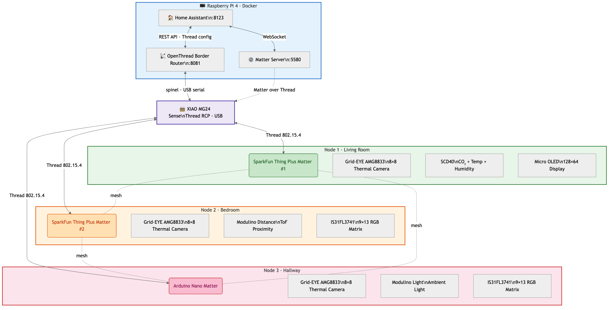

<details><summary>Diagram source (Mermaid)</summary>

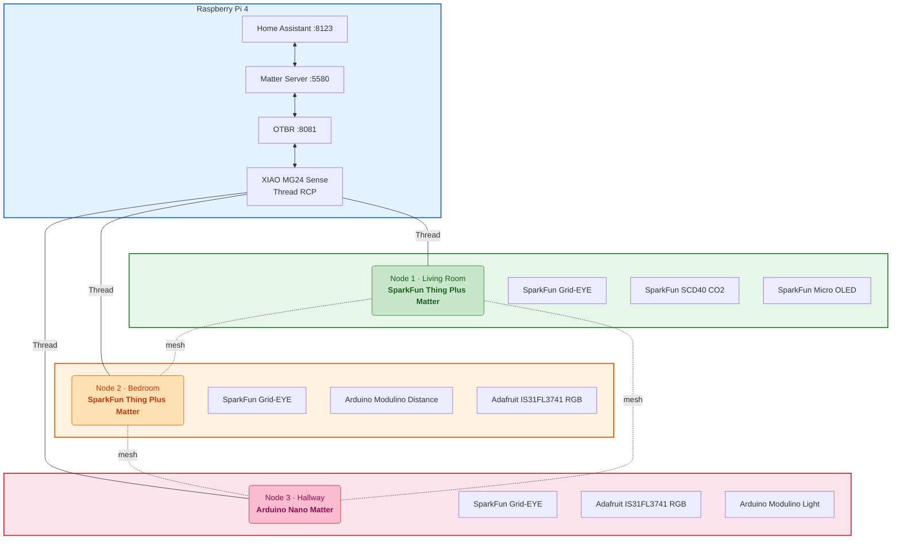
```mermaid
graph TD
    subgraph RPI["Raspberry Pi 4"]
        HA["Home Assistant :8123"] <--> MS["Matter Server :5580"]
        MS <--> OTBR["OTBR :8081"]
        OTBR <--> XIAO["XIAO MG24 Sense<br/>Thread RCP"]
    end
    XIAO ---|Thread| R1
    XIAO ---|Thread| R2
    XIAO ---|Thread| R3
    subgraph N1[" "]
        R1("Node 1 · Living Room<br/><b>SparkFun Thing Plus Matter</b>")
        GE1["SparkFun Grid-EYE"]
        SCD["SparkFun SCD40 CO2"]
        OLED["SparkFun Micro OLED"]
    end
    subgraph N2[" "]
        R2("Node 2 · Bedroom<br/><b>SparkFun Thing Plus Matter</b>")
        GE2["SparkFun Grid-EYE"]
        DIST["Arduino Modulino Distance"]
        LED2["Adafruit IS31FL3741 RGB"]
    end
    subgraph N3[" "]
        R3("Node 3 · Hallway<br/><b>Arduino Nano Matter</b>")
        GE3["SparkFun Grid-EYE"]
        LED["Adafruit IS31FL3741 RGB"]
        LIGHT["Arduino Modulino Light"]
    end
    R1 -.-|mesh| R2
    R2 -.-|mesh| R3
    R3 -.-|mesh| R1
    style RPI fill:#e3f2fd,stroke:#1565c0,stroke-width:2px
    style N1 fill:#e8f5e9,stroke:#2e7d32,stroke-width:2px
    style N2 fill:#fff3e0,stroke:#e65100,stroke-width:2px
    style N3 fill:#fce4ec,stroke:#c62828,stroke-width:2px
    style R1 fill:#c8e6c9,stroke:#2e7d32,color:#1b5e20
    style R2 fill:#ffe0b2,stroke:#e65100,color:#bf360c
    style R3 fill:#f8bbd0,stroke:#c62828,color:#880e4f
```

</details>

---

## Prerequisites

### What You Need (Hardware)

You'll need to purchase the following components. Everything connects with plug-and-play cables — **zero soldering required**.

| | Component | Store | Role | Price |
|:---:|-----------|:---:|------|:---:|
|  | [Raspberry Pi 4](https://www.raspberrypi.com/products/raspberry-pi-4-model-b/) (4GB or 8GB) | [raspberrypi.com](https://www.raspberrypi.com/products/raspberry-pi-4-model-b/) | Smart home server | ~$55 |
|  | microSD card (32GB+) | Any electronics store | RPi storage | ~$10 |
|  | USB-C power supply (5V/3A) | [raspberrypi.com](https://www.raspberrypi.com/products/type-c-power-supply/) | RPi power | ~$10 |
|  | [Seeed XIAO MG24 Sense](https://www.seeedstudio.com/Seeed-Studio-XIAO-MG24-p-6247.html) | [seeedstudio.com](https://www.seeedstudio.com/Seeed-Studio-XIAO-MG24-p-6247.html) | Thread radio (Border Router) | ~$8 |
|  | [SparkFun Thing Plus Matter](https://www.sparkfun.com/products/20270) (MGM240P) ×2 | [sparkfun.com](https://www.sparkfun.com/products/20270) | Sensor nodes 1 & 2 | ~$25 each |
|  | [Arduino Nano Matter](https://store.arduino.cc/products/nano-matter) (MGM240S) | [store.arduino.cc](https://store.arduino.cc/products/nano-matter) | Sensor node 3 | ~$18 |
|  | [Arduino Nano Connector Carrier](https://store.arduino.cc/products/nano-connector-carrier) | [store.arduino.cc](https://store.arduino.cc/products/nano-connector-carrier) | Qwiic port for Nano Matter | ~$9 |
|  | [SparkFun Grid-EYE AMG8833 Qwiic](https://www.sparkfun.com/products/14607) ×3 | [sparkfun.com](https://www.sparkfun.com/products/14607) | 8×8 thermal camera | ~$40 each |
|  | [SparkFun SCD40 CO₂ Sensor Qwiic](https://www.sparkfun.com/products/22395) | [sparkfun.com](https://www.sparkfun.com/products/22395) | CO₂ + humidity + temp | ~$50 |
|  | [Arduino Modulino Distance](https://store.arduino.cc/products/modulino-distance) | [store.arduino.cc](https://store.arduino.cc/products/modulino-distance) | ToF proximity sensor | ~$10 |
|  | [SparkFun Micro OLED Breakout Qwiic](https://www.sparkfun.com/products/22495) | [sparkfun.com](https://www.sparkfun.com/products/22495) | Status display | ~$18 |
|  | [Adafruit IS31FL3741 9×13 RGB LED](https://www.adafruit.com/product/5201) ×2 | [adafruit.com](https://www.adafruit.com/product/5201) | Heatmap display | ~$25 each |
|  | [Arduino Modulino Light](https://store.arduino.cc/products/modulino-light) | [store.arduino.cc](https://store.arduino.cc/products/modulino-light) | Ambient light sensor | ~$10 |
|  | [Qwiic/STEMMA QT cables](https://www.sparkfun.com/products/14427) ×9 | [sparkfun.com](https://www.sparkfun.com/products/14427) | Sensor connections | ~$2 each |
|  | USB-C cables ×4 | Any electronics store | Connect boards to computer | ~$5 each |

**Total: ~$484** (all plug-and-play, zero soldering)

### What You Need (On Your Computer)

You don't need any software pre-installed. This guide will walk you through installing everything:

| Software | What It Does | When You'll Install It |
|----------|-------------|:----------------------:|
| [Raspberry Pi Imager](https://www.raspberrypi.com/software/) | Flashes the operating system to the SD card | Part 1 |
| [Arduino IDE 2.x](https://www.arduino.cc/en/software) | Programs the sensor boards and provides flashing tools | Part 2 |
| A terminal app | SSH into the Raspberry Pi (Terminal on Mac, PowerShell on Windows) | Part 3 |
| A web browser | Access Home Assistant UI | Part 5 |

**That's it.** No Python, no special drivers, no command-line tools to install separately. Everything comes bundled with the software above.

### What You Need to Know

- How to type commands in a terminal — we'll show you every command to copy-paste

**You do NOT need to know:** programming, Linux, networking, IoT protocols, or anything about Silicon Labs hardware. This guide explains everything.

---

## Part 1: Prepare the Raspberry Pi

The Raspberry Pi is a small computer that will run your smart home server. In this section, you'll install an operating system on it, connect it to your WiFi, and install Docker (which runs the smart home software).

### 1.1 Download and Install Raspberry Pi Imager

> **Important:** You need **Raspberry Pi Imager v2.0.6 or newer**. Older versions have a bug where settings (hostname, WiFi, SSH) are not applied to the new Trixie OS.

1. Go to [raspberrypi.com/software](https://www.raspberrypi.com/software/)
2. Download **Raspberry Pi Imager** for your operating system:
   - **Mac:** Download the `.dmg` file (works on both Intel and Apple Silicon). Or install via Homebrew: `brew install --cask raspberry-pi-imager`
   - **Windows:** Download the `.exe` installer and run it
3. Install it — on Mac, drag to Applications; on Windows, follow the installer prompts

> **Visual guide:** The official Raspberry Pi documentation has step-by-step screenshots of the entire Imager process: [raspberrypi.com/documentation/computers/getting-started.html](https://www.raspberrypi.com/documentation/computers/getting-started.html#raspberry-pi-imager)

### 1.2 Flash RPi OS to the SD Card

Raspberry Pi Imager 2.0 uses a **step-by-step wizard** that walks you through everything.

1. Insert your microSD card into your computer (use an SD card adapter if needed)
2. Open **Raspberry Pi Imager**

**Step 1 — Choose Device:**
3. Select **Raspberry Pi 4**

**Step 2 — Choose OS:**
4. Select **Raspberry Pi OS (64-bit)** — this is the Desktop version based on Debian 13 (Trixie)

**Step 3 — Choose Storage:**
5. Select your microSD card from the list

**Step 4 — Customize Settings:**

After clicking **Next**, the Imager walks you through customization screens. Fill in each one:

6. **Hostname:** Enter `smartpi`
7. **Location:** Select your timezone and keyboard layout
8. **User Account:**
   - Username: `smartpi`
   - Password: `smartpi`
9. **Wireless LAN:** Enter your WiFi network name (SSID) and password
10. **Remote Access:**
    - Enable **SSH**
    - Select **Password authentication**

> **Note:** You can click "Skip Customisation" on any screen you don't want to change, but we recommend filling in all of them — it saves time after boot.

**Step 5 — Write:**

11. Review your settings and click **Write**
12. Confirm that you want to erase the SD card
13. Wait for flashing and verification to complete (5-10 minutes)

### 1.3 Boot the Raspberry Pi

1. Remove the SD card from your computer
2. Insert it into the Raspberry Pi's microSD slot (on the bottom)
3. Connect the power supply to the RPi's USB-C port
4. Wait 2-3 minutes for the first boot to complete

> **Tip:** The RPi has no power button — it turns on as soon as you plug in power. The green LED on the board blinks during boot.

### 1.4 Connect via SSH

SSH lets you control the Raspberry Pi from your computer's terminal.

**On Mac:**
1. Open **Terminal** (press Cmd+Space, type "Terminal", press Enter)

**On Windows:**
1. Open **PowerShell** (press Win+X, select "PowerShell")

Type this command:

```bash
ssh smartpi@smartpi.local
```

- If asked "Are you sure you want to continue connecting?", type `yes` and press Enter
- Enter the password: `smartpi`

You should see a prompt like this:
```
smartpi@smartpi:~ $
```

**You are now controlling the Raspberry Pi remotely.** Every command you type from here runs on the Raspberry Pi — not on your own computer. When you're done, type `exit` to return to your own machine.

<pre style="background:#1e1e1e;color:#d4d4d4;padding:14px 18px;border-radius:6px;font-family:'Menlo','Monaco','Courier New',monospace;font-size:12.5px;line-height:1.6;overflow-x:auto;">$ ssh smartpi@smartpi.local
Warning: Permanently added 'smartpi.local' to the list of known hosts.
smartpi@smartpi.local's password:

Linux smartpi 6.6.51+rpt-rpi-2712 #1 SMP PREEMPT Debian 1:6.6.51-1+rpt3 (2024-10-08) aarch64

The programs included with the Debian GNU/Linux system are free software;
the exact distribution terms for each individual piece of software are
described in the individual files in /usr/share/doc/*/copyright.

Last login: Sun Mar  2 12:00:00 2026

smartpi@smartpi:~ $</pre>

> **Troubleshooting:** If `smartpi.local` doesn't work, find the RPi's IP address in your router's admin page (usually 192.168.1.x) and use `ssh smartpi@192.168.1.xxx` instead.

### 1.5 Update the System

Run these commands to make sure everything is up to date:

```bash
sudo apt update && sudo apt upgrade -y
```

This takes 5-10 minutes. Wait for it to finish.

<pre style="background:#1e1e1e;color:#d4d4d4;padding:14px 18px;border-radius:6px;font-family:'Menlo','Monaco','Courier New',monospace;font-size:12.5px;line-height:1.6;overflow-x:auto;">$ sudo apt update && sudo apt upgrade -y
Get:1 https://download.docker.com/linux/debian bookworm InRelease [43.3 kB]
Get:2 http://deb.debian.org/debian trixie InRelease [159 kB]
Get:3 http://deb.debian.org/debian trixie-updates InRelease [49.7 kB]
...
Fetched 12.4 MB in 8s (1,550 kB/s)
Reading package lists... Done
Building dependency tree... Done
Reading state information... Done
Calculating upgrade... Done
The following packages will be upgraded:
  base-files libc-bin libc-dev-bin libc6 libc6-dev ...
Reading changelogs... Done
142 upgraded, 0 newly installed, 0 to remove and 0 not upgraded.
...
Processing triggers for man-db (2.12.1-2) ...
Processing triggers for libc-bin (2.40-2) ...

smartpi@smartpi:~ $</pre>

### 1.6 Install Docker

Docker lets you run Home Assistant and other services in isolated containers.

> **Note:** RPi OS Trixie (Debian 13) requires the official Docker apt repository method. The convenience script (`get.docker.com`) may not correctly detect Trixie.

Run these commands one at a time. Copy-paste each line and wait for it to finish:

**Step 1: Install prerequisites:**

```bash
sudo apt install -y ca-certificates curl
```

**Step 2: Add Docker's official GPG key:**

```bash
sudo install -m 0755 -d /etc/apt/keyrings
sudo curl -fsSL https://download.docker.com/linux/debian/gpg -o /etc/apt/keyrings/docker.asc
sudo chmod a+r /etc/apt/keyrings/docker.asc
```

**Step 3: Add the Docker repository:**

```bash
echo \
  "deb [arch=$(dpkg --print-architecture) signed-by=/etc/apt/keyrings/docker.asc] https://download.docker.com/linux/debian \
  bookworm stable" | \
  sudo tee /etc/apt/sources.list.d/docker.list > /dev/null
```

> **Why `bookworm` instead of `trixie`?** RPi OS Trixie is based on Debian 13, but Docker doesn't publish packages for Trixie yet. The Bookworm (Debian 12) packages work perfectly on Trixie.

**Step 4: Install Docker:**

```bash
sudo apt update
sudo apt install -y docker-ce docker-ce-cli containerd.io docker-buildx-plugin docker-compose-plugin
```

Wait for the installation to complete (2-3 minutes).

**Step 5: Add your user to the Docker group** (so you can run Docker without `sudo`):

```bash
sudo usermod -aG docker smartpi
```

**Important:** Log out and log back in for the group change to take effect:

```bash
exit
```

Then reconnect:
```bash
ssh smartpi@smartpi.local
```

**Step 6: Verify Docker is working:**

```bash
docker --version
```

Expected output:

<pre style="background:#1e1e1e;color:#d4d4d4;padding:14px 18px;border-radius:6px;font-family:'Menlo','Monaco','Courier New',monospace;font-size:12.5px;line-height:1.6;overflow-x:auto;">$ docker --version
Docker version 29.2.1, build a5c7197

$ docker compose version
Docker Compose version v5.1.0</pre>

> **Note:** We use `docker compose` (with a space, the plugin), NOT the old `docker-compose` (with a hyphen). The plugin version comes built-in with this installation.

### 1.7 Quick test — Run Hello World

```bash
docker run hello-world
```

If you see "Hello from Docker!", Docker is working correctly.

<pre style="background:#1e1e1e;color:#d4d4d4;padding:14px 18px;border-radius:6px;font-family:'Menlo','Monaco','Courier New',monospace;font-size:12.5px;line-height:1.6;overflow-x:auto;">$ docker run hello-world
Unable to find image 'hello-world:latest' locally
latest: Pulling from library/hello-world
478afc919002: Pull complete
Digest: sha256:305243c734571da2d100c8c8b3c3167a098cab6049c9b5f44a73b42c3a3ef9b
Status: Downloaded newer image for hello-world:latest

Hello from Docker!
This message shows that your installation appears to be working correctly.

To generate this message, Docker took the following steps:
 1. The Docker client contacted the Docker daemon.
 2. The Docker daemon pulled the "hello-world" image from the Docker Hub.
 3. The Docker daemon created a new container from that image which runs the
    executable that produces the output you are currently reading.
 4. The Docker daemon streamed that output to the Docker client, which sent it
    to your terminal.

smartpi@smartpi:~ $</pre>

---

## Part 2: Install Arduino IDE and Silicon Labs Board Support

Arduino IDE is the software you'll use to program the sensor boards. It also includes the tools needed to flash the Thread radio (XIAO MG24 Sense).

### 2.1 Download and Install Arduino IDE

1. Go to [arduino.cc/en/software](https://www.arduino.cc/en/software)
2. Download **Arduino IDE 2.3.8** (or latest 2.x) for your operating system
3. Install it:
   - **Mac:** Open the `.dmg` file and **drag Arduino IDE to Applications**
   - **Windows:** Run the installer, follow the prompts

4. Open Arduino IDE — you should see a clean editor with an empty sketch:

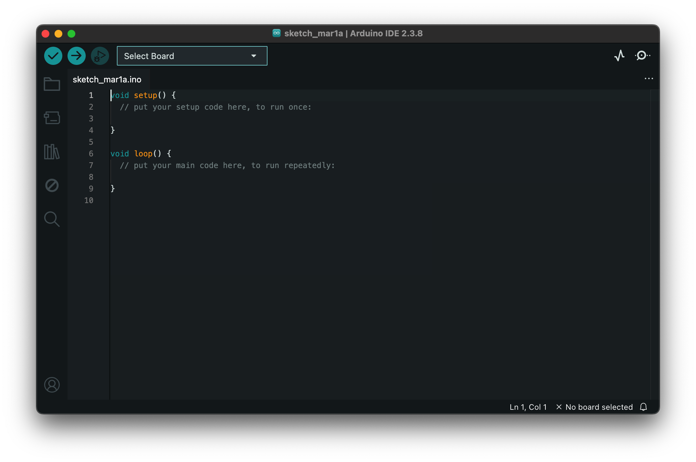

### 2.2 Add Silicon Labs Board Support

1. In Arduino IDE, go to **Arduino IDE** → **Settings** (Mac) or **File** → **Preferences** (Windows)
2. In the **Additional boards manager URLs** field, paste this URL:
   ```
   https://siliconlabs.github.io/arduino/package_arduinosilabs_index.json
   ```
3. Click **OK**

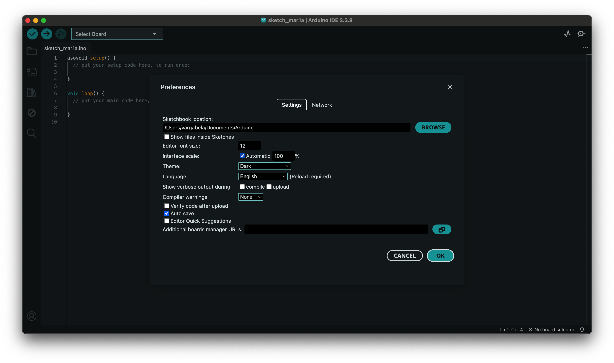

4. Click the **Board Manager** icon in the left sidebar (the circuit board icon)
5. Search for **"Silicon Labs"**
6. Find **"Silicon Labs"** by Silicon Labs → click **Install** on version **3.0.0**
7. Wait for the installation to complete (this downloads ~800MB of tools including OpenOCD and the ARM compiler)

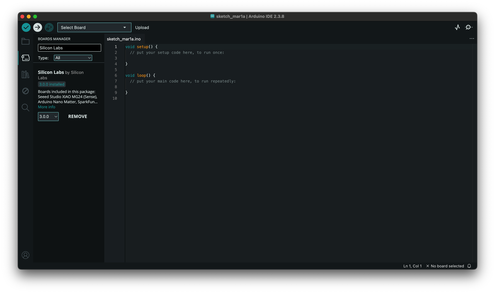

> **What just happened?** You installed board definitions for all Silicon Labs Arduino-compatible boards (XIAO MG24 Sense, Arduino Nano Matter, SparkFun Thing Plus Matter, and more), plus the flash programming tools (OpenOCD) that we'll use in the next step.

### 2.3 Install Required Libraries

1. Click the **Library Manager** icon in the left sidebar (the books icon)
2. Search and install each of these three libraries:

| Library Name | Version | What It Does |
|-------------|---------|-------------|
| SparkFun Qwiic OLED Arduino Library | 1.0.15 | Controls the small OLED display |
| Sensirion I2C SCD4x | 1.1.0 | Reads CO2, humidity, and temperature from the SCD40 sensor |
| Adafruit IS31FL3741 Library | 1.2.3 | Controls the RGB LED matrix for heatmap visualization |

Search for each library by name, then click **Install**:

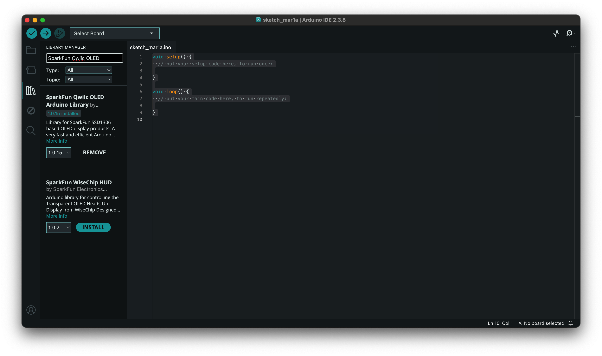

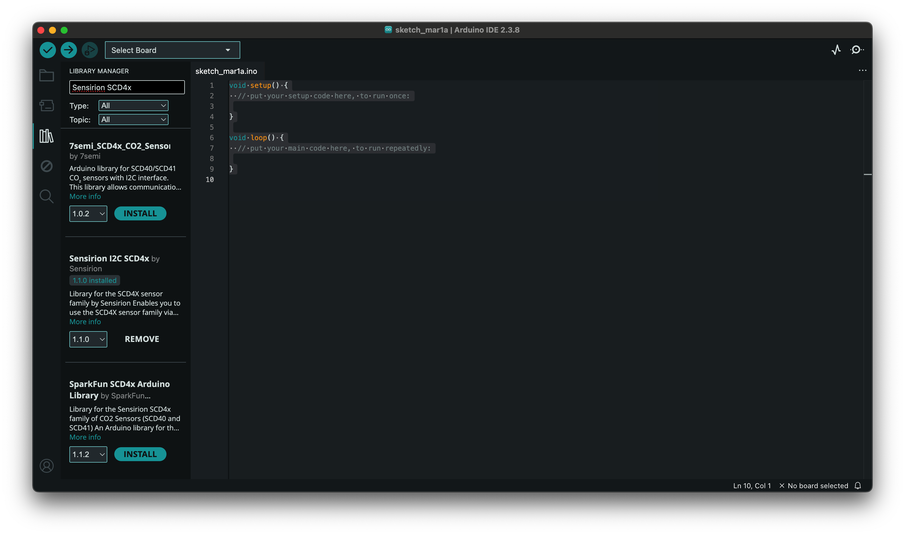

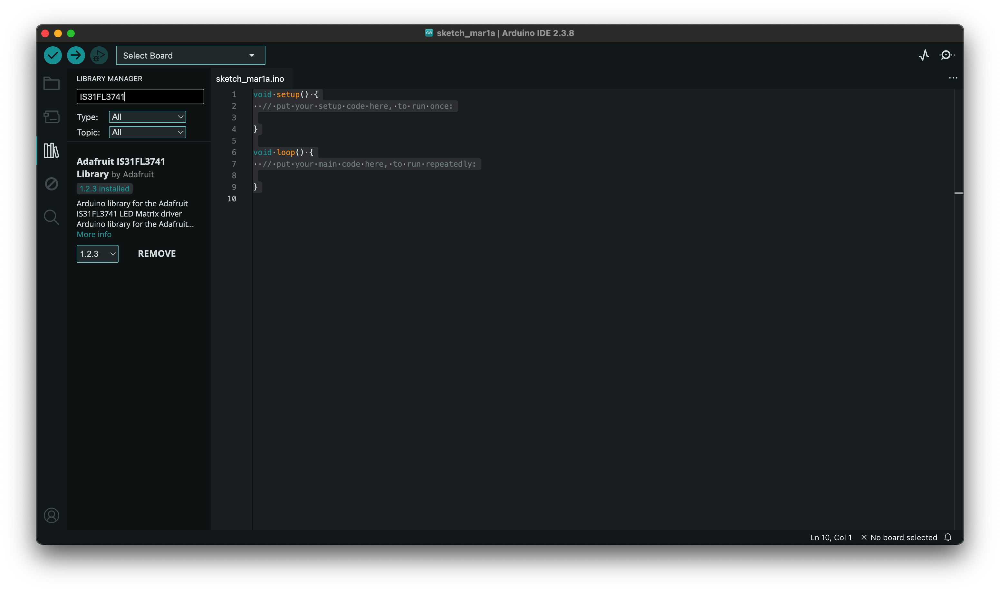

> **Tip:** When you install a library, Arduino IDE automatically installs its dependencies too. You may see additional libraries (like Adafruit GFX, Adafruit BusIO, Sensirion Core) appear — that's normal.

---

## Part 3: Flash XIAO MG24 Sense as Thread Radio

The XIAO MG24 Sense is a tiny board that acts as the Thread radio for your Raspberry Pi. Thread is the wireless protocol that your sensors will use to communicate. The XIAO needs special firmware to work as a radio — we'll flash it now from your computer.

### 3.1 Why custom firmware?

The XIAO MG24 Sense ships with no firmware (factory blank). We need to flash it with OpenThread RCP (Radio Co-Processor) firmware that:
- Turns it into a Thread radio that the Raspberry Pi can use
- Uses the correct serial port (USART0 → USB bridge)
- Communicates at 460800 baud rate

We use firmware from the [darkxst/silabs-firmware-builder](https://github.com/darkxst/silabs-firmware-builder) project, which is pre-built and verified to work with the XIAO MG24 Sense. For details on why this custom firmware is needed (instead of the stock Arduino RCP), see [`firmware/xiao-mg24-rcp/README.md`](firmware/xiao-mg24-rcp/README.md).

### 3.2 The firmware files

The firmware files are included in this project's [`firmware/xiao-mg24-rcp/`](firmware/xiao-mg24-rcp/) folder:

| File | Purpose |
|------|---------|
| [`darkxst_ot_rcp_2.5.3_460800.hex`](firmware/xiao-mg24-rcp/darkxst_ot_rcp_2.5.3_460800.hex) | OpenThread RCP firmware (460800 baud, Intel HEX format) |

This `.hex` file is ready to flash with OpenOCD. It was converted from the original `.gbl` format (which OpenOCD cannot flash) from [darkxst/silabs-firmware-builder](https://github.com/darkxst/silabs-firmware-builder) release `20250627`. For technical details on why this custom firmware is needed, see [`firmware/xiao-mg24-rcp/README.md`](firmware/xiao-mg24-rcp/README.md).

> **Important:** Download the firmware from **this repository**, not from darkxst directly. The darkxst release only provides `.gbl` files which require conversion before OpenOCD can flash them. We've already done that conversion for you.

### 3.3 Connect the XIAO MG24 Sense to your computer

1. Plug the XIAO MG24 Sense into your computer using a USB-C cable
2. Wait 5 seconds for your computer to recognize it

**Verify the connection:**

**On Mac:**
```bash
ls /dev/cu.usbmodem*
```

You should see something like:
```
/dev/cu.usbmodem9AD1F1E23
```

**On Windows:**
Open Device Manager → look for "Seeed Studio XIAO MG24 Sense" under Ports (COM & LPT)

### 3.4 Prepare the board in Arduino IDE (Burn Bootloader)

Arduino IDE's OpenOCD programmer (installed in Part 2) can erase the chip and flash a bootloader directly from the GUI.

1. Open **Arduino IDE**
2. Click the **board selector** dropdown in the toolbar and select **Seeed Studio XIAO MG24 (Sense)** with its USB port:

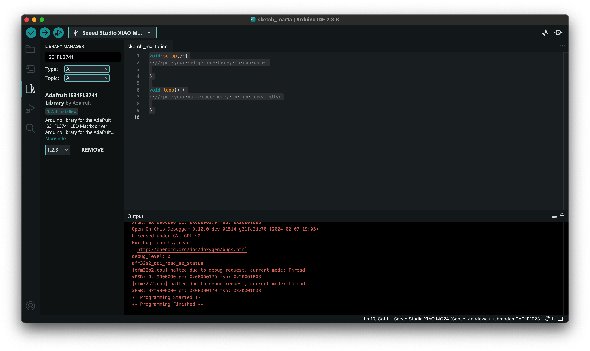

3. Go to **Tools** → **Programmer** → select **OpenOCD**
4. Go to **Tools** → **Burn Bootloader**

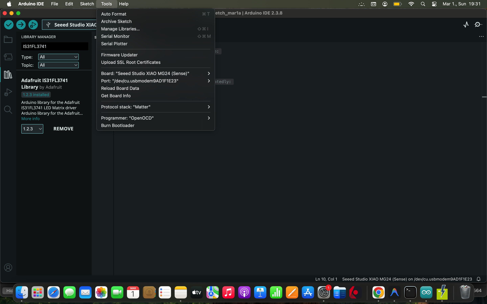

5. Wait for the Output panel to show **"Programming Finished"** — this erases the chip and installs a bootloader via OpenOCD

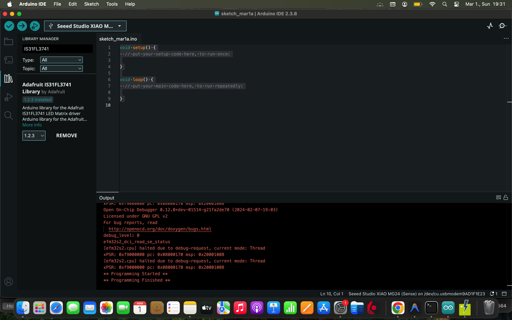

> **What just happened?** Arduino IDE used OpenOCD (the programmer you installed with the SiLabs board support) to mass-erase the chip and flash a bootloader. This puts the XIAO in a clean, known state.

### 3.5 Flash the RCP firmware (Terminal)

The custom OpenThread RCP firmware must be flashed from the Terminal — Arduino IDE's GUI can burn bootloaders but cannot flash custom `.hex` firmware files.

Open **Terminal** (Mac: press Cmd+Space, type "Terminal", press Enter) and run these commands. Copy-paste each one exactly:

**Step 1: Set the OpenOCD path** (this was installed with the Arduino SiLabs board support in Part 2):

```bash
OPENOCD="$HOME/Library/Arduino15/packages/SiliconLabs/tools/openocd/0.12.0-arduino1-static/bin/openocd"
SCRIPTS="$HOME/Library/Arduino15/packages/SiliconLabs/tools/openocd/0.12.0-arduino1-static/share/openocd/scripts/"
```

> **If you get "No such file or directory"** on the next step, your OpenOCD might have installed to a slightly different path. Run this to find it:
> ```bash
> find "$HOME/Library/Arduino15" -name "openocd" -type f 2>/dev/null
> ```
> Copy the full path from the output and use it for `OPENOCD=` above.

**Step 2: Navigate to the firmware directory:**

```bash
cd path/to/matter-thermal-mesh/firmware/xiao-mg24-rcp/
```

Replace `path/to/` with where you downloaded the project. On **Mac**, the easiest way is to drag the `xiao-mg24-rcp` folder from Finder into the Terminal window — it will paste the full path automatically. Then press Enter.

You can verify you're in the right directory by running `ls` — you should see `darkxst_ot_rcp_2.5.3_460800.hex`.

**Step 3: Flash the RCP firmware:**

```bash
"$OPENOCD" -s "$SCRIPTS" \
  -f interface/cmsis-dap.cfg \
  -c "transport select swd" \
  -f target/efm32s2_g23.cfg \
  -c "init" -c "reset halt" \
  -c "flash write_image erase darkxst_ot_rcp_2.5.3_460800.hex" \
  -c "verify_image darkxst_ot_rcp_2.5.3_460800.hex" \
  -c "reset run" -c "exit"
```

Expected output (last lines):
```
wrote 131072 bytes from file darkxst_ot_rcp_2.5.3_460800.hex in 3.0s (41.9 KiB/s)
verified 123980 bytes in 0.5s (230.2 KiB/s)
```

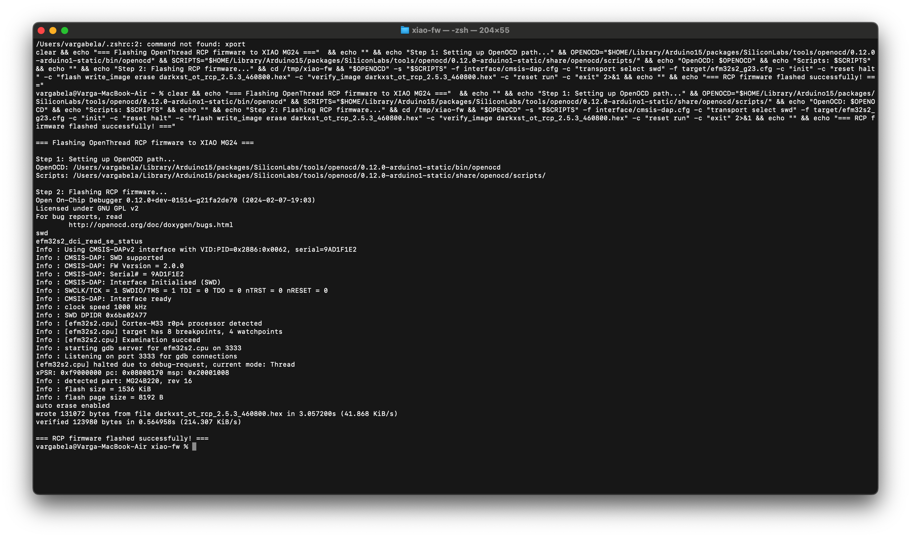

> **Windows users:** The OpenOCD path is different on Windows:
> ```
> set OPENOCD=%USERPROFILE%\AppData\Local\Arduino15\packages\SiliconLabs\tools\openocd\0.12.0-arduino1-static\bin\openocd.exe
> set SCRIPTS=%USERPROFILE%\AppData\Local\Arduino15\packages\SiliconLabs\tools\openocd\0.12.0-arduino1-static\share\openocd\scripts\
> ```
> Then run the same flash command above (replace `"$OPENOCD"` with `"%OPENOCD%"` and `"$SCRIPTS"` with `"%SCRIPTS%"`).

> **Important:** If the path to your firmware files contains spaces, copy the `.hex` files to a path without spaces first (e.g., `C:\temp\xiao-fw\`). OpenOCD does not handle spaces in file paths correctly.

### 3.6 Verify the firmware (optional)

After flashing, the XIAO's LED should stop blinking (the RCP firmware has no LED activity). OpenOCD already confirmed the flash succeeded above — this step is an extra sanity check. **You can skip to 3.7 if you prefer.**

```bash
pip3 install universal-silabs-flasher
```

Then:
```bash
universal-silabs-flasher --device /dev/cu.usbmodem9AD1F1E23 --probe-methods "spinel:460800" probe
```

(Replace the device path with yours from step 3.3)

Expected output:
```
Detected ApplicationType.SPINEL, version 'SL-OPENTHREAD/2.5.3.0_GitHub-1fceb225b' at 460800 baudrate
```

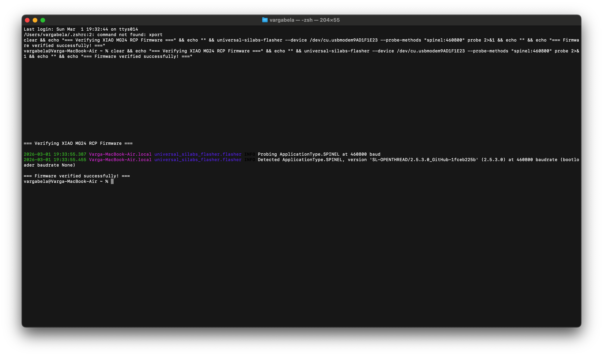

**The XIAO MG24 Sense is now a Thread radio!**

### 3.7 Move the XIAO to the Raspberry Pi

1. **Unplug** the XIAO MG24 Sense from your computer
2. **Plug it** into one of the Raspberry Pi's USB ports
3. SSH into the RPi and verify it's detected:

```bash
ssh smartpi@smartpi.local
ls /dev/serial/by-id/
```

You should see:
```
usb-Seeed_Studio_Seeed_Studio_XIAO_MG24__Sense__CMSIS-DAP_9AD1F1E2-if02
```

**Note down this path** — you'll need it in Part 4.

<pre style="background:#1e1e1e;color:#d4d4d4;padding:14px 18px;border-radius:6px;font-family:'Menlo','Monaco','Courier New',monospace;font-size:12.5px;line-height:1.6;overflow-x:auto;">smartpi@smartpi:~ $ ls /dev/serial/by-id/
usb-Seeed_Studio_Seeed_Studio_XIAO_MG24__Sense__CMSIS-DAP_9AD1F1E2-if02</pre>

---

## Part 4: Deploy Home Assistant (Docker)

Now we'll set up the smart home software on the Raspberry Pi. Three services run in Docker containers:

| Service | What It Does | Port |
|---------|-------------|:----:|
| **Home Assistant** | Smart home dashboard and automation | 8123 |
| **OpenThread Border Router (OTBR)** | Connects the Thread network to your WiFi | 8081 |
| **Matter Server** | Handles Matter device communication | 5580 |

### 4.1 Connect to the Raspberry Pi

All commands in Part 4 run **on the Raspberry Pi**, not on your computer. You'll type them in the same SSH terminal you used in Part 1.

**On Mac:** Open **Terminal** (Cmd+Space → type "Terminal" → Enter)
**On Windows:** Open **PowerShell** (Win+X → select "PowerShell")

Then connect to the RPi:

```bash
ssh smartpi@smartpi.local
```

Enter the password `smartpi` when prompted. You should see the `smartpi@smartpi:~ $` prompt — this means you're now typing commands on the Raspberry Pi.

### 4.2 Create the project directory

```bash
sudo mkdir -p /opt/homeassistant
```

### 4.3 Create the Docker Compose file

Create the configuration file that defines all three services:

```bash
sudo nano /opt/homeassistant/docker-compose.yml
```

This opens **nano** — a simple terminal text editor. It looks empty at first (that's normal).

> **nano quick reference:**
> - **Paste:** right-click in the terminal window (or Ctrl+Shift+V on Linux/Windows terminals)
> - **Save:** press `Ctrl+O` (hold Control, tap O), then press Enter to confirm the filename
> - **Exit:** press `Ctrl+X` (hold Control, tap X)
> - If nano asks "Save modified buffer?" press `Y`, then Enter
> - The shortcuts are also shown at the bottom of the nano screen

> ⚠️ **Before pasting:** You'll need to replace `XXXXXXXXXX` in the YAML below with your XIAO's serial number from Part 3.7. Everything else can be pasted as-is.

Paste the following content:

```yaml
services:
  homeassistant:
    container_name: homeassistant
    image: ghcr.io/home-assistant/home-assistant:2026.2
    restart: unless-stopped
    privileged: true
    network_mode: host
    environment:
      - TZ=Europe/Budapest
    volumes:
      - /opt/homeassistant/config:/config
      - /run/dbus:/run/dbus:ro
    depends_on:
      - otbr
      - matter-server

  otbr:
    container_name: otbr
    image: ghcr.io/ownbee/hass-otbr-docker:v0.3.0
    restart: unless-stopped
    privileged: true
    network_mode: host
    environment:
      DEVICE: "/dev/ttyACM0"
      BAUDRATE: "460800"
      FLOW_CONTROL: "0"
      AUTOFLASH_FIRMWARE: "0"
      FIREWALL: "1"
      NAT64: "0"
      OTBR_REST_PORT: "8081"
      BACKBONE_IF: "wlan0"
    devices:
      - /dev/serial/by-id/usb-Seeed_Studio_Seeed_Studio_XIAO_MG24__Sense__CMSIS-DAP_XXXXXXXXXX-if02:/dev/ttyACM0
    volumes:
      - otbr_data:/var/lib/thread

  matter-server:
    container_name: matter-server
    image: ghcr.io/home-assistant-libs/python-matter-server:8.1.2
    restart: unless-stopped
    privileged: true
    network_mode: host
    environment:
      - TZ=Europe/Budapest
    volumes:
      - matter_data:/data
      - /run/dbus:/run/dbus:ro
    command: --storage-path /data --paa-root-cert-dir /data/credentials --bluetooth-adapter 0

volumes:
  otbr_data:
  matter_data:
```

> ⚠️ **Two things to change before saving:**
>
> **1. Replace `XXXXXXXXXX`** with your actual XIAO serial number from Part 3.7. Keep the `-if02` suffix at the end — only replace the `XXXXXXXXXX` part. Example:
> ```yaml
>       - /dev/serial/by-id/usb-Seeed_Studio_Seeed_Studio_XIAO_MG24__Sense__CMSIS-DAP_9AD1F1E2-if02:/dev/ttyACM0
> ```
>
> **2. Replace `Europe/Budapest`** (it appears twice) with your own timezone, e.g. `America/New_York`, `Europe/London`, `Asia/Tokyo`. Wrong timezone = automations fire at wrong times. ([Full list](https://en.wikipedia.org/wiki/List_of_tz_database_time_zones))

<pre style="background:#1e1e1e;color:#d4d4d4;padding:14px 18px;border-radius:6px;font-family:'Menlo','Monaco','Courier New',monospace;font-size:12.5px;line-height:1.6;overflow-x:auto;">  GNU nano 7.2              /opt/homeassistant/docker-compose.yml

services:
  homeassistant:
    container_name: homeassistant
    image: ghcr.io/home-assistant/home-assistant:2026.2
    restart: unless-stopped
    privileged: true
    network_mode: host
    environment:
      - TZ=Europe/Budapest
    volumes:
      - /opt/homeassistant/config:/config
      - /run/dbus:/run/dbus:ro
    depends_on:
      - otbr
      - matter-server
  ...


^G Help      ^O Write Out  ^W Where Is  ^K Cut       ^T Execute   ^C Location
^X Exit      ^R Read File  ^\ Replace   ^U Paste     ^J Justify   ^/ Go To Line</pre>

### 4.4 Start the Docker stack

```bash
cd /opt/homeassistant
sudo docker compose up -d
```

This downloads the container images (~2GB total) and starts all three services. Wait 3-5 minutes.

<pre style="background:#1e1e1e;color:#d4d4d4;padding:14px 18px;border-radius:6px;font-family:'Menlo','Monaco','Courier New',monospace;font-size:12.5px;line-height:1.6;overflow-x:auto;">$ sudo docker compose up -d
[+] Pulling 3/3
 ✔ matter-server Pulled    18.3s
 ✔ otbr Pulled             24.1s
 ✔ homeassistant Pulled    52.7s
[+] Running 4/4
 ✔ Volume "homeassistant_otbr_data"      Created    0.0s
 ✔ Container matter-server              Started    1.8s
 ✔ Container otbr                       Started    2.1s
 ✔ Container homeassistant              Started    3.4s

smartpi@smartpi:/opt/homeassistant $</pre>

### 4.5 Verify all containers are running

```bash
docker ps
```

You should see 3 containers running:

<pre style="background:#1e1e1e;color:#d4d4d4;padding:14px 18px;border-radius:6px;font-family:'Menlo','Monaco','Courier New',monospace;font-size:12.5px;line-height:1.6;overflow-x:auto;">$ docker ps
CONTAINER ID   IMAGE                                                     COMMAND                  CREATED         STATUS         NAMES
8e32abfaf9ad   ghcr.io/home-assistant/home-assistant:2026.2              "/init"                  3 minutes ago   Up 3 minutes   homeassistant
7438692263ff   ghcr.io/home-assistant-libs/python-matter-server:stable   "matter-server --sto…"   3 minutes ago   Up 3 minutes   matter-server
25d91c5ce684   ghcr.io/ownbee/hass-otbr-docker:latest                    "/init"                  3 minutes ago   Up 3 minutes   otbr</pre>

### 4.6 Verify the Thread radio is working

Check the OTBR logs to make sure it's communicating with the XIAO MG24 Sense:

```bash
docker logs otbr 2>&1 | tail -20
```

You should see mDNS and TREL discovery messages — **no** "timeout" or "Failure" errors. This means the XIAO RCP radio is working correctly.

> **Troubleshooting:** If you see `Init() at spinel_driver.cpp:83: Failure` or `Wait for response timeout`, the XIAO serial connection is stuck. Unplug the XIAO from the RPi USB port, wait 5 seconds, plug it back in, then restart the container: `sudo docker compose restart otbr`

<pre style="background:#1e1e1e;color:#d4d4d4;padding:14px 18px;border-radius:6px;font-family:'Menlo','Monaco','Courier New',monospace;font-size:12.5px;line-height:1.6;overflow-x:auto;">$ docker logs otbr 2>&1 | tail -20
[I] RoutingManager: Received RA from fe80:0:0:0:b292:4aff:fed4:45f2 on infra netif 3
[I] RoutingManager: - RA Header - flags - M:0 O:1 S:0
[I] RoutingManager: - RA Header - default route - lifetime:300
[I] RoutingManager: - PIO 2001:4c4e:1ea7:f300::/64 (valid:3600, preferred:3600)
[I] MeshForwarder-: Received IPv6 UDP msg, len:92, chksum:e168, from:eeab663df7bec47e, prio:net
[I] MeshForwarder-:     src:[fe80:0:0:0:ecab:663d:f7be:c47e]:19788
[I] MeshForwarder-:     dst:[ff02:0:0:0:0:0:0:1]:19788
[I] Mle-----------: Receive Advertisement (fe80:0:0:0:ecab:663d:f7be:c47e,0x9000)
[I] MeshForwarder-: Sent IPv6 UDP msg, len:92, to:0xffff, prio:net, radio:all
[I] Mle-----------: Send Advertisement (ff02:0:0:0:0:0:0:1)</pre>

> **Note:** The Thread network will be created automatically in Part 5 when we add the OTBR integration in Home Assistant. No manual setup needed here.

---

## Part 5: Set Up Home Assistant

> **You can close the SSH terminal now.** The next steps happen entirely in your **web browser** — no more terminal until Part 6.

### 5.1 Open Home Assistant in your browser

Open your web browser and go to:

```
http://smartpi.local:8123
```

Wait for the welcome page to load (first boot takes 1-2 minutes). You should see the Home Assistant welcome screen:

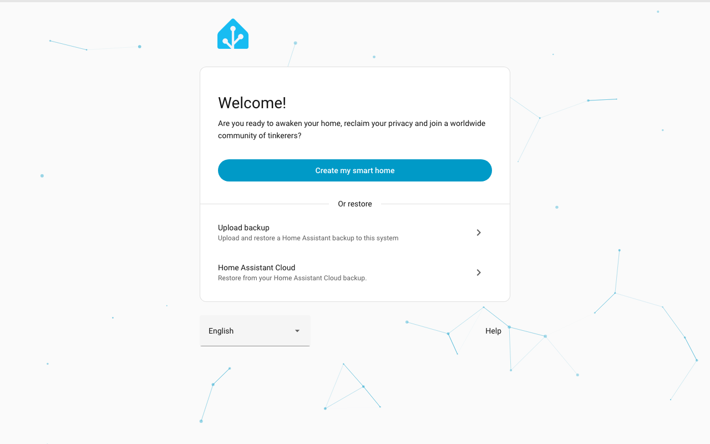

### 5.2 Create your account

1. Click **"Create my smart home"**

You'll see the account creation form:

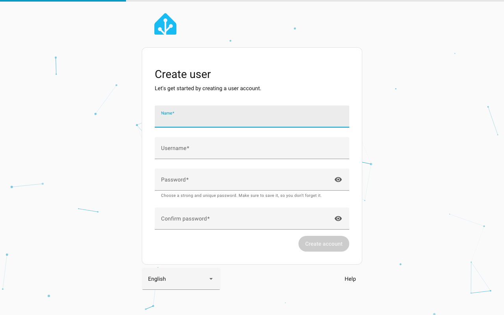

2. Fill in the form:
   - **Name:** `Smart Pi` (or your preferred display name)
   - **Username:** `smartpi`
   - **Password:** `smartpi`
   - **Confirm password:** `smartpi`

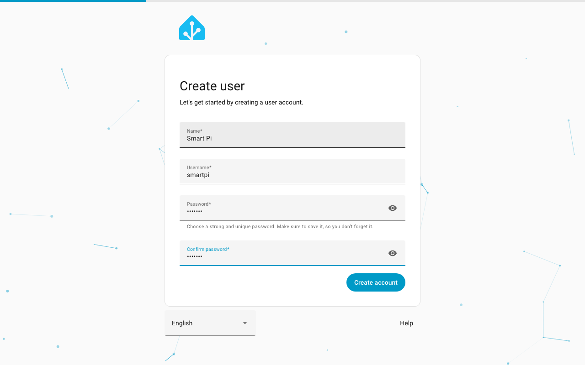

3. Click **"Create account"**

### 5.3 Complete the onboarding wizard

After creating your account, Home Assistant walks you through a few setup screens.

**Home location** — You can search for your city or drag the map pin. The default works fine for this guide. Click **Next**.

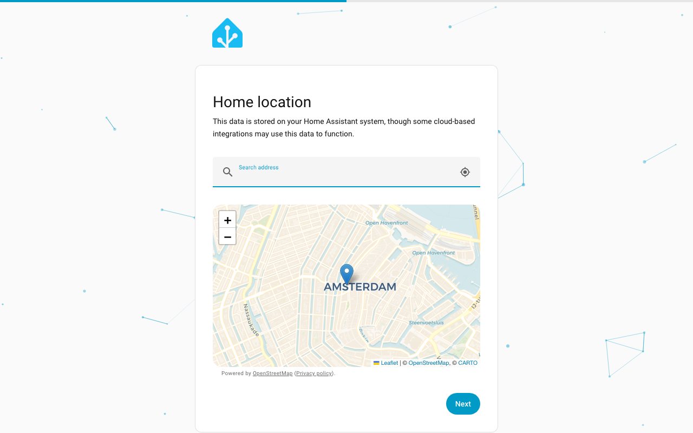

**Country** — Select your country so Home Assistant uses the correct units (metric/imperial). Click **Next**.

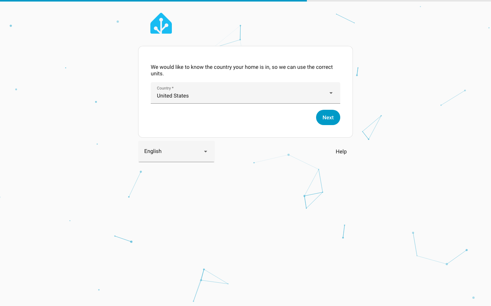

**Analytics** — Choose whether to share anonymous usage data. All toggles are off by default. Click **Next**.

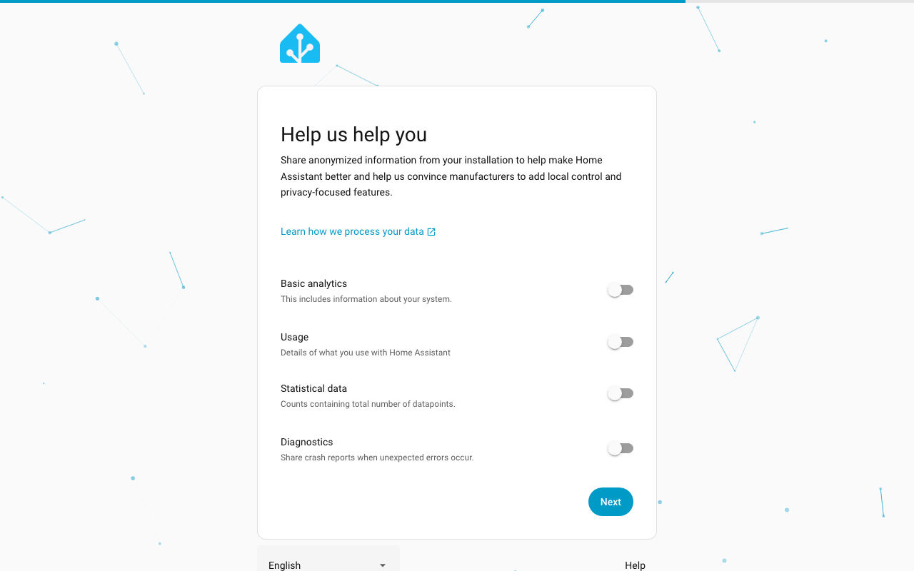

**Discovered devices** — Home Assistant automatically scans your network and shows what it found. You should see **Matter** and **Thread** in the list — this confirms our Docker containers are running correctly. Click **Finish**.

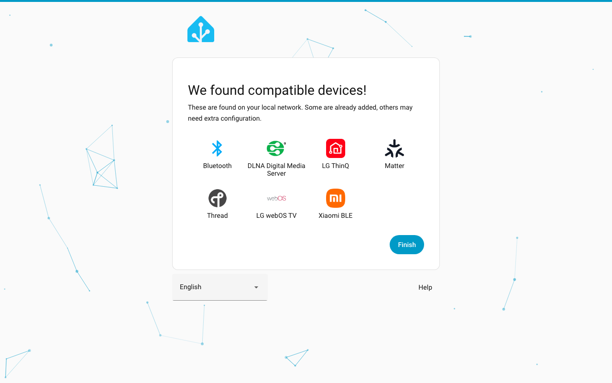

You'll land on the Home Assistant dashboard:

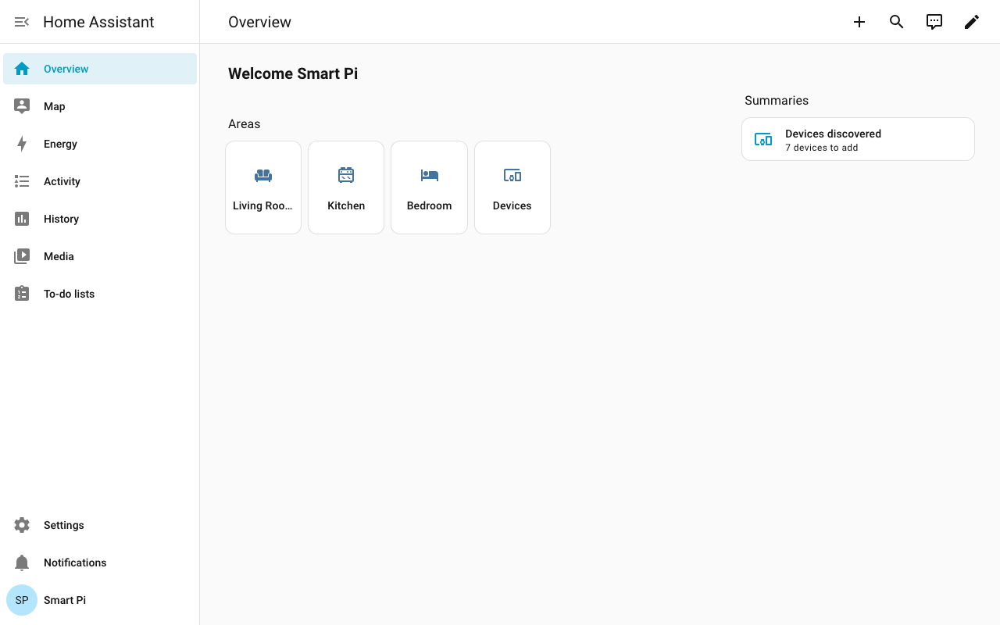

### 5.4 Add the Matter integration

Now we need to configure the Matter and Thread integrations so Home Assistant can communicate with our sensor boards.

1. Click **Settings** in the left sidebar
2. Click **Devices & Services**
3. You'll see the **Integrations** page with discovered devices on your network

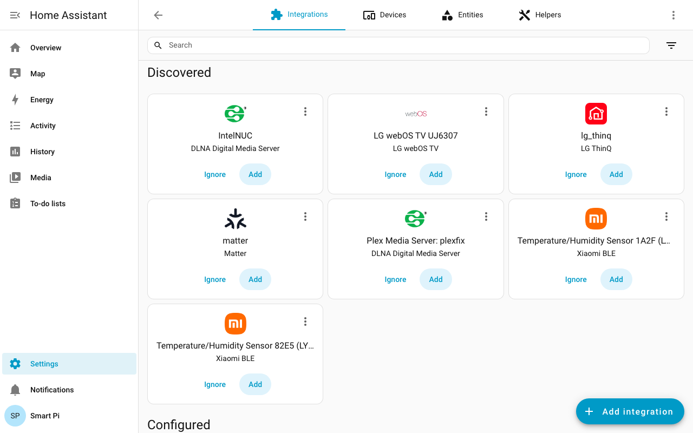

4. Find the **Matter** card in the "Discovered" section and click **Add**
5. A dialog appears with the Matter Server URL pre-filled as `ws://localhost:5580/ws` — this is correct
6. Click **Submit**

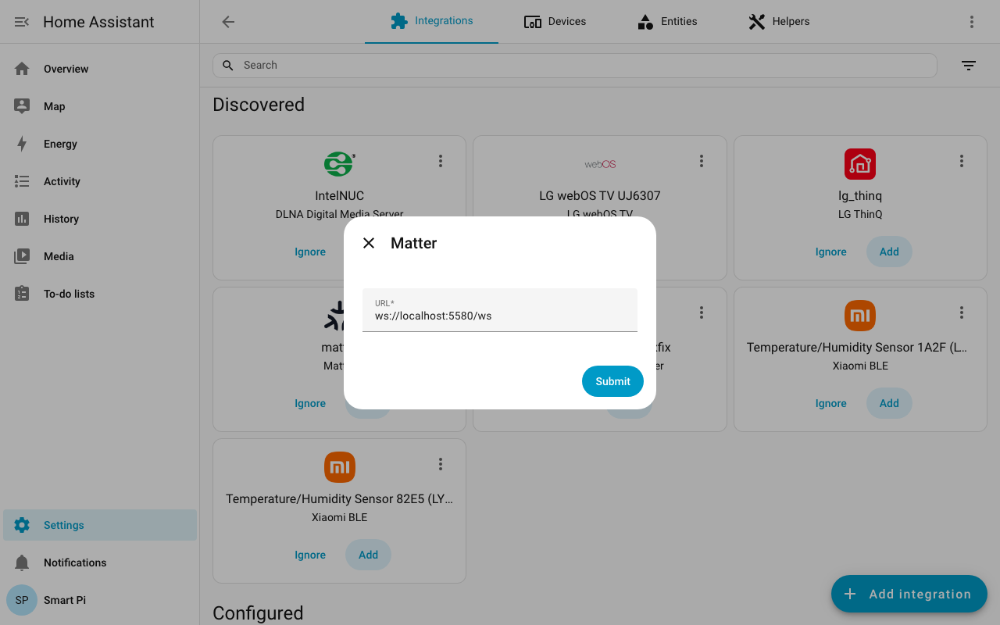

7. You should see **"Success — Created configuration for Matter."** Click **Finish**.


### 5.5 Add the OpenThread Border Router integration

The OTBR integration connects Home Assistant to the Thread network. This is what allows your Matter devices to communicate wirelessly.

1. On the Integrations page, click the **"+ Add integration"** button (bottom right)
2. Search for **"Open Thread"**
3. Click **"Open Thread Border Router"**

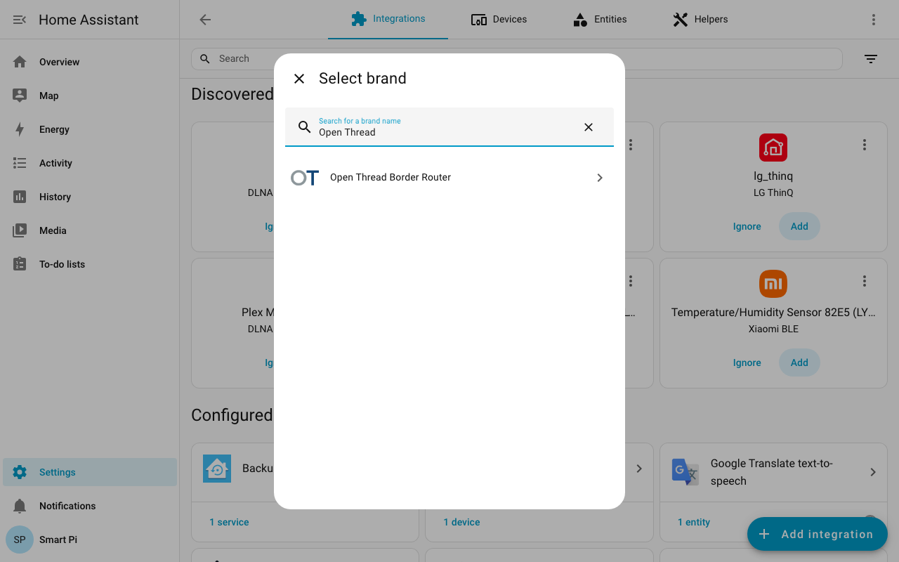

4. Enter the OTBR REST API URL: `http://localhost:8081`
5. Click **Submit**

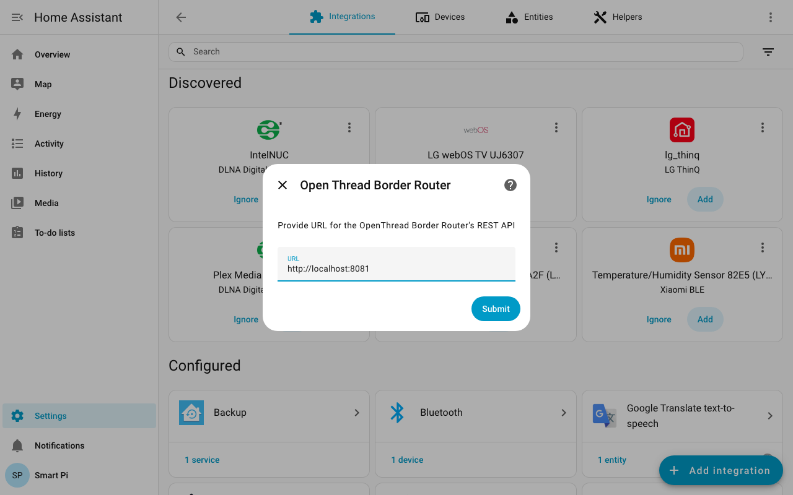

6. You should see **"Success — Created configuration for Open Thread Border Router."** Click **Finish**.

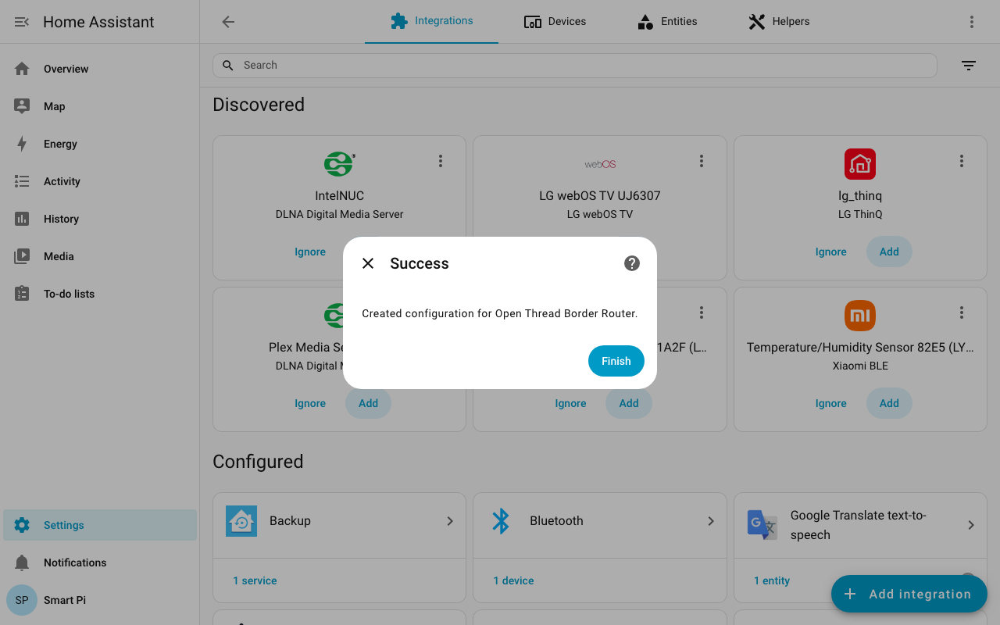

> **Note:** Adding the OTBR integration automatically creates a Thread network and configures the Thread integration. You do **not** need to add Thread separately — it's already set up.

### 5.6 Verify your integrations

Back on the Integrations page, scroll down to the **Configured** section. You should now have these integrations active (among others):

- **Matter** — ready to commission Matter devices
- **Open Thread Border Router** — managing the Thread network via the XIAO MG24 Sense radio
- **Thread** — automatically configured when OTBR was added

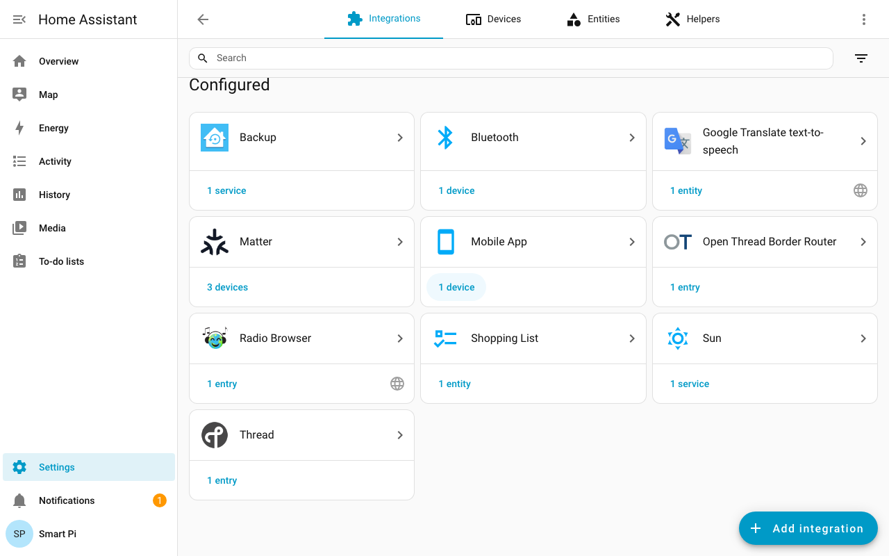

Home Assistant is now fully configured and ready to commission Matter devices over Thread.

---

## Part 6: Flash Sensor Firmware

Now we'll program the three sensor boards with firmware that reads the thermal cameras and reports data over Matter/Thread.

This step is done on your **computer** (Mac/PC) using Arduino IDE.

### Understanding the firmware

Each board runs a self-contained Arduino sketch that:
1. **Reads sensors** via I2C (Qwiic daisy-chain — no soldering)
2. **Detects presence** using thermal data
3. **Reports to Home Assistant** via Matter endpoints over Thread
4. **Shows live output** on a local display (OLED or RGB LED matrix)

The firmware source code is heavily commented — read through it to understand how each part works. The three boards have different sensor configurations:

| | Node 1: SparkFun Thing Plus Matter (MGM240P) | Node 2: SparkFun Thing Plus Matter #2 (MGM240P) | Node 3: Arduino Nano Matter (MGM240S) |
|---|---|---|---|
| **Room** | Living Room | Bedroom | Hallway |
| **Thermal camera** | Grid-EYE AMG8833 (8x8) | Grid-EYE AMG8833 (8x8) | Grid-EYE AMG8833 (8x8) |
| **Environment** | SCD40 (CO2 + humidity) | — | — |
| **Proximity** | — | Modulino Distance (VL53L4CD) | — |
| **Ambient light** | — | — | Modulino Light (LTR381RGB) |
| **Display** | Micro OLED 64x48 mono | IS31FL3741 9×13 RGB LED matrix | IS31FL3741 9×13 RGB LED matrix |
| **Matter endpoints** | Temperature, Occupancy, Humidity, Air Quality | Temperature, Occupancy | Temperature, Occupancy |
| **Debug interface** | J-Link (Segger) | J-Link (Segger) | CMSIS-DAP (OpenOCD) |

### 6.1 Connect the SparkFun Thing Plus Matter (Living Room sensor)

1. **Connect sensors** to the SparkFun board using Qwiic cables (they only fit one way — the connectors are keyed):
   - Grid-EYE AMG8833 → Qwiic port on SparkFun board
   - SCD40 CO2 sensor → daisy-chain from Grid-EYE's second Qwiic port
   - Micro OLED display → daisy-chain from SCD40's second Qwiic port

   All three sensors share the same I2C bus through Qwiic daisy-chaining. The order doesn't matter — each device has a unique I2C address.

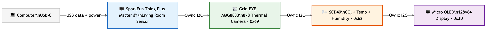

<details><summary>Mermaid source</summary>

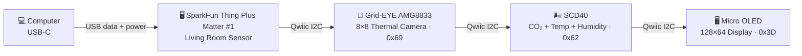
```mermaid
graph LR
    PC["💻 Computer\nUSB-C"]
    SF1["🖥 SparkFun Thing Plus Matter #1\nLiving Room Sensor"]
    GE["📡 Grid-EYE AMG8833\n8×8 Thermal Camera · 0x69"]
    SCD["🌬 SCD40\nCO₂ + Temp + Humidity · 0x62"]
    OLED["🖥 Micro OLED\n128×64 Display · 0x3D"]
    PC -->|"USB data + power"| SF1
    SF1 -->|"Qwiic I2C"| GE
    GE -->|"Qwiic I2C"| SCD
    SCD -->|"Qwiic I2C"| OLED
```

</details>

2. Connect the SparkFun Thing Plus Matter to your computer via **USB-C cable**

### 6.2 Flash the SparkFun firmware (Living Room)

1. Open **Arduino IDE**
2. Open the firmware file: **File** → **Open** → navigate to `firmware/sparkfun-thing-plus/sparkfun-thing-plus.ino`
3. Select your board from the toolbar dropdown: click **"Select Board"** → choose **SparkFun Thing Plus Matter** on the matching USB port

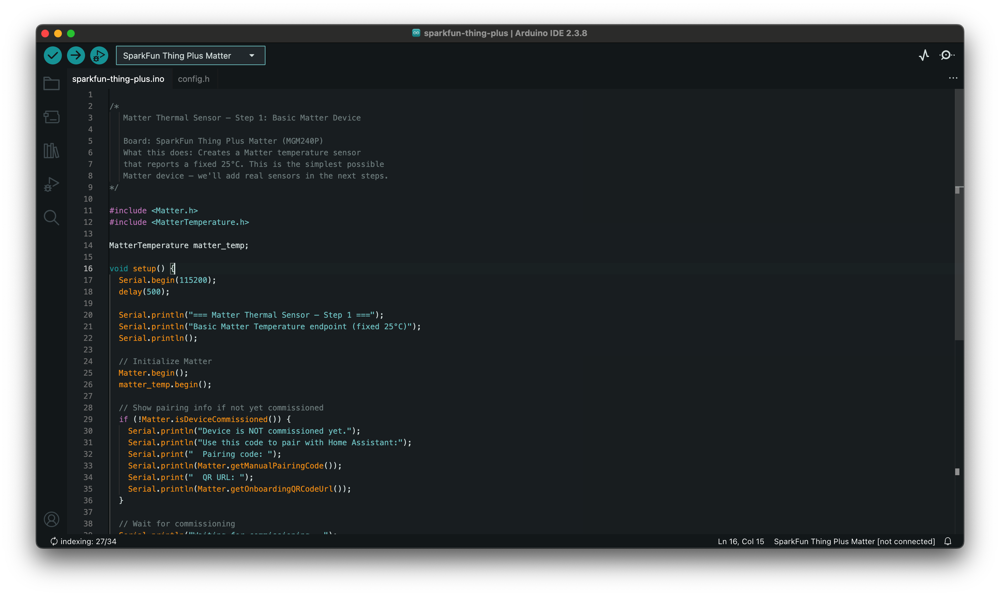

4. Click the **Upload** button (→ arrow icon in the toolbar), or use **Sketch** → **Upload**

The IDE will first compile the sketch, then flash it to the board. The SparkFun Thing Plus Matter uses a **Segger J-Link** debug interface — you'll see J-Link output in the Output panel with messages like "Comparing range..." as it verifies the flash:

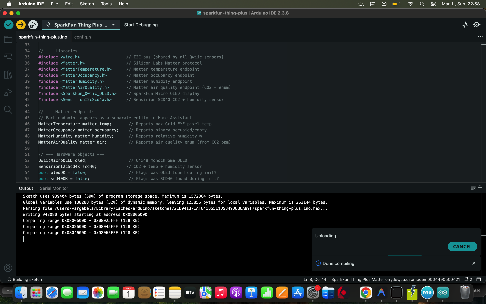

When the upload completes, you'll see **"Done uploading"** in the status bar:

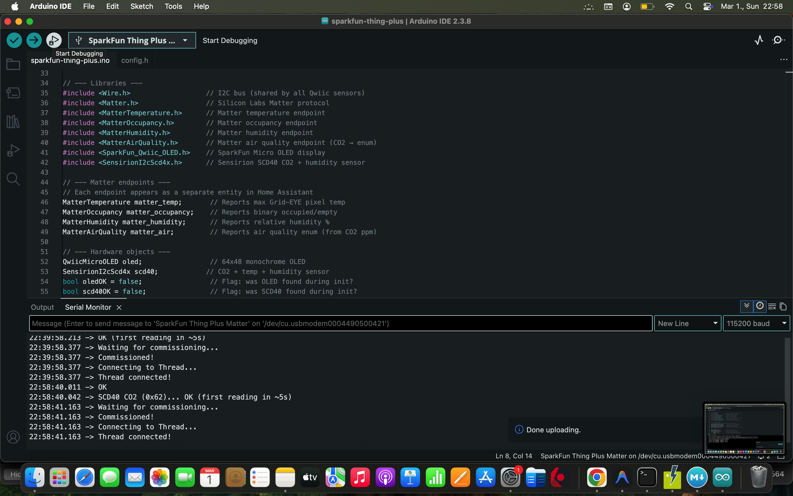

> **Note:** The SparkFun board has a built-in **J-Link debugger**, which also enables full step-through debugging with breakpoints. Notice the **"Start Debugging"** button that appears in the toolbar — this is a powerful feature for development. The Arduino Nano Matter uses a different debugger (CMSIS-DAP) as we'll see in section 6.5.

### 6.3 Verify SparkFun firmware (Living Room)

1. Click the **Serial Monitor** tab at the bottom of the Arduino IDE (or **Tools** → **Serial Monitor**)
2. Set the baud rate to **115200** (dropdown on the right side of the Serial Monitor bar)

You should see the boot sequence:

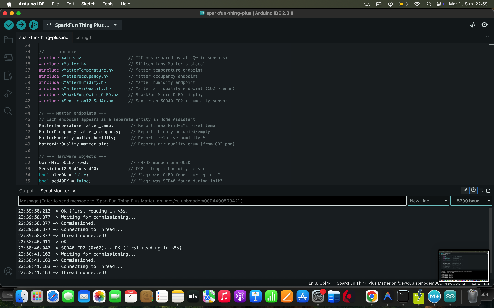

The expected output looks like:

<pre style="background:#1e1e1e;color:#d4d4d4;padding:14px 18px;border-radius:6px;font-family:'Menlo','Monaco','Courier New',monospace;font-size:12.5px;line-height:1.6;overflow-x:auto;">=== Matter Thermal Sensor — SparkFun Thing Plus Matter ===
Grid-EYE + SCD40 + OLED → Matter over Thread

Grid-EYE (0x69)... OK
Micro OLED (0x3D)... OK
SCD40 CO2 (0x62)... OK (first reading in ~5s)
Device is NOT commissioned yet.
Use this code to pair with Home Assistant:
  Pairing code: 34970112332
  QR URL: https://project-chip.github.io/connectedhomeip/qrcode.html?data=...
Waiting for commissioning...
</pre>

**Write down the pairing code** — you'll need it in Part 7 to connect the board to Home Assistant.

> **Tip:** If you don't see output, press the **reset button** on the SparkFun board (or unplug and replug USB). The init messages print once at boot. If all three sensors show "OK", your Qwiic wiring is correct. If any sensor shows "FAILED" or "not found", check that Qwiic cable.

### 6.4 Connect the Arduino Nano Matter (Hallway sensor)

1. Disconnect the SparkFun board from USB (or leave it connected — all boards can be connected simultaneously)
2. **Connect sensors** to the Nano Matter using Qwiic/STEMMA QT cables:
   - Grid-EYE AMG8833 → Qwiic port on Nano Matter
   - IS31FL3741 RGB LED Matrix → daisy-chain from Grid-EYE (via STEMMA QT)
   - Modulino Light → daisy-chain from IS31FL3741 (via Qwiic)

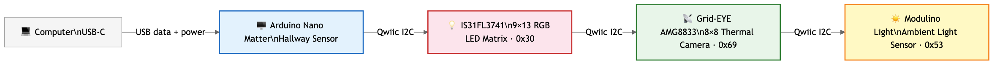

<details><summary>Mermaid source</summary>

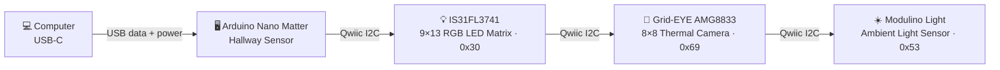
```mermaid
graph LR
    PC["💻 Computer\nUSB-C"]
    NM["🖥 Arduino Nano Matter\nHallway Sensor"]
    LED["💡 IS31FL3741\n9×13 RGB LED Matrix · 0x30"]
    GE["📡 Grid-EYE AMG8833\n8×8 Thermal Camera · 0x69"]
    LIGHT["☀️ Modulino Light\nAmbient Light Sensor · 0x53"]
    PC -->|"USB data + power"| NM
    NM -->|"Qwiic I2C"| LED
    LED -->|"Qwiic I2C"| GE
    GE -->|"Qwiic I2C"| LIGHT
```

</details>

3. Connect the Arduino Nano Matter to your computer via **USB-C cable**

### 6.5 Flash the Nano Matter firmware (Hallway)

1. In Arduino IDE, open `firmware/nano-matter/nano-matter.ino` (**File** → **Open**)
2. Select your board from the toolbar dropdown: click the board name → choose **Arduino Nano Matter** on the matching USB port

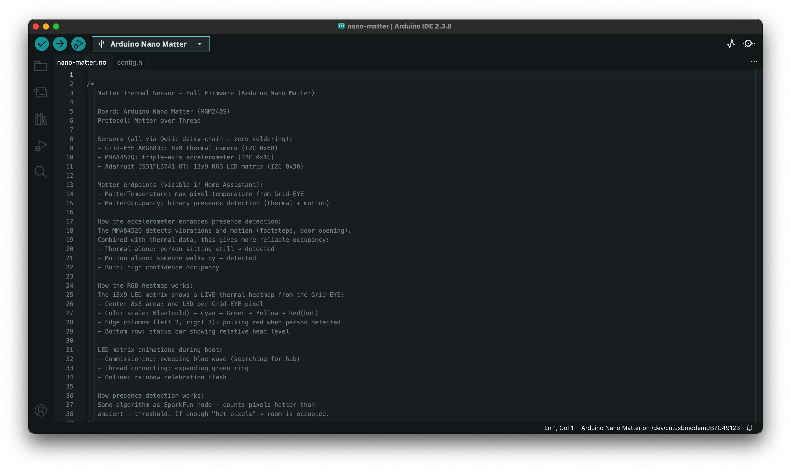

3. Click **Upload** (→ arrow) or **Sketch** → **Upload**

The Nano Matter uses a **CMSIS-DAP** debug interface (via OpenOCD), which is different from the SparkFun's J-Link. You'll see OpenOCD output in the Output panel instead of J-Link messages:

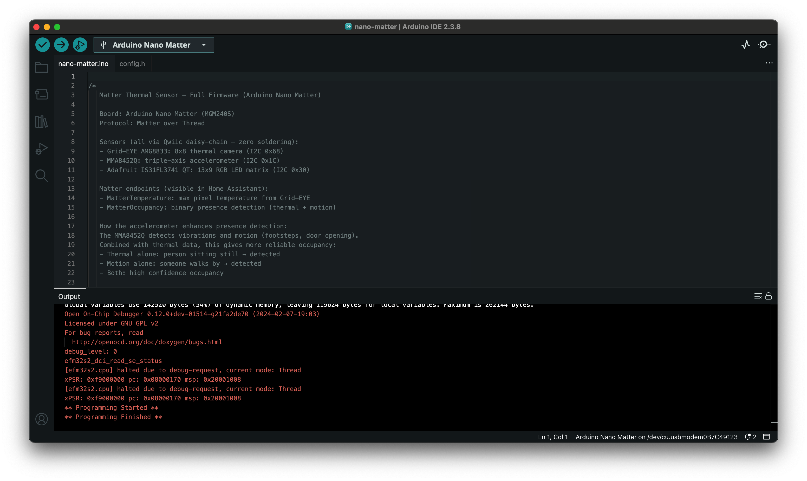

> **J-Link vs CMSIS-DAP — what's the difference?**
>
> Both are debug interfaces that allow programming and debugging the microcontroller:
> - **J-Link** (SparkFun): Commercial debugger by Segger. Fast, feature-rich, widely supported. The SparkFun board has a Segger J-Link chip built in.
> - **CMSIS-DAP** (Nano Matter): Open standard debug protocol. Uses OpenOCD as the software interface. Built into the Arduino Nano Matter's USB bridge chip.
>
> For this tutorial, the difference is only cosmetic — both flash the firmware the same way. But if you're doing advanced development, J-Link offers faster flash speeds and more debugging features.

### 6.6 Verify Nano Matter firmware (Hallway)

1. Open **Serial Monitor** (click the tab at the bottom, or **Tools** → **Serial Monitor**)
2. Set baud rate to **115200**

The expected output:

<pre style="background:#1e1e1e;color:#d4d4d4;padding:14px 18px;border-radius:6px;font-family:'Menlo','Monaco','Courier New',monospace;font-size:12.5px;line-height:1.6;overflow-x:auto;">=== Matter Thermal Sensor — NanoMatter-1 ===
Room: Living Room
Grid-EYE + Modulino Light + IS31FL3741 RGB Matrix → Matter over Thread

IS31FL3741 LED Matrix (0x30)... OK
Grid-EYE (0x69)... OK
Modulino Light (0x53)... OK
Matter device initialized
Device is NOT commissioned yet.
Commission it to your Matter hub with:
  Manual pairing code: 34970112332
  QR code URL: https://project-chip.github.io/connectedhomeip/qrcode.html?data=...
</pre>

The LED matrix will show a **sweeping blue wave animation** — this means the board is waiting to be commissioned (paired) with Home Assistant. You'll do that in Part 7.

> **Tip:** If the LED matrix doesn't light up, check the Qwiic cable connection and make sure the matrix board's power LED is on. If the Modulino Light shows "not found (optional)", the firmware will still work — it just won't adjust display brightness based on ambient light.

### 6.7 Connect the SparkFun Thing Plus Matter #2 (Bedroom sensor)

The second SparkFun board has a different sensor configuration — a ToF (Time-of-Flight) distance sensor instead of CO2/humidity, and an RGB LED matrix instead of the monochrome OLED.

1. **Connect sensors** to SparkFun #2 using Qwiic cables:
   - Grid-EYE AMG8833 → Qwiic port on SparkFun board
   - Modulino Distance → daisy-chain from Grid-EYE
   - IS31FL3741 RGB LED Matrix → daisy-chain from Modulino Distance

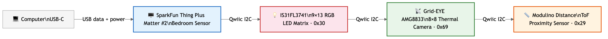

<details><summary>Mermaid source</summary>

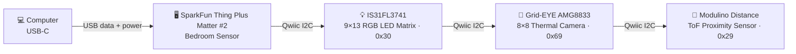
```mermaid
graph LR
    PC["💻 Computer\nUSB-C"]
    SF2["🖥 SparkFun Thing Plus Matter #2\nBedroom Sensor"]
    LED["💡 IS31FL3741\n9×13 RGB LED Matrix · 0x30"]
    GE["📡 Grid-EYE AMG8833\n8×8 Thermal Camera · 0x69"]
    DIST["📏 Modulino Distance\nToF Proximity Sensor · 0x29"]
    PC -->|"USB data + power"| SF2
    SF2 -->|"Qwiic I2C"| LED
    LED -->|"Qwiic I2C"| GE
    GE -->|"Qwiic I2C"| DIST
```

</details>

2. Connect SparkFun #2 to your computer via **USB-C cable**

### 6.8 Flash the SparkFun #2 firmware (Bedroom)

1. In Arduino IDE, open `firmware/sparkfun-thing-plus-2/sparkfun-thing-plus-2.ino`
2. Select **SparkFun Thing Plus Matter** from the board dropdown (same board type as #1, but different USB port)
3. Click **Upload**

The process is identical to SparkFun #1 — you'll see the same J-Link output in the Output panel.

### 6.9 Verify SparkFun #2 firmware (Bedroom)

Open Serial Monitor at **115200** baud. Expected output:

<pre style="background:#1e1e1e;color:#d4d4d4;padding:14px 18px;border-radius:6px;font-family:'Menlo','Monaco','Courier New',monospace;font-size:12.5px;line-height:1.6;overflow-x:auto;">=== Matter Thermal Sensor — SparkFun-2 ===
Room: Bedroom
Grid-EYE + Modulino Distance + IS31FL3741 → Matter over Thread

IS31FL3741 LED Matrix (0x30)... OK
Grid-EYE (0x69)... OK
Modulino Distance (0x29)... OK
Matter device initialized
Device is NOT commissioned yet.
Commission it to your Matter hub with:
  Manual pairing code: 34970112332
  QR code URL: https://project-chip.github.io/connectedhomeip/qrcode.html?data=...
</pre>

The LED matrix will show the same blue wave animation, waiting for commissioning.

> **Tip:** The Modulino Distance sensor measures up to ~1.3 meters. Objects closer than 1.5m trigger the proximity flag, which supplements the thermal presence detection. This works well for doorways or hallways where someone might walk past without sitting down.

### 6.10 How the firmware works (for the curious)

All three sketches follow the same pattern:

1. **Setup:** Initialize I2C bus → detect sensors → start Matter endpoints → wait for commissioning
2. **Loop:** Read sensors at 5Hz → update display → report to Matter at 1Hz → print debug output to Serial

**Presence detection** works by comparing each of the 64 thermal pixels against the ambient room temperature plus a threshold (2.5°C). If at least 2 pixels are "hot" (e.g., body heat from a person), the room is flagged as occupied. Each board enhances this with a secondary sensor:
- **SparkFun #1:** No secondary presence sensor (thermal only), but adds CO2 + humidity via SCD40
- **Nano Matter:** The Modulino Light measures ambient brightness (lux) — the LED matrix automatically adjusts its brightness to match the room lighting
- **SparkFun #2:** The Modulino Distance (ToF) detects objects within 1.5m — proximity keeps the "occupied" flag active for 5 seconds

**Matter endpoints** are what Home Assistant sees. Each endpoint (Temperature, Occupancy, Humidity, Air Quality) appears as a separate entity in HA. The firmware updates these at 1Hz — fast enough for environmental monitoring without flooding the Thread mesh network.

The firmware source code in `firmware/sparkfun-thing-plus/`, `firmware/nano-matter/`, and `firmware/sparkfun-thing-plus-2/` is extensively commented to explain every function, constant, and design decision. We encourage you to read through it and modify the thresholds, timing, or display behavior to suit your setup.

---

## Part 7: Commission Matter Devices

Commissioning connects your sensor boards to the Thread mesh network through Home Assistant. Each board joins via Bluetooth (BLE) first, then switches to Thread for ongoing communication.

You have **three sensor boards** to commission — one at a time.

### 7.1 Prepare for commissioning

1. Make sure **all three sensor boards** are powered on via USB
2. Keep them within **2 meters** of the Raspberry Pi (BLE range is limited)
3. Install the **Home Assistant** app on your phone:
   - [Android (Google Play)](https://play.google.com/store/apps/details?id=io.homeassistant.companion.android)
   - [iOS (App Store)](https://apps.apple.com/app/home-assistant/id1099568401)
4. Open the app and connect to your HA instance: `http://smartpi.local:8123`
5. Log in with your credentials (username: `smartpi`, password: `smartpi`)
6. **Sync Thread credentials** — this is a critical step that must be done **before** commissioning any device:
   - In the HA app, go to **Settings** → **Companion app** → **Troubleshooting**
   - Tap **"Sync Thread credentials"**
   - Wait for the confirmation message
   - Without this step, commissioning will fail with: *"Your device requires a Thread border router"*

> **Why the phone app?** Matter commissioning requires Bluetooth (BLE) to initially pair with each sensor board. Home Assistant uses your phone's Bluetooth for this — even though the Raspberry Pi has a Bluetooth adapter, HA intentionally delegates BLE pairing to the phone app for reliability. This is only needed once per device: after the initial BLE pairing, the board switches to Thread and communicates directly with HA — no phone needed anymore.

> **Important:** Commission **one board at a time**. All three boards share the same pairing code (`34970112332`), so if multiple boards are waiting simultaneously, HA may pair with the wrong one. After each board is commissioned, it stops advertising — then you can safely commission the next one.

> **What the boards look like while waiting:**
> - SparkFun boards: OLED/LED matrix will show animation; serial output says "Device is NOT commissioned yet"
> - Nano Matter: LED matrix shows a **sweeping blue wave** animation

### 7.2 Commission Node 1 — Living Room (SparkFun Thing Plus Matter)

1. In the **Home Assistant app** on your phone, go to **Settings** → **Devices & Services**
2. Tap the **Matter** integration (you set it up in Part 5)
3. Tap **"Add device"**
4. Select **"No. It's new."** (your board is brand new or factory reset)
5. The app will scan for nearby Matter devices via Bluetooth
6. When prompted, enter the pairing code: **34970112332**
7. Wait 30-60 seconds — the app will:
   - Connect to the board via BLE (Bluetooth)
   - Provision Thread network credentials
   - The board switches from BLE to Thread and appears as a Matter device

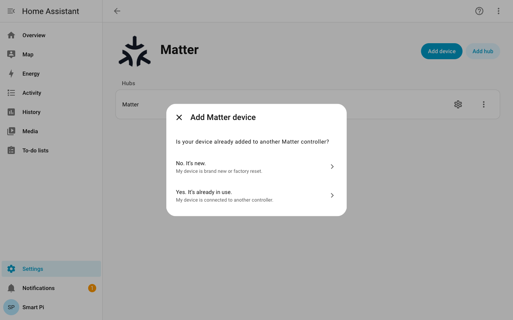

> The screenshot above shows the "Add Matter device" dialog as seen in the HA web UI. The same dialog appears in the Home Assistant app on your phone.

Once commissioning completes, the SparkFun #1 should appear with these entities:
- **Temperature** — max Grid-EYE pixel temperature
- **Occupancy** — binary presence detection
- **Humidity** — from SCD40 sensor
- **Air Quality (CO2)** — from SCD40 sensor

The serial output on the board will change to:

<pre style="background:#1e1e1e;color:#d4d4d4;padding:14px 18px;border-radius:6px;font-family:'Menlo','Monaco','Courier New',monospace;font-size:12.5px;line-height:1.6;overflow-x:auto;">Device commissioned!
Waiting for Thread network...
Connected to Thread network!
Waiting for Matter device discovery...
Matter device is now online!
</pre>

Once the device appears in HA, click on it to see its detail page with all sensor entities:

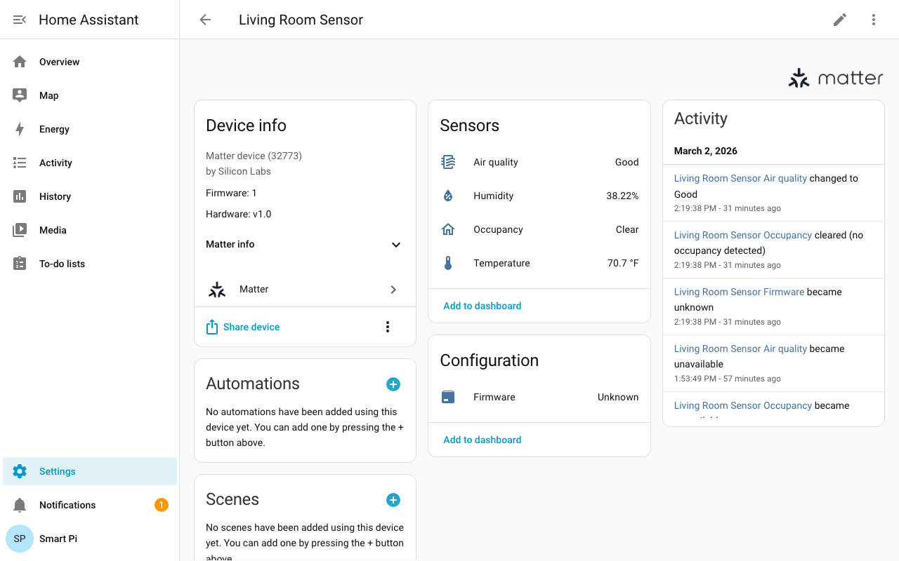

### 7.3 Commission Node 2 — Bedroom (SparkFun Thing Plus Matter #2)

1. Wait for Node 1 commissioning to fully complete (the board should show "Matter device is now online!" in serial output)
2. In the **Home Assistant app**: **Settings** → **Devices & Services** → **Matter** → **"Add device"**
3. Select **"No. It's new."** → enter the pairing code: **34970112332**
4. Wait 30-60 seconds for commissioning to complete

SparkFun #2 should appear with these entities:
- **Temperature** — max Grid-EYE pixel temperature
- **Occupancy** — binary presence detection (thermal + proximity via Modulino Distance)

The LED matrix on SparkFun #2 will switch from animation to showing a **live heatmap** once online.

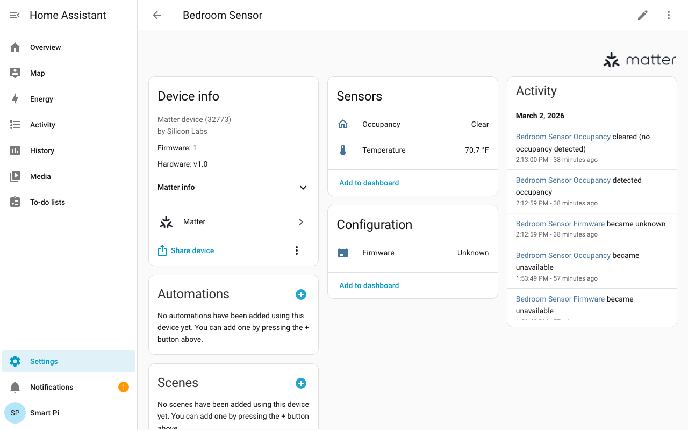

### 7.4 Commission Node 3 — Hallway (Arduino Nano Matter)

1. Wait for Node 2 commissioning to fully complete
2. In the **Home Assistant app**: **Settings** → **Devices & Services** → **Matter** → **"Add device"**
3. Select **"No. It's new."** → enter the pairing code: **34970112332**
4. Wait 30-60 seconds for commissioning to complete

The Nano Matter should appear with these entities:
- **Temperature** — max Grid-EYE pixel temperature
- **Occupancy** — binary presence detection (thermal only)

The LED matrix will switch from the **blue wave animation** to a **live heatmap**, and then do a brief **rainbow celebration flash** to confirm it's online. The display brightness will automatically adjust based on ambient light (Modulino Light sensor).

After all three boards are commissioned, go back to **Settings** → **Devices & Services** → **Matter** in your browser. You should see all three devices listed (with generic names — you'll rename them in the next step).

### 7.5 Rename your devices

By default, Home Assistant assigns generic names to Matter devices. Rename them so you can tell them apart:

1. Go to **Settings** → **Devices & Services** → **Matter**
2. Click on each device and give it a descriptive name:
   - SparkFun #1 → **"Living Room Sensor"**
   - SparkFun #2 → **"Bedroom Sensor"**
   - Nano Matter → **"Hallway Sensor"**

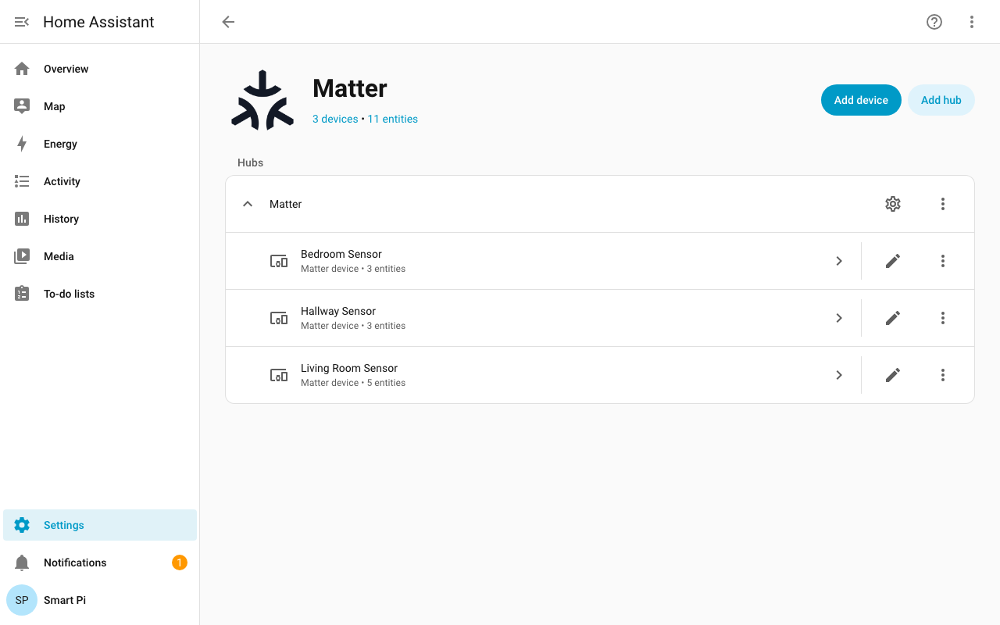

> **Device names vs entity IDs:** Renaming a device changes how it appears in the HA UI, but the underlying **entity ID** (like `binary_sensor.matter_device_occupancy_4`) stays the same. In Part 8, you'll use entity IDs to write automations — not device names. Don't worry about this now; we'll look up the exact IDs when we need them.

### 7.6 Verify all three nodes are working

Go to **Settings** → **Devices & Services** → **Matter**. You should see all three sensors listed with their current readings. Click on each device to confirm it's reporting live data:

- **Living Room Sensor** → Air quality, Humidity, Occupancy, Temperature
- **Bedroom Sensor** → Occupancy, Temperature
- **Hallway Sensor** → Occupancy, Temperature

Click on each device to open its detail page and confirm the sensor values are updating:


Test presence detection by walking in front of each sensor:
- The **Occupancy** entity should switch to "Detected" within a few seconds
- The LED matrices on SparkFun #2 and Nano Matter should show **pulsing red edges** when occupancy is detected
- The Micro OLED on SparkFun #1 will show occupancy status

**Congratulations — your 3-node Matter Thermal Mesh is live!**

All three sensor nodes are now reporting to Home Assistant over Thread. In Part 8, you'll create automations that respond to this data.

<!-- TODO: Photo of LED matrix showing live heatmap — take with phone camera -->

---

## Part 8: Create Automations

Home Assistant automations connect your sensor data to real actions. In this part you'll create two automations: a phone notification when presence is detected, and an air quality alert when CO2 gets too high. Both can be tested in under a minute.

**What you need:**
- HA Companion App installed on your phone (the app you used in Part 7)
- All sensors online and reporting live data

### 8.1 Open the Automations page

1. In Home Assistant: **Settings** → **Automations & Scenes**
2. You'll see an empty page — "Start automating"

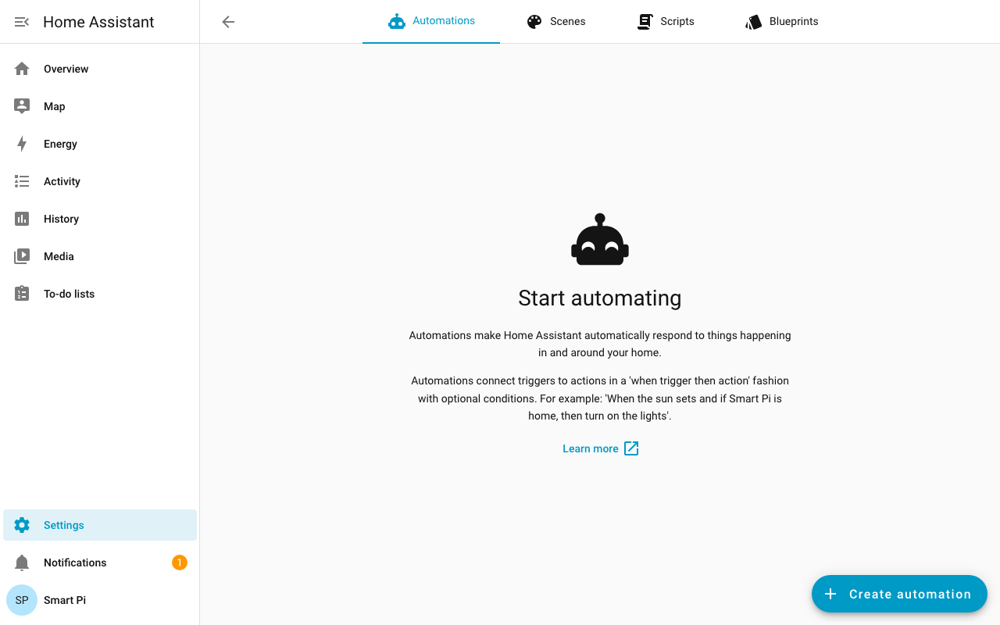

---

### 8.2 Find your occupancy entity IDs

Before writing any automation, you need the exact entity IDs of your occupancy sensors. Entity IDs are the stable identifiers that HA uses internally — they don't change when you rename devices.

1. Go to **Settings** → **Devices & Services** → click the **Entities** tab at the top
2. Type **"occupancy"** in the search box
3. You'll see your 3 sensors listed, grouped by device name

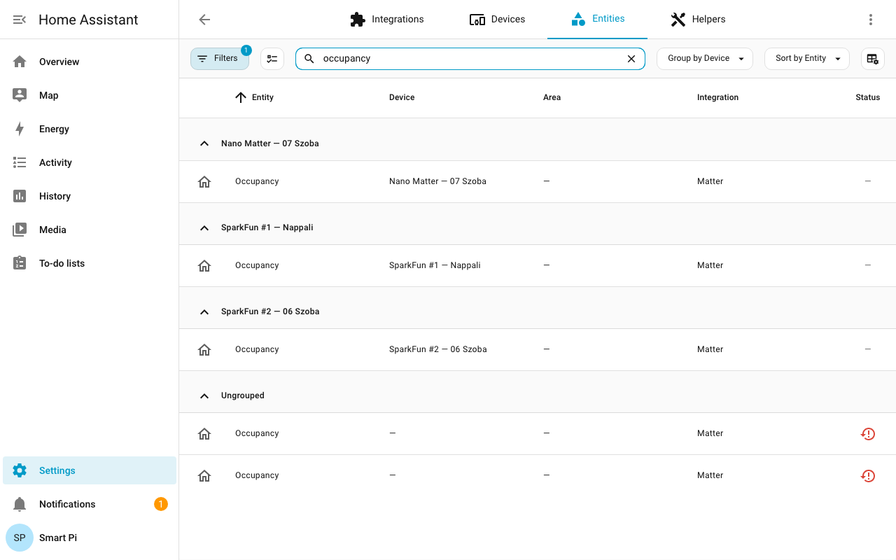

To see the exact entity ID, click on any entity and look for the **Entity ID** field in the settings panel. It will look like:

- `binary_sensor.matter_device_occupancy`
- `binary_sensor.matter_device_occupancy_2`
- `binary_sensor.matter_device_occupancy_3`

Note down all three — you'll use them in the next step.

> **Tip:** The exact suffix numbers depend on the order you commissioned your devices. Use the entities search to find your actual IDs.

---

### 8.3 Create the "Presence Detected — Notify" automation

1. Go back to **Settings** → **Automations & Scenes**
2. Click **"+ Create automation"** in the bottom right
3. Click **"Create new automation"** — you'll see the automation editor:

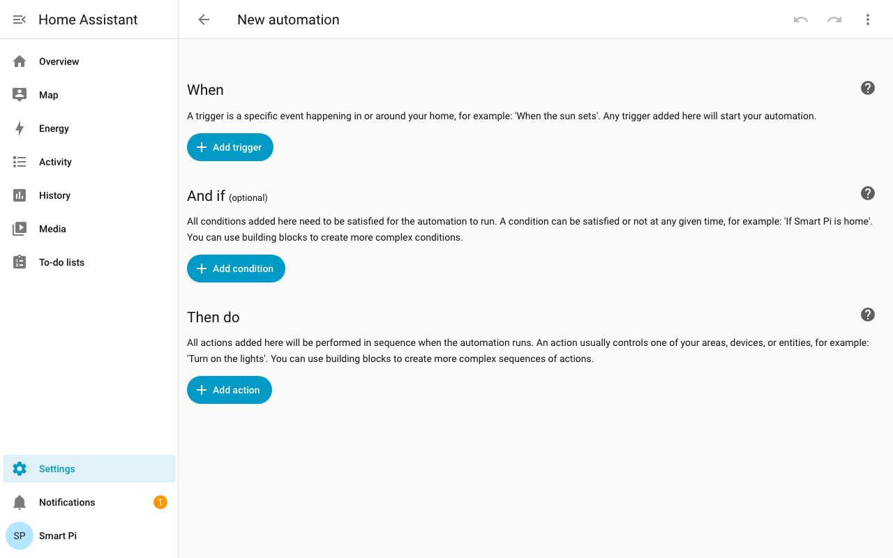

4. Click the **three-dot menu ⋮** in the top right corner of the editor → **"Edit in YAML"**


5. Clear the default content and paste the following YAML:

> **Before pasting:** go back to Step 8.2 and find your three occupancy entity IDs. Replace the three `binary_sensor.YOUR_ENTITY_ID_X` lines below with your actual IDs.
>
> **YAML is indentation-sensitive** — if the spacing is wrong, the automation will appear to save but will never run. Paste as-is and only edit the entity ID lines.

```yaml
alias: "Presence Detected — Notify"
description: "Sends a mobile notification when any thermal sensor detects someone"
triggers:
  - trigger: state
    entity_id:
      - binary_sensor.YOUR_ENTITY_ID_1    # ← replace with your 1st occupancy entity ID
      - binary_sensor.YOUR_ENTITY_ID_2    # ← replace with your 2nd occupancy entity ID
      - binary_sensor.YOUR_ENTITY_ID_3    # ← replace with your 3rd occupancy entity ID
    to: "on"
conditions: []
actions:
  - action: notify.notify
    data:
      title: "Presence detected"
      message: "A sensor just detected someone!"
mode: single
```

**Example:** if Step 8.2 showed `matter_device_occupancy`, `matter_device_occupancy_4`, and `matter_device_occupancy_5`, your entity ID lines should be:
```yaml
      - binary_sensor.matter_device_occupancy
      - binary_sensor.matter_device_occupancy_4
      - binary_sensor.matter_device_occupancy_5
```

6. Click **Save** in the top right

The automation now appears in your automations list, enabled by default:

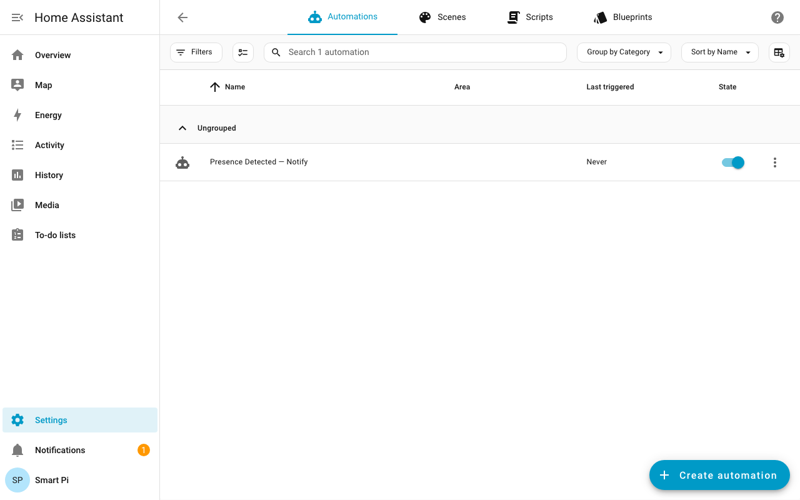

You can also open it to see the full configuration in the visual editor — it shows the trigger and action in plain language:

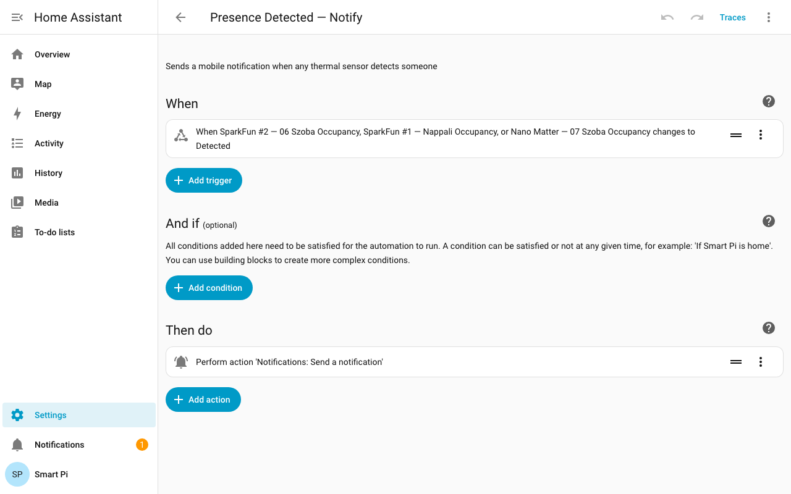

---

### 8.4 Test the automation

Walk in front of any sensor. Within a few seconds:
- The Occupancy entity changes to "Detected"
- The automation fires and sends a push notification to your phone

To confirm the automation ran, open it and click **"Traces"** in the top right. You'll see a log entry showing when it triggered and which sensor fired it:

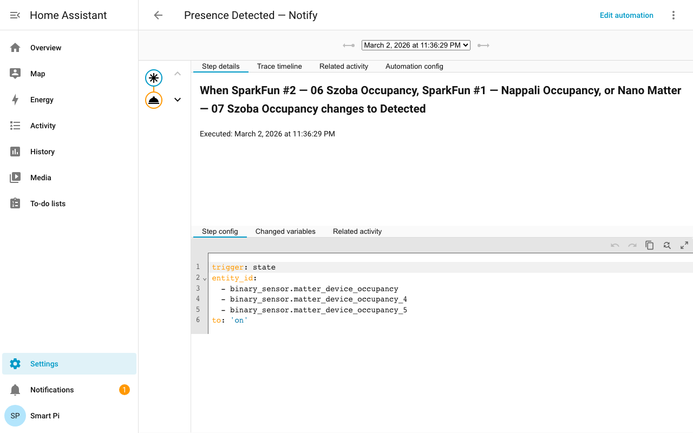

A successful trace shows:
- **Which trigger fired** — the entity ID and the state it changed to
- **When it executed** — timestamp of the automation run
- **What action ran** — the notification service call

If the trace is empty, the automation has not fired yet. Check that your sensors are online (**Settings → Devices & Services → Matter** — all devices should show as available).

---

### 8.5 (Bonus) CO2 air quality alert

The Living Room sensor (SparkFun Thing Plus Matter #1) includes an SCD40 CO2 sensor. Use it to alert when indoor air quality drops — a useful reminder to open a window.

**Find your CO2 entity ID:**

1. **Settings** → **Devices & Services** → **Entities** → search **"air quality"**
2. Note the entity ID for the Living Room device (e.g. `sensor.matter_device_air_quality_2`)

**Create the automation** — same steps as 8.3, with this YAML:

```yaml
alias: "CO2 Alert — Open a Window"
description: "Alerts when CO2 exceeds 1000 ppm in the Living Room"
triggers:
  - trigger: numeric_state
    entity_id: sensor.matter_device_air_quality_2   # replace with your CO2 entity ID
    above: 1000
conditions: []
actions:
  - action: notify.notify
    data:
      title: "CO2 Alert"
      message: >-
        CO2 is {{ states('sensor.matter_device_air_quality_2') }} ppm —
        open a window!
mode: single
```

> **What's normal?** Outdoor air is ~420 ppm CO2. A well-ventilated room stays below 800 ppm. Above 1000 ppm, most people notice reduced focus. Above 2000 ppm, air quality is noticeably poor. The SCD40 sensor in this guide measures CO2, temperature, and humidity with ±40 ppm accuracy.

---

**Your Matter Thermal Mesh is complete.**

Three sensors. One Thread mesh. One Home Assistant installation. Automations that respond to real presence data — all built on open standards, no proprietary cloud required.

What you built:
- Raspberry Pi running Home Assistant + OpenThread Border Router in Docker
- Thread border router (XIAO MG24 Sense as RCP)
- 3 thermal presence sensors (SparkFun Thing Plus Matter × 2, Arduino Nano Matter)
- Matter over Thread — standard protocol, works with any Matter-compatible hub
- Real-time visualization dashboard
- Automated responses to occupancy and air quality data

---

## Troubleshooting

### RPi Imager: SD card not detected

- Try a different USB port or SD card adapter
- On Mac: check System Information → Card Reader
- On Windows: check Disk Management

### SSH: "Connection refused" or hostname not found

- Wait 3 minutes after first boot
- Try the IP address instead: find it in your router's admin page
- Make sure your computer is on the same WiFi network as the RPi

### Docker: Permission denied

If you see "permission denied" when running Docker commands:
```bash
sudo usermod -aG docker smartpi
exit
# Reconnect via SSH
ssh smartpi@smartpi.local
```

### Arduino IDE: Upload fails or "No target device found"

This is usually a **bootloader issue**. The Silicon Labs boards need a valid bootloader before you can upload sketches. Common symptoms:
- "Error: No target device found" during upload
- Upload starts but immediately fails
- Board is detected on a USB port but upload hangs

**Fix — Burn the bootloader first:**

1. In Arduino IDE, select your board and port (just like for uploading)
2. Go to **Tools** → **Programmer** → select **OpenOCD** (Nano Matter) or leave default (SparkFun)
3. Go to **Tools** → **Burn Bootloader**
4. Wait for "Done burning bootloader" — this takes 10-30 seconds
5. Try uploading your sketch again

> **What does "Burn Bootloader" actually do?** It performs a mass erase of the chip (clears all flash including any old firmware) and writes the Silicon Labs bootloader. This is a one-time step per board — once the bootloader is in place, regular uploads work fine. If you're getting a brand new board out of the box, always burn the bootloader first.

**If Burn Bootloader also fails:**
- Check your USB cable (try a different one — charge-only cables won't work)
- On Mac: check **System Information** → **USB** to verify the board appears
- SparkFun boards: the J-Link debugger should show as "J-Link" in the USB device list
- Nano Matter: the CMSIS-DAP bridge should show as "Arduino Nano Matter"
- Try unplugging all other USB devices to avoid port conflicts

### Board flashed successfully but no serial output / LED not blinking

If the upload completes with "Flashing completed successfully!" but the board appears completely dead (no serial output, no LED activity), the **bootloader is missing or corrupted**.

This happens when:
- A previous mass erase wiped the bootloader but no one burned it back
- The bootloader area (0x08000000) was overwritten by accident
- The board was used with Simplicity Studio or other tools that erase the full chip

**The upload itself won't fail** — it writes to 0x08006000 and above, so J-Link happily programs the application. But without the bootloader at 0x08000000, the MCU doesn't know how to jump to your code.

**Fix — Mass erase + Burn Bootloader + Re-upload:**

1. In Arduino IDE: **Tools** → **Burn Bootloader** (this does mass erase + bootloader in one step)
2. Upload your sketch again
3. Open Serial Monitor — you should see output now

**Alternative fix via command line** (if you have Simplicity Commander):
```bash
# 1. Mass erase
commander device masserase

# 2. Flash bootloader
commander flash /path/to/bootloader.hex

# 3. Re-upload sketch from Arduino IDE
```

> **How to tell if this is your problem:** If `commander device info` shows the correct chip (e.g., MGM240PB32VNA2) but the board does nothing after flash, it's almost certainly a missing bootloader.

### OpenOCD: "No CMSIS-DAP device found"

- Unplug and replug the XIAO MG24 Sense
- Try a different USB cable (some cables are charge-only)
- On Mac: check System Information → USB for "Seeed Studio XIAO MG24 Sense"

### OTBR: Serial timeout / XIAO not responding

The XIAO's CMSIS-DAP bridge requires DTR=True. If Docker can't communicate:

1. Check the device path: `ls /dev/serial/by-id/`
2. Check container logs: `docker logs otbr 2>&1 | tail -30`
3. Try the **socat workaround** if you see serial timeouts:

```bash
sudo apt install socat
socat TCP-LISTEN:9999,reuseaddr,fork FILE:/dev/ttyACM0,b460800,raw,echo=0 &
```

Then change `docker-compose.yml`:
- `DEVICE: "tcp://localhost:9999"` (instead of `/dev/ttyACM0`)
- Remove the `devices:` section
- Restart: `docker compose restart otbr`

### BLE Commissioning: "Your device requires a Thread border router"

This error means your phone doesn't have the Thread network credentials and can't provision them to the sensor board. Fix:

1. In the HA app: **Settings** → **Companion app** → **Troubleshooting** → **Sync Thread credentials**
2. Wait for the confirmation, then retry commissioning

This must be done **once** before your first commissioning attempt. If the OTBR or Thread credentials change (e.g. after a RPi reset), sync again.

### BLE Commissioning: Timeout

- Keep the sensor board within 2 meters of the RPi
- Power cycle RPi Bluetooth:
  ```bash
  bluetoothctl power off && sleep 2 && bluetoothctl power on
  docker compose restart matter-server
  ```
- Don't run `bluetoothctl scan` while commissioning (it interferes)

### Device shows "unavailable" in HA

1. Check OTBR is running: `docker ps | grep otbr`
2. Check Thread network: `curl -s http://localhost:8081/node/state` (should show `"leader"`)
3. Power cycle the sensor board (unplug/replug USB)
4. Wait 30-60 seconds for reconnection

### After RPi reboot

All containers restart automatically. Matter devices reconnect within 30-60 seconds. If not:

```bash
docker compose -f /opt/homeassistant/docker-compose.yml up -d
```

---

## Software Versions (Pinned)

This guide was tested and verified with these exact versions:

| Software | Version |
|----------|---------|
| Raspberry Pi OS | Debian 13 (trixie) 64-bit Desktop |
| Docker | 29.2.1 |
| Home Assistant | 2026.2 |
| OTBR Docker image | ghcr.io/ownbee/hass-otbr-docker:v0.3.0 |
| Matter Server | ghcr.io/home-assistant-libs/python-matter-server:8.1.2 |
| Arduino IDE | 2.3.x |
| Arduino SiLabs Core | 3.0.0 |
| darkxst RCP firmware | SL-OPENTHREAD/2.5.3.0 |
| OpenOCD | 0.12.0-arduino1-static |
| universal-silabs-flasher | 0.1.3 |

---

## What's Next

Now that your thermal mesh is fully running with automations, you can go further:

- **Add more sensors** — commission additional boards to cover more rooms
- **Control smart lights** — replace `notify.notify` with a `light.turn_on` action to control a smart bulb based on presence
- **Build complex automations** — add conditions (e.g. only notify between 10pm and 6am), delays, and multi-step sequences
- **Explore raw sensor data** — the Grid-EYE outputs an 8×8 thermal array; with a custom Thread/UDP setup you can get precise heat-blob positioning beyond binary presence
- **Visualize the Thread mesh** — see how your sensors communicate via the OTBR web UI at `http://smartpi.local:8081`