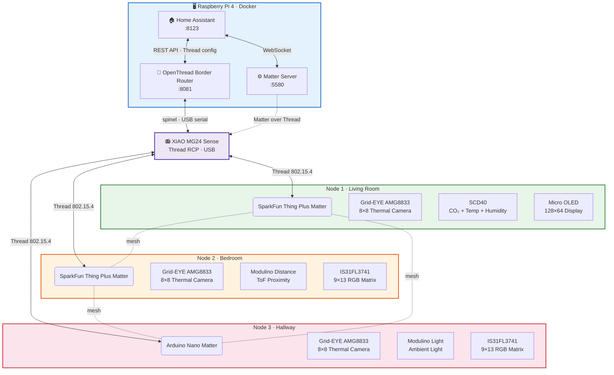
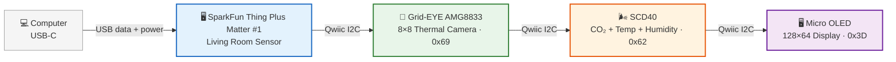
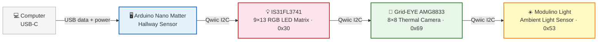

# Wiring & Connection Diagrams

All diagrams are in Mermaid format. Source files: `docs/diagrams/*.mmd` — PNG renders: `docs/diagrams/*.png`.

---

## System Architecture

Mermaid source

---

## Node 1 — Living Room (SparkFun Thing Plus Matter)

Mermaid source

**Cables:** 1× USB-C + 3× Qwiic — zero soldering.

---

## Node 2 — Bedroom (SparkFun Thing Plus Matter #2)

```mermaid
graph LR
    PC["💻 Computer\nUSB-C"]
    SF2["🖥 SparkFun Thing Plus Matter #2\nBedroom Sensor"]
    LED["💡 IS31FL3741\n9×13 RGB LED Matrix · 0x30"]
    GE["📡 Grid-EYE AMG8833\n8×8 Thermal Camera · 0x69"]
    DIST["📏 Modulino Distance\nToF Proximity Sensor · 0x29"]

    PC -->|"USB data + power"| SF2
    SF2 -->|"Qwiic I2C"| LED
    LED -->|"Qwiic I2C"| GE
    GE -->|"Qwiic I2C"| DIST

    style PC fill:#f5f5f5,stroke:#9e9e9e,stroke-width:1px
    style SF2 fill:#e3f2fd,stroke:#1565c0,stroke-width:2px
    style LED fill:#fce4ec,stroke:#c62828,stroke-width:2px
    style GE fill:#e8f5e9,stroke:#2e7d32,stroke-width:2px
    style DIST fill:#fff3e0,stroke:#e65100,stroke-width:2px
```

Mermaid source

**Cables:** 1× USB-C + 2× Qwiic + 1× STEMMA QT — zero soldering.

---

## Node 3 — Hallway (Arduino Nano Matter)

Mermaid source

**Cables:** 1× USB-C + 1× Qwiic + 1× STEMMA QT + 1× Qwiic — zero soldering.

---

## Cable Summary (All 3 Nodes + RPi)

| # | Type | From | To |
|---|------|------|----|
| 1 | USB-C → USB-A | XIAO MG24 | RPi USB port |
| 2 | USB-C | SparkFun #1 | USB charger |
| 3 | Qwiic | SparkFun #1 | Grid-EYE #1 |
| 4 | Qwiic | Grid-EYE #1 | SCD40 |
| 5 | Qwiic | SCD40 | Micro OLED |
| 6 | USB-C | SparkFun #2 | USB charger |
| 7 | Qwiic | SparkFun #2 | IS31FL3741 #1 |
| 8 | Qwiic | IS31FL3741 #1 | Grid-EYE #2 |
| 9 | STEMMA QT | Grid-EYE #2 | Modulino Distance |
| 10 | USB-C | Nano Matter | USB charger |
| 11 | Qwiic | Nano Matter | IS31FL3741 #2 |
| 12 | Qwiic | IS31FL3741 #2 | Grid-EYE #3 |
| 13 | STEMMA QT | Grid-EYE #3 | Modulino Light |

**Total: 4× USB-C + 7× Qwiic + 2× STEMMA QT = 13 cables**

---

*Rendered with: `mmdc -i diagram.mmd -o diagram.png -t neutral -b white -w 1200 -s 2`*
