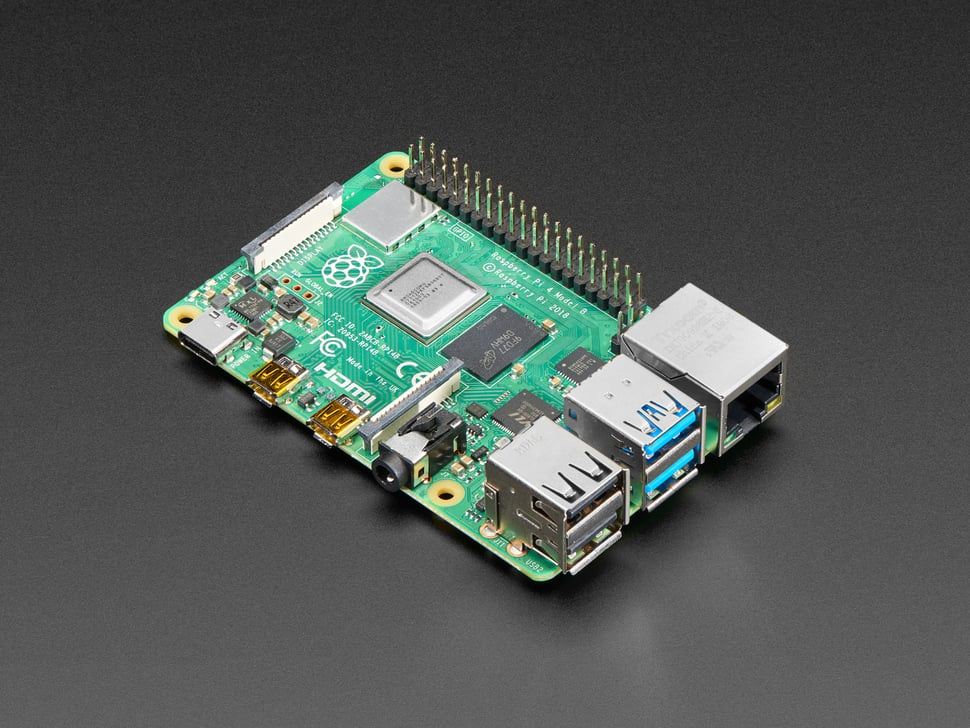
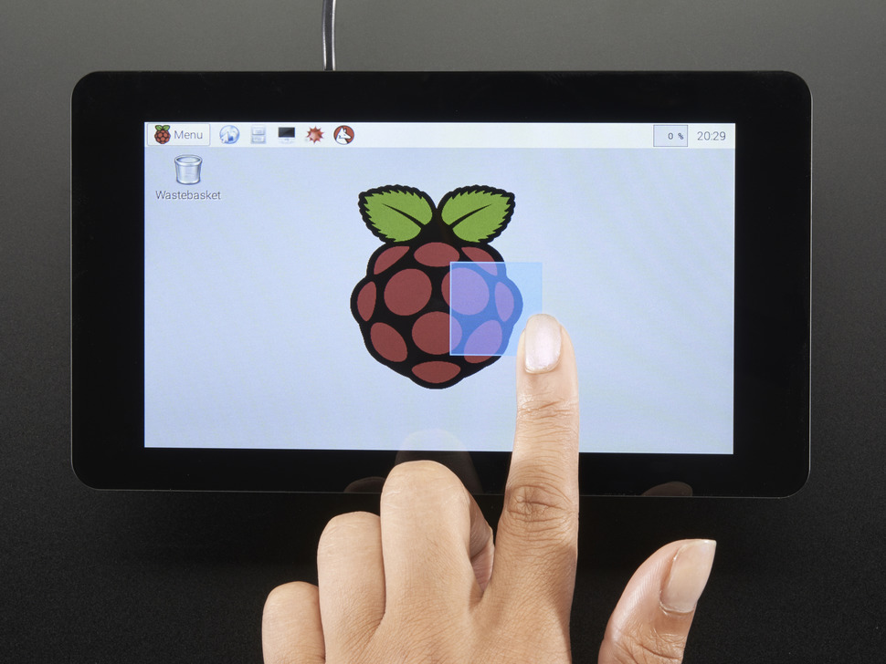
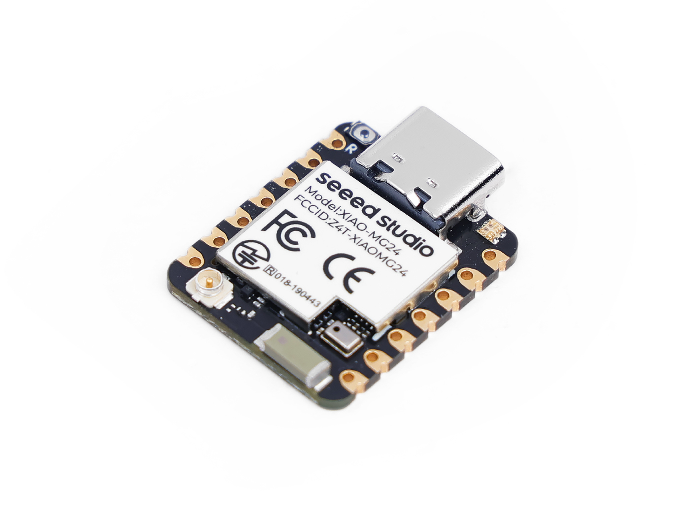
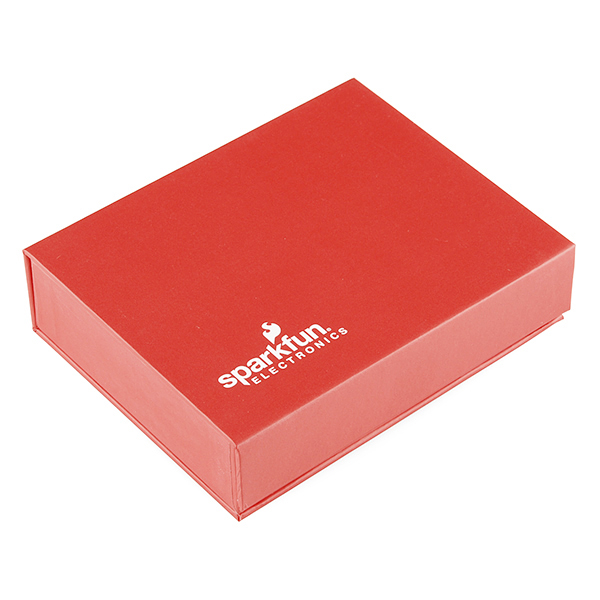

# [Project Name] — Setup Guide

> **Difficulty:** Beginner | **Time:** ~2 hours | **Last verified:** YYYY-MM-DD
> **Tested on:** macOS (see notes for Windows differences)

## What You'll Build

[1-2 sentences describing the finished product]

<!-- USER PHOTO: hero-complete-setup.jpg — Complete assembled setup -->


## Hardware Shopping List

| Item | Photo | Price | Link |
|------|-------|-------|------|
| Raspberry Pi 4 (4GB+) |  | ~$55 | [raspberrypi.com](https://www.raspberrypi.com/products/raspberry-pi-4-model-b/) |
| RPi 7" Touchscreen |  | ~$60 | [raspberrypi.com](https://www.raspberrypi.com/products/raspberry-pi-touch-display/) |
| Seeed XIAO MG24 (Sense) |  | ~$10 | [seeedstudio.com](https://www.seeedstudio.com/Seeed-XIAO-MG24-Sense-p-6248.html) |
| [DevKit Name] |  | ~$XX | [link] |
| [Sensor Name] |  | ~$XX | [link] |
| Qwiic Cable Kit |  | ~$8 | [sparkfun.com](https://www.sparkfun.com/products/15081) |
| USB-C Cable | - | ~$5 | - |
| microSD Card (32GB+) | - | ~$10 | - |

**Total: ~$XXX**

## Prerequisites

Before starting, make sure you have:
- [ ] Raspberry Pi OS installed and SSH working (see [Base Setup Guide](../SETUP-GUIDE.md#part-1))
- [ ] Docker + Home Assistant running (see [Base Setup Guide](../SETUP-GUIDE.md#part-2))
- [ ] Arduino IDE installed on your computer

## Step 1: Flash the Firmware

**Goal:** Get [sensor name] data flowing from [devkit name]
**Time:** ~15 minutes

### 1.1 Open Arduino IDE

Open Arduino IDE on your computer.

### 1.2 Install the Board Package

Go to **Tools > Board > Boards Manager** and search for `Silicon Labs`:


Install **Silicon Labs** (version X.X.X or later).

### 1.3 Select Your Board

Go to **Tools > Board > Silicon Labs** and select **[Board Name]**.


### 1.4 Select Port

Go to **Tools > Port** and select the serial port for your board.


> **Windows note:** The port will show as `COMx` instead of `/dev/cu.usbmodemXXX`.
> Open Device Manager to find the correct COM port.

### 1.5 Open the Firmware Sketch

Open the file: `firmware/[board-name]/[board-name].ino`


### 1.6 Upload

Click the **Upload** button (right arrow icon).


**Verify:** Open **Tools > Serial Monitor** at 115200 baud. You should see:
```
=== [Project Name] — [Node Name] ===
Grid-EYE (0x68)... OK
Matter device initialized
```


## Step 2: Commission to Home Assistant

**Goal:** Your sensor appears in Home Assistant
**Time:** ~10 minutes

### 2.1 Get the Pairing Code

In the Serial Monitor, find the line:
```
Manual pairing code: 34970112332
```

### 2.2 Add the Device in HA

1. Go to **Settings > Devices & Services > Matter**
2. Click **Add Device**
3. Enter the pairing code: `34970112332`
4. Wait for commissioning (~30 seconds)


**Verify:** The device appears under **Matter** integration with sensor entities.


## Step 3: [Next Step]

**Goal:** [What this achieves]
**Time:** ~X minutes

[Step instructions...]

**Verify:** [How to check it worked]

## Step N: Verify on Dashboard

<!-- USER PHOTO: kiosk-display-live.jpg — 7" display showing live dashboard -->


## Troubleshooting

### [Common Issue 1]
**Symptom:** [What you see]
**Cause:** [Why it happens]
**Fix:** [How to fix it]

### [Common Issue 2]
**Symptom:** [What you see]
**Cause:** [Why it happens]
**Fix:** [How to fix it]

### SSH connection refused (Windows)

**Symptom:** `ssh: connect to host smartpi.local port 22: Connection refused`
**Cause:** Windows may not resolve `.local` mDNS hostnames by default
**Fix:** Install [Bonjour Print Services](https://support.apple.com/kb/DL999) or use the RPi's IP address directly. Find it via your router's admin page or with `arp -a` on your network.

## Platform Notes

> This guide was tested on **macOS**. Here are the key differences for Windows users:

| Step | macOS | Windows |
|------|-------|---------|
| SSH | `ssh smartpi@smartpi.local` (built-in Terminal) | Use PowerShell, PuTTY, or Windows Terminal |
| Serial ports | `/dev/cu.usbmodemXXX` | `COMx` (check Device Manager) |
| SCP file copy | `scp -r folder/ smartpi@smartpi.local:~/` | Use WinSCP or `scp` in PowerShell |
| mDNS (.local) | Works out of the box | May need Bonjour installed |
| Arduino IDE | Same | Same |
| Playwright | Same | Same |

## What's Next?

- [ ] Add more sensors to the mesh
- [ ] Create HA automations
- [ ] Build a custom dashboard

---

*Guide created with the [Smart Home Matter Starter](../README.md). Verified on [date].*
