# Arduino IDE vs Zephyr RTOS: A Hands-On Comparison

**The Arduino developer's guide to real-time multithreading -- and why the pain of learning Zephyr pays off.**

<details>
<summary><strong>Table of Contents</strong></summary>

- [What You'll Build](#what-youll-build)
- [Part 0: Why Zephyr? (The Hook)](#part-0-why-zephyr-the-hook)
  - [0.1 The loop() Problem](#01-the-loop-problem)
  - [0.2 What Zephyr Gives You](#02-what-zephyr-gives-you)
- [Part 1: Setup -- What You Need](#part-1-setup----what-you-need)
  - [1.1 Hardware](#11-hardware)
  - [1.2 Software (Arduino Side)](#12-software-arduino-side)
  - [1.3 Software (Zephyr Side)](#13-software-zephyr-side)
  - [1.4 Verify the Toolchain](#14-verify-the-toolchain)
- [Part 2: The Arduino Way (Baseline)](#part-2-the-arduino-way-baseline)
  - [2.1 The Sketch](#21-the-sketch)
  - [2.2 Compile and Upload](#22-compile-and-upload)
  - [2.3 The Evidence: Serial Output](#23-the-evidence-serial-output)
- [Part 3: The Zephyr Way (Three Threads)](#part-3-the-zephyr-way-three-threads)
  - [3.1 Project Structure](#31-project-structure)
  - [3.2 The Application Code](#32-the-application-code)
  - [3.3 The Devicetree Overlay](#33-the-devicetree-overlay)
  - [3.4 Build and Flash](#34-build-and-flash)
  - [3.5 Serial Output: Proof of Concurrency](#35-serial-output-proof-of-concurrency)
- [Part 4: The Stutter Demo (Centerpiece)](#part-4-the-stutter-demo-centerpiece)
  - [4.1 Side-by-Side Comparison](#41-side-by-side-comparison)
  - [4.2 Serial Timestamp Analysis](#42-serial-timestamp-analysis)
  - [4.3 The Visual Proof](#43-the-visual-proof)
- [Part 5: Portability -- Same Code, Different Board](#part-5-portability----same-code-different-board)
  - [5.1 The SiWx917 Overlay](#51-the-siwx917-overlay)
  - [5.2 Build for SiWx917](#52-build-for-siwx917)
  - [5.3 Flash and Verify](#53-flash-and-verify)
  - [5.4 What Just Happened](#54-what-just-happened)
- [Part 6: BLE -- Wireless Sensor Broadcasting](#part-6-ble----wireless-sensor-broadcasting)
  - [6.1 What BLE Does in Our Demo](#61-what-ble-does-in-our-demo)
  - [6.2 See It With Your Phone](#62-see-it-with-your-phone)
  - [6.3 Arduino Cannot Do This](#63-arduino-cannot-do-this)
  - [6.4 BLE on SiWx917: The Debug Journey](#64-ble-on-siwx917-the-debug-journey)
- [Part 7: Energy -- Why Sleep Matters](#part-7-energy----why-sleep-matters)
  - [7.1 The Always-On Problem](#71-the-always-on-problem)
  - [7.2 Zephyr Sleeps Automatically](#72-zephyr-sleeps-automatically)
  - [7.3 Battery Life: A Thousand Times Better](#73-battery-life-a-thousand-times-better)
  - [7.4 What You Did NOT Have to Write](#74-what-you-did-not-have-to-write)
- [Part 8: The Honest Trade-offs](#part-8-the-honest-trade-offs)
  - [8.1 Setup Complexity](#81-setup-complexity)
  - [8.2 The Learning Curve](#82-the-learning-curve)
  - [8.3 Decision Matrix](#83-decision-matrix)
- [Appendix: Troubleshooting](#appendix-troubleshooting)
- [Software Versions (Pinned)](#software-versions-pinned)

</details>

---

## What You'll Build

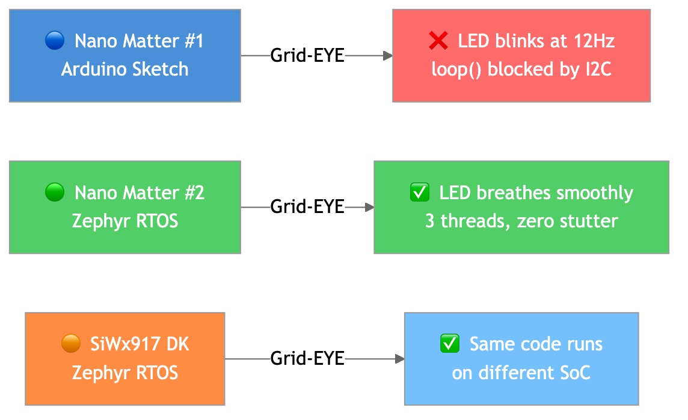

Three boards, three Grid-EYE thermal sensors, one question: **can your firmware do two things at once?**

You will build the same LED + sensor application twice — first in Arduino (single-threaded), then in Zephyr RTOS (multi-threaded) — and see the difference with your own eyes. Then you will take the Zephyr code and run it on a completely different SoC without changing a single line of application code.

<details><summary>Mermaid source</summary>

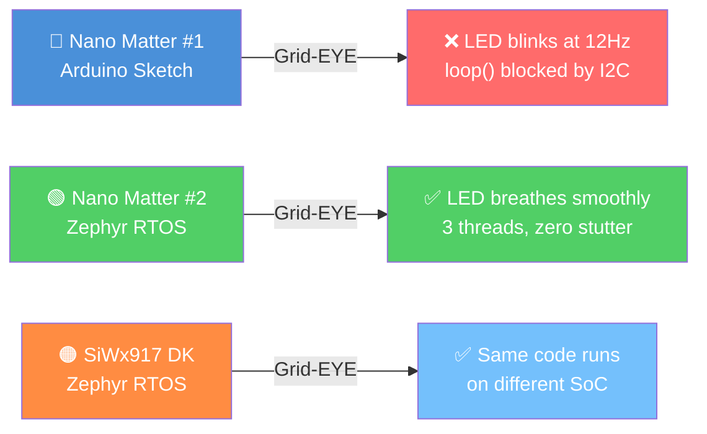
```mermaid
graph LR
    NM1["🔵 Nano Matter #1<br/>Arduino Sketch"] -- "Grid-EYE" --> R1["❌ LED blinks at 12Hz<br/>loop() blocked by I2C"]
    NM2["🟢 Nano Matter #2<br/>Zephyr RTOS"] -- "Grid-EYE" --> R2["✅ LED breathes smoothly<br/>3 threads, zero stutter"]
    SIW["🟠 SiWx917 DK<br/>Zephyr RTOS"] -- "Grid-EYE" --> R3["✅ Same code runs<br/>on different SoC"]

    style NM1 fill:#4a90d9,color:#fff
    style NM2 fill:#51cf66,color:#fff
    style SIW fill:#ff8c42,color:#fff
    style R1 fill:#ff6b6b,color:#fff
    style R2 fill:#51cf66,color:#fff
    style R3 fill:#74c0fc,color:#fff
```

</details>

---

## Part 0: Why Zephyr? (The Hook)

### 0.1 The loop() Problem

If you have written anything non-trivial on Arduino, you have hit this wall: you need to do two things at once, and `loop()` can only do one.

The Arduino model is elegant and simple. Your code lives in `setup()` and `loop()`. The loop runs over and over, as fast as possible, and you do everything inside it -- read sensors, update LEDs, check buttons, send data. It works beautifully for simple projects.

Then you add a sensor that takes 13 milliseconds to read over I2C. And suddenly your LED animation stutters. Your servo jitters. Your timing drifts.

This is not a bug. It is a fundamental design limitation. The `loop()` function is single-threaded. While it is waiting for I2C bytes to clock in, **nothing else can execute**. No LED updates. No button checks. No communication. The entire MCU is blocked, waiting for a slow peripheral bus.

You can work around it. You can use `millis()` timers, state machines, interrupts, and cooperative scheduling hacks. Many experienced Arduino developers do. But these are workarounds for a missing feature: **your code cannot run in parallel**.

### 0.2 What Zephyr Gives You

Zephyr RTOS gives you real threads. Not cooperative timers. Not interrupt-driven hacks. Actual, preemptive, priority-scheduled threads managed by a real-time kernel.

Your LED animation runs on one thread. Your sensor polling runs on another. Your BLE advertising runs on a third. When the sensor thread blocks on I2C, the kernel switches to the LED thread. The LED never stutters. The sensor gets its data. Nobody waits for anyone.

And there is a second killer feature: **portability**. The same Zephyr application -- the same `main.c` -- compiles and runs on completely different SoC families. An Arduino Nano Matter (EFR32/MGM240S) and a SiWx917 Dev Kit (Wi-Fi 6/BLE SoC) share zero silicon design heritage. But the same Zephyr app runs on both, without changing a single line of application code. The only difference is a small overlay file that tells the build system which I2C bus to use.

Arduino cannot do this. A sketch written for the Nano Matter would need a complete rewrite for the SiWx917.

Here is the architectural difference at a glance:

<details><summary>Mermaid source</summary>

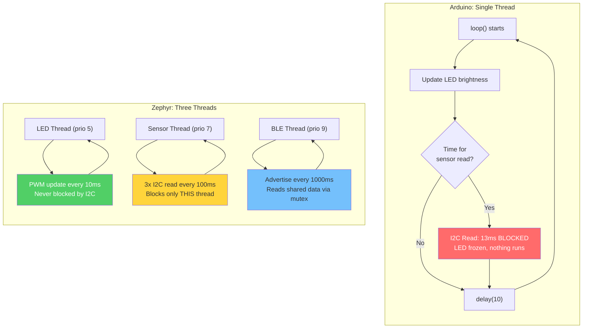
```mermaid
graph TD
    subgraph Arduino["Arduino: Single Thread"]
        direction TB
        A1["loop() starts"] --> A2["Update LED brightness"]
        A2 --> A3{"Time for<br/>sensor read?"}
        A3 -->|No| A5["delay(10)"]
        A3 -->|Yes| A4["I2C Read: 13ms BLOCKED<br/>LED frozen, nothing runs"]
        A4 --> A5
        A5 --> A1
    end

    subgraph Zephyr["Zephyr: Three Threads"]
        direction TB
        Z1["LED Thread (prio 5)"] --> Z1a["PWM update every 10ms<br/>Never blocked by I2C"]
        Z1a --> Z1
        Z2["Sensor Thread (prio 7)"] --> Z2a["3x I2C read every 100ms<br/>Blocks only THIS thread"]
        Z2a --> Z2
        Z3["BLE Thread (prio 9)"] --> Z3a["Advertise every 1000ms<br/>Reads shared data via mutex"]
        Z3a --> Z3
    end

    style A4 fill:#ff6b6b,color:#fff
    style Z1a fill:#51cf66,color:#fff
    style Z2a fill:#ffd43b,color:#333
    style Z3a fill:#74c0fc,color:#333
```

</details>

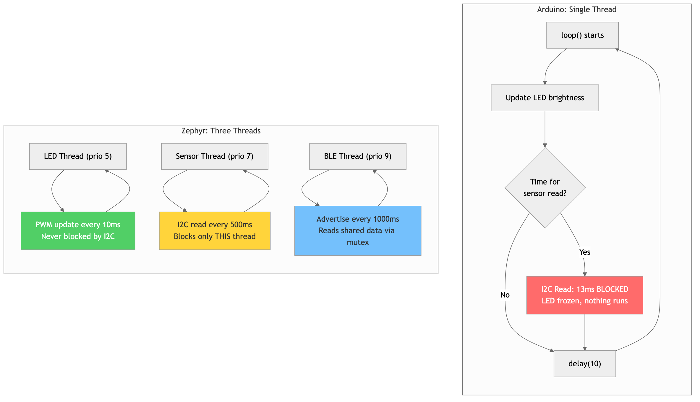

The red block in the Arduino diagram is the problem. The green block in the Zephyr diagram is the solution.

---

## Part 1: Setup -- What You Need

### 1.1 Hardware

| | Component | Store | Role | ~Price |
|:---:|-----------|:---:|------|:---:|
|  | [Arduino Nano Matter](https://store.arduino.cc/products/nano-matter) (MGM240S) ×2 | [store.arduino.cc](https://store.arduino.cc/products/nano-matter) | One runs Arduino sketch, one runs Zephyr | ~$16 each |
|  | [Arduino Nano Connector Carrier](https://store.arduino.cc/products/nano-connector-carrier) ×2 | [store.arduino.cc](https://store.arduino.cc/products/nano-connector-carrier) | Provides Qwiic port for sensors | ~$9 each |
|  | [SparkFun Grid-EYE AMG8833 Qwiic](https://www.sparkfun.com/products/14607) ×3 | [sparkfun.com](https://www.sparkfun.com/products/14607) | 8×8 thermal sensor (2 for Nano Matters, 1 for SiWx917) | ~$40 each |
|  | [SiWx917 Dev Kit (BRD2605A)](https://www.silabs.com/development-tools/wireless/wi-fi/siwx917-dk2605a-wifi-6-bluetooth-le-soc-dev-kit) | [silabs.com](https://www.silabs.com/development-tools/wireless/wi-fi/siwx917-dk2605a-wifi-6-bluetooth-le-soc-dev-kit) | Portability demo — different SoC, same code (Part 5) | ~$30 |
|  | [Qwiic/STEMMA QT cables](https://www.sparkfun.com/products/14427) ×3 | [sparkfun.com](https://www.sparkfun.com/products/14427) | Plug-and-play I2C — zero soldering | ~$2 each |
|  | USB cables (USB-C + micro-USB) ×3 | Any electronics store | Short, thick cables recommended | ~$5 each |

**Total: ~$206** for the full 3-board demo. You can skip the SiWx917 DK (~$30 + 1 Grid-EYE ~$40) and do Parts 1–4 with just 2 Nano Matters for ~$136.

All sensor connections are via Qwiic/STEMMA QT -- zero soldering required.

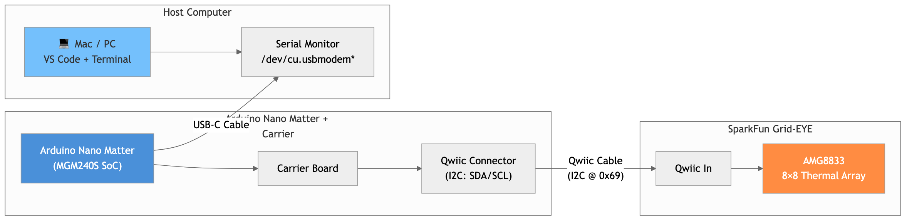

<details><summary>Mermaid source</summary>

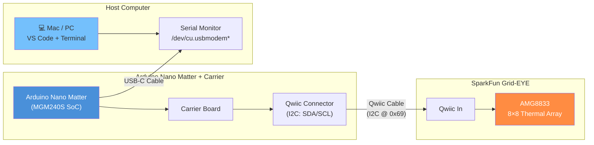
```mermaid
graph LR
    subgraph BOARD["Arduino Nano Matter + Carrier"]
        direction TB
        NM["Arduino Nano Matter<br/>(MGM240S SoC)"]
        CAR["Carrier Board"]
        QWIIC["Qwiic Connector<br/>(I2C: SDA/SCL)"]
        NM --> CAR
        CAR --> QWIIC
    end

    subgraph SENSOR["SparkFun Grid-EYE"]
        direction TB
        GE["AMG8833<br/>8×8 Thermal Array"]
        QC["Qwiic In"]
        QC --> GE
    end

    subgraph USB["Host Computer"]
        direction TB
        MAC["💻 Mac / PC<br/>VS Code + Terminal"]
        SERIAL["Serial Monitor<br/>/dev/cu.usbmodem*"]
        MAC --> SERIAL
    end

    QWIIC -- "Qwiic Cable<br/>(I2C @ 0x69)" --> QC
    NM -- "USB-C Cable" --> SERIAL

    style NM fill:#4a90d9,color:#fff
    style GE fill:#ff8c42,color:#fff
    style MAC fill:#74c0fc,color:#333
```

</details>

**Important:** The Grid-EYE AMG8833 uses I2C address **0x69** (not 0x68 as many tutorials assume). This is already configured in both the Arduino sketch and the Zephyr devicetree overlay.

### 1.2 Software (Arduino Side)

If you already have Arduino IDE set up with the Silicon Labs board package, you are good. If not:

1. **Arduino IDE 2.x** -- Download from [arduino.cc](https://www.arduino.cc/en/software). On Mac, install by dragging to Applications from the DMG (do not use Homebrew).
2. **Silicon Labs board package** -- In Arduino IDE: File > Preferences > Additional Board Manager URLs, add:
   ```
   https://siliconlabs.github.io/arduino/package_arduinosilabs_index.json
   ```
   Then: Tools > Board > Boards Manager > search "Silicon Labs" > Install.
3. **Adafruit AMG88xx library** -- Sketch > Include Library > Manage Libraries > search "Adafruit AMG88xx" > Install.
4. **arduino-cli** (optional, for command-line builds):
   ```bash
   brew install arduino-cli
   arduino-cli core install SiliconLabs:silabs
   arduino-cli lib install "Adafruit AMG88xx Library"
   ```

### 1.3 Software (Zephyr Side)

This is the harder part. Zephyr has a real toolchain with real complexity. Budget 30 minutes for first-time setup.

**Prerequisites (Mac):**

```bash
# Homebrew packages
brew install cmake ninja gperf python3 ccache qemu dtc wget

# Python virtual environment (recommended to avoid system conflicts)
python3 -m venv ~/zephyrproject/.venv
source ~/zephyrproject/.venv/bin/activate
```

**Prerequisites (Windows):**

Install [Chocolatey](https://chocolatey.org/), then:

```powershell
choco install cmake ninja gperf python3 dtc-msys2 wget
python -m venv %HOMEPATH%\zephyrproject\.venv
%HOMEPATH%\zephyrproject\.venv\Scripts\activate
```

**Install West and initialize the Zephyr workspace:**

```bash
# Install west (Zephyr's meta-tool for building, flashing, managing)
pip3 install west

# Initialize workspace -- this downloads the Zephyr source tree
west init ~/zephyrproject
cd ~/zephyrproject
west update
```

> **Note:** `west update` downloads several GB of source code and HALs. This takes 10-20 minutes on a typical connection. Go get coffee. When it finishes, you should see no errors -- the last lines will show the final module being updated (e.g., `=== updating modules/lib/...`). If any module fails, just run `west update` again to resume.

**Install additional Python dependencies:**

```bash
pip3 install -r ~/zephyrproject/zephyr/scripts/requirements.txt
```

**Install the Zephyr SDK (compiler toolchain):**

The Zephyr SDK contains the ARM cross-compiler, debugger, and host tools.

Mac:
```bash
cd ~
wget https://github.com/zephyrproject-rtos/sdk-ng/releases/download/v0.17.0/zephyr-sdk-0.17.0_macos-x86_64.tar.xz
tar xf zephyr-sdk-0.17.0_macos-x86_64.tar.xz
cd zephyr-sdk-0.17.0
./setup.sh
```

> **Apple Silicon (M1/M2/M3):** Use the `macos-aarch64` variant instead of `macos-x86_64`.

Windows:
```powershell
# Download from https://github.com/zephyrproject-rtos/sdk-ng/releases
# Run the installer .exe
```

**Set environment variables** (add these lines to your shell config file -- `~/.zshrc` on Mac, `~/.bashrc` on Linux -- so they persist across terminal sessions):

```bash
export ZEPHYR_BASE=~/zephyrproject/zephyr
export ZEPHYR_SDK_INSTALL_DIR=~/zephyr-sdk-0.17.0
```

### 1.4 Verify the Toolchain

Build the hello_world sample to confirm everything works:

```bash
source ~/zephyrproject/.venv/bin/activate
cd ~/zephyrproject
west build -b arduino_nano_matter zephyr/samples/hello_world
```

If this compiles without errors, your Zephyr toolchain is ready. The output binary is at `build/zephyr/zephyr.hex`.

Expected last lines:

<pre style="background:#1e1e1e;color:#d4d4d4;padding:14px 18px;border-radius:6px;font-family:'Menlo','Monaco','Courier New',monospace;font-size:12.5px;line-height:1.6;overflow-x:auto;">[154/154] Linking C executable zephyr/zephyr.elf
Memory region         Used Size  Region Size  %age Used
           FLASH:       17284 B         1 MB      1.65%
             RAM:        4416 B       256 KB      1.68%
        IDT_LIST:          0 GB        32 KB      0.00%
</pre>

---

## Part 2: The Arduino Way (Baseline)

### 2.1 The Sketch

File: [`firmware/arduino/led-sensor/led-sensor.ino`](../firmware/arduino/led-sensor/led-sensor.ino)

Here is the complete Arduino sketch. Read the comments carefully -- they explain exactly where and why the stutter happens.

```cpp
/*
 * Arduino IDE: LED + Grid-EYE Demo (The "Before")
 *
 * Demonstrates the fundamental problem with Arduino's single-threaded loop():
 * - LED toggle (on/off blink) runs in loop()
 * - Grid-EYE I2C reads also happen in loop()
 * - 3 sensor reads × ~13ms = ~39ms blocked per iteration
 * - LED only toggles at ~12Hz → visible blinking like a turn signal
 *
 * Compare with the Zephyr version:
 * - LED thread does smooth PWM breathing at 100Hz (buttery smooth)
 * - Sensor thread does the same 3 reads independently
 * - Zero interference — the kernel scheduler handles concurrency
 *
 * This is NOT a bug — it's a design limitation of the Arduino model.
 * The loop() function can only do one thing at a time.
 *
 * Hardware: Arduino Nano Matter + Carrier + Grid-EYE AMG8833 (Qwiic)
 * Grid-EYE I2C address: 0x69
 */

#include <Wire.h>
#include <Adafruit_AMG88xx.h>

/* Grid-EYE sensor instance */
Adafruit_AMG88xx amg;

/* 64-pixel temperature array (8×8 grid) */
float pixels[AMG88xx_PIXEL_ARRAY_SIZE];

/*
 * RGB LED pins on Arduino Nano Matter
 * LEDR (pin 22) = Red   = PC1 on MGM240S
 * LEDG (pin 23) = Green = PC2
 * LEDB (pin 24) = Blue  = PC3
 * All are active LOW — digitalWrite(LEDB, LOW) = ON, HIGH = OFF
 */

/* LED toggle state (on/off blink pattern) */
bool ledState = false;

/* Timing statistics */
unsigned long loopCount = 0;
float maxTemp = 0.0;

void setup() {
  Serial.begin(115200);

  /* Wait for USB serial to connect (important for SiLabs boards) */
  delay(2000);

  /* Configure RGB LED pins */
  pinMode(LEDR, OUTPUT);
  pinMode(LEDG, OUTPUT);
  pinMode(LEDB, OUTPUT);

  /* Start with LED off (active LOW: HIGH = off) */
  digitalWrite(LEDR, HIGH);
  digitalWrite(LEDG, HIGH);
  digitalWrite(LEDB, HIGH);

  Serial.println();
  Serial.println("=============================================");
  Serial.println("  Arduino LED + Grid-EYE Demo (Stutter Demo)");
  Serial.println("=============================================");
  Serial.println("Watch the blue LED on this board.");
  Serial.println();
  Serial.println("TARGET:  LED toggles fast -> appears as steady glow");
  Serial.println("REALITY: 3x sensor reads block ~39ms per loop");
  Serial.println("         LED only toggles at ~12Hz -> visible blink!");
  Serial.println();
  Serial.println("Now look at the Zephyr board: smooth PWM breathing.");
  Serial.println("Same sensor. Same LED. Different architecture.");
  Serial.println();

  /* Initialize Grid-EYE at address 0x69 */
  if (!amg.begin(0x69)) {
    Serial.println("ERROR: AMG8833 not found at 0x69!");
    Serial.println("Check: Qwiic cable connected? Sensor powered?");
    /* Blink red LED to signal error */
    while (1) {
      digitalWrite(LEDR, LOW);
      delay(200);
      digitalWrite(LEDR, HIGH);
      delay(200);
    }
  }
  Serial.println("AMG8833 Grid-EYE initialized at 0x69.");
  Serial.println("Starting LED blink + sensor polling...");
  Serial.println();
}

void loop() {
  unsigned long loopStart = micros();
  loopCount++;

  /*
   * TOGGLE LED — simple on/off blink.
   *
   * In a properly threaded RTOS, the LED could run at 100Hz
   * (appears as a steady glow) or use PWM for smooth breathing.
   * But in loop(), the I2C reads below will block us for ~39ms,
   * so the LED can only toggle at ~12Hz — a visible, crude blink.
   */
  ledState = !ledState;
  digitalWrite(LEDB, ledState ? LOW : HIGH);  /* Active LOW */

  /*
   * SENSOR READS — THIS IS WHERE THE BLOCKING HAPPENS
   *
   * Each readPixels() reads 128 bytes over I2C at 100kHz → ~13ms.
   * We read 3 times to represent a realistic IoT workload:
   *   - Read #1: primary temperature measurement
   *   - Read #2: verification/averaging read
   *   - Read #3: simulates a second I2C device (display, IMU, etc.)
   *
   * In real IoT firmware, loop() often handles:
   *   - Multiple sensor reads (temperature + humidity + motion)
   *   - Display updates (OLED refresh over I2C: 10-50ms)
   *   - Communication (BLE advertising, serial logging)
   * Total blocking of 30-100ms per loop is common.
   *
   * Result: ~39ms of I2C blocking → LED toggles at ~12Hz.
   * That's a visible blink, like a turn signal.
   *
   * On Zephyr, these same reads happen on a SEPARATE thread.
   * The LED thread keeps running at 100Hz — zero interference.
   */
  unsigned long sensorStart = micros();

  for (int r = 0; r < 3; r++) {
    amg.readPixels(pixels);  /* ~13ms each — BLOCKS everything */
  }

  unsigned long sensorDuration = micros() - sensorStart;

  /* Find the hottest pixel (uses last read's data) */
  maxTemp = pixels[0];
  for (int i = 1; i < AMG88xx_PIXEL_ARRAY_SIZE; i++) {
    if (pixels[i] > maxTemp) {
      maxTemp = pixels[i];
    }
  }

  unsigned long loopDuration = micros() - loopStart;

  /* Print timing proof every 20 loops (~1.6 seconds at 12Hz) */
  if (loopCount % 20 == 0) {
    Serial.print("[STUTTER] Loop #");
    Serial.print(loopCount);
    Serial.print(": ");
    Serial.print(loopDuration / 1000.0, 1);
    Serial.print(" ms total (");
    Serial.print(sensorDuration / 1000.0, 1);
    Serial.print(" ms I2C) | ~");
    Serial.print(1000000.0 / loopDuration / 2, 0);
    Serial.print(" Hz blink | Max: ");
    Serial.print(maxTemp, 1);
    Serial.println(" C");
  }

  /*
   * Minimal delay (1ms) — standard Arduino practice.
   * The real bottleneck is the ~39ms of I2C reads above.
   * Total loop time: ~40ms → LED toggles at ~12Hz → visible blink.
   */
  delay(1);
}
```

The critical section is the sensor read inside `loop()`. Each `amg.readPixels(pixels)` reads 128 bytes over I2C at 100kHz, blocking for ~13ms. The demo reads the sensor 3 times per loop (simulating a realistic IoT workload with multiple sensors), totaling ~39ms of blocking per iteration. During that time, the LED toggle is frozen. The LED visibly blinks at ~12Hz instead of appearing as a steady glow.

### 2.2 Compile and Upload

**Using Arduino IDE (GUI):**

1. Open `firmware/arduino/led-sensor/led-sensor.ino` in Arduino IDE
2. Tools > Board > Silicon Labs > Arduino Nano Matter
3. Tools > Port > select the Nano Matter's serial port (e.g., `/dev/cu.usbmodemXXX`)
4. Click Upload (right arrow button)

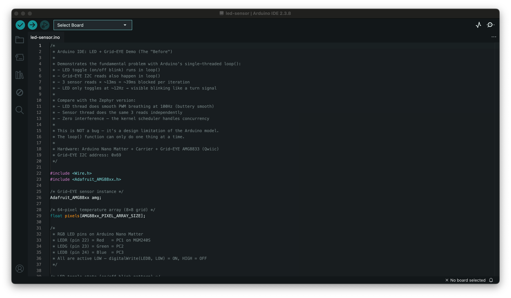

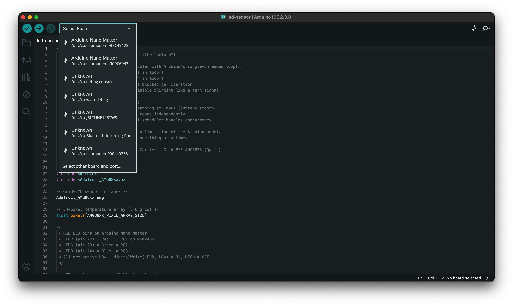

**Using arduino-cli (command line):**

```bash
# Find your board's port
arduino-cli board list

# Compile
arduino-cli compile --fqbn SiliconLabs:silabs:nano_matter firmware/arduino/led-sensor/

# Upload (replace port with yours)
arduino-cli upload -p /dev/cu.usbmodemXXX --fqbn SiliconLabs:silabs:nano_matter firmware/arduino/led-sensor/
```

> **SiLabs serial tip:** These boards do not DTR-reset like standard Arduinos. If you want to see boot messages, open your serial monitor BEFORE uploading -- the serial port stays active through the upload process on SiLabs boards.

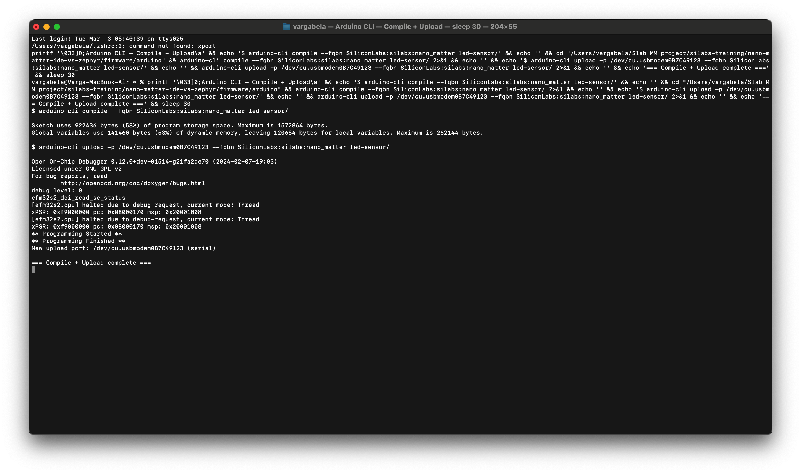

### 2.3 The Evidence: Serial Output

Open the serial monitor at 115200 baud. You will see output like this:

<pre style="background:#1e1e1e;color:#d4d4d4;padding:14px 18px;border-radius:6px;font-family:'Menlo','Monaco','Courier New',monospace;font-size:12.5px;line-height:1.6;overflow-x:auto;">=============================================
  Arduino LED + Grid-EYE Demo (Stutter Demo)
=============================================
Watch the blue LED on this board.

TARGET:  LED toggles fast -> appears as steady glow
REALITY: 3x sensor reads block ~39ms per loop
         LED only toggles at ~12Hz -> visible blink!

Now look at the Zephyr board: smooth PWM breathing.
Same sensor. Same LED. Different architecture.

AMG8833 Grid-EYE initialized at 0x69.
Starting LED blink + sensor polling...

[STUTTER] Loop #20: 41.4 ms total (41.4 ms I2C) | ~12 Hz blink | Max: 26.0 C
[STUTTER] Loop #40: 40.8 ms total (40.7 ms I2C) | ~12 Hz blink | Max: 25.8 C
[STUTTER] Loop #60: 40.3 ms total (40.3 ms I2C) | ~12 Hz blink | Max: 26.0 C
[STUTTER] Loop #80: 41.0 ms total (41.0 ms I2C) | ~12 Hz blink | Max: 25.8 C
[STUTTER] Loop #100: 41.1 ms total (41.1 ms I2C) | ~12 Hz blink | Max: 25.8 C
</pre>

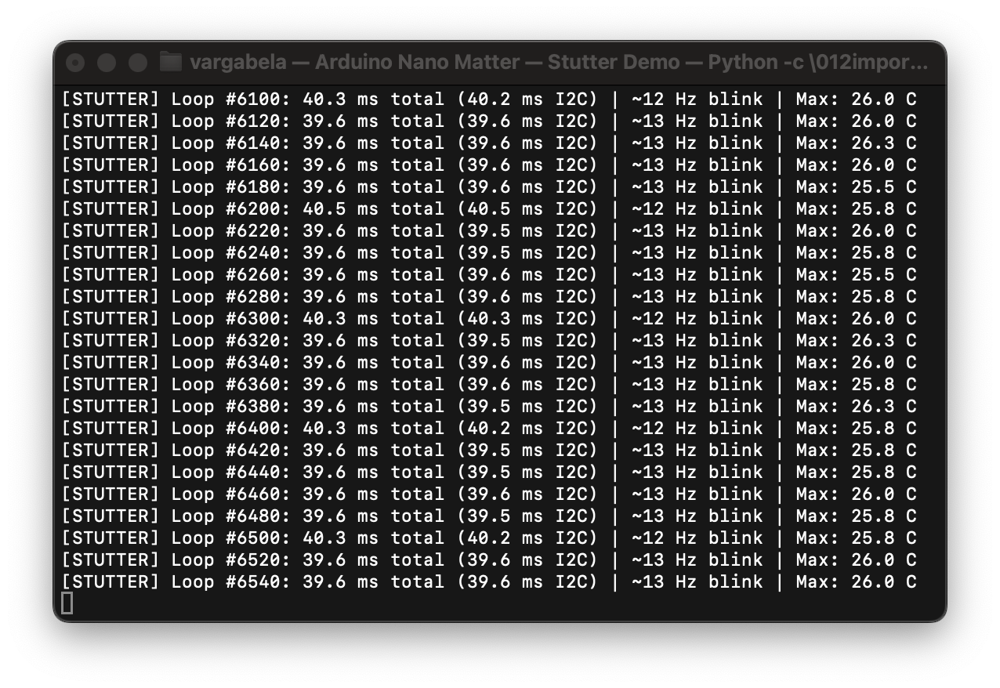

Two things to notice:

1. **Every loop takes ~41ms.** Three sensor reads consume the entire loop time. The LED can only toggle once per iteration -- at ~12Hz, that is a clearly visible on-off blink.
2. **The LED blinks like a turn signal.** At 12Hz, each on/off state lasts ~41ms. This is not a subtle stutter -- it is a crude, visible blink. Compare this with the Zephyr board's smooth PWM breathing.

Now look at the blue LED on the board. It blinks on and off, roughly 12 times per second. That is `loop()` fighting the I2C bus for every iteration.

---

## Part 3: The Zephyr Way (Three Threads)

### 3.1 Project Structure

A Zephyr application is not a single `.ino` file. It is a structured project with build configuration:

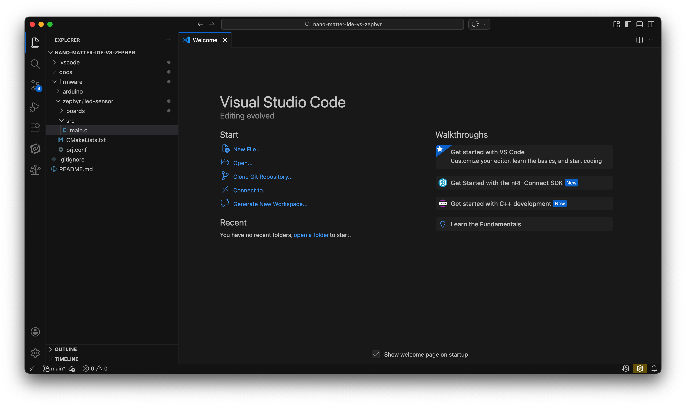

```
firmware/zephyr/led-sensor/
  CMakeLists.txt              # Build system entry point
  prj.conf                    # Kconfig: which Zephyr subsystems to enable
  src/
    main.c                    # Application code (all three threads)
  boards/
    arduino_nano_matter.overlay  # Devicetree: sensor + I2C config for Nano Matter
    arduino_nano_matter.conf     # Board-specific Kconfig (enable PWM)
    siwx917_dk2605a.overlay      # Devicetree: sensor config for SiWx917
    siwx917_dk2605a.conf         # Board-specific Kconfig (GPIO-only LEDs)
```

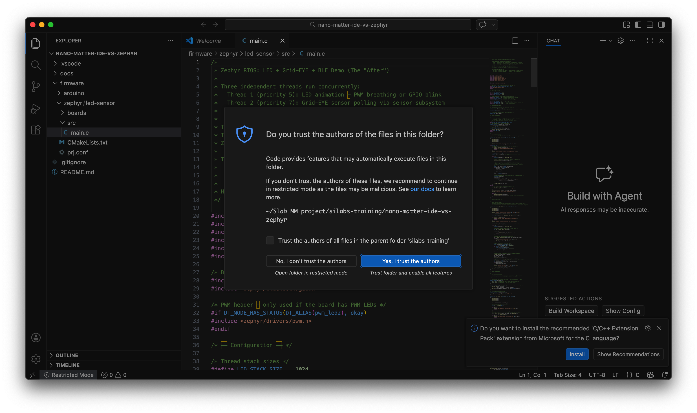

This looks like more files than Arduino, and it is. But each file has a clear purpose:

- **`CMakeLists.txt`** -- Tells the build system where to find source files. Rarely changes.
- **`prj.conf`** -- Lists which Zephyr features you need: I2C, GPIO, BLE, sensor subsystem. Think of it as `#include` for kernel modules.
- **`main.c`** -- Your application code. This is the one file you actually write.
- **`boards/*.overlay`** -- Hardware-specific configuration in devicetree format. This is where you say "the AMG88xx sensor is on I2C bus X at address 0x69." Different file per board -- the application code does not change.
- **`boards/*.conf`** -- Board-specific Kconfig overrides (e.g., enable PWM on boards that have it).

### 3.2 The Application Code

File: [`firmware/zephyr/led-sensor/src/main.c`](../firmware/zephyr/led-sensor/src/main.c)

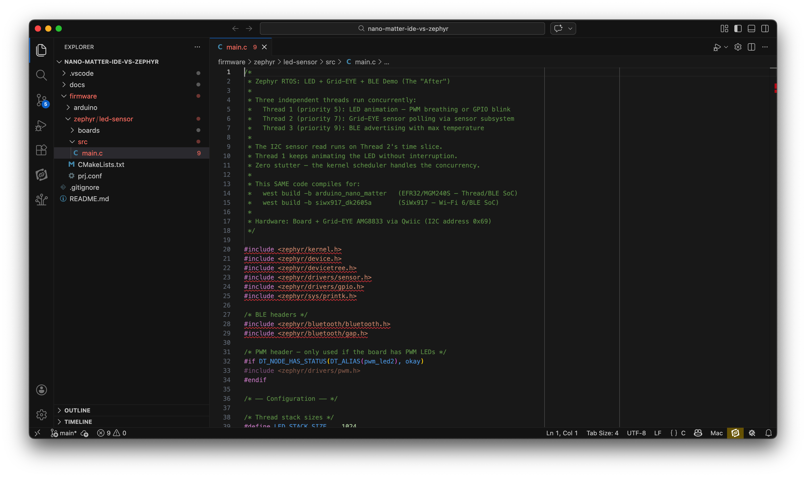

This is the complete application. Three threads, each doing one job. The code below shows key excerpts -- the full file is at [`firmware/zephyr/led-sensor/src/main.c`](../firmware/zephyr/led-sensor/src/main.c):

```c
/*
 * Zephyr RTOS: LED + Grid-EYE + BLE Demo (The "After")
 *
 * Three independent threads run concurrently:
 *   Thread 1 (priority 5): LED animation — PWM breathing or GPIO blink
 *   Thread 2 (priority 7): Grid-EYE sensor polling via sensor subsystem
 *   Thread 3 (priority 9): BLE advertising with max temperature
 *
 * The I2C sensor read runs on Thread 2's time slice.
 * Thread 1 keeps animating the LED without interruption.
 * Zero stutter — the kernel scheduler handles the concurrency.
 *
 * This SAME code compiles for:
 *   west build -b arduino_nano_matter   (EFR32/MGM240S — Thread/BLE SoC)
 *   west build -b siwx917_dk2605a       (SiWx917 — Wi-Fi 6/BLE SoC)
 *
 * Hardware: Board + Grid-EYE AMG8833 via Qwiic (I2C address 0x69)
 */

#include <zephyr/kernel.h>
#include <zephyr/device.h>
#include <zephyr/devicetree.h>
#include <zephyr/drivers/sensor.h>
#include <zephyr/drivers/gpio.h>
#include <zephyr/sys/printk.h>
#include <zephyr/bluetooth/bluetooth.h>
#include <zephyr/bluetooth/gap.h>

#if DT_NODE_HAS_STATUS(DT_ALIAS(pwm_led2), okay)
#include <zephyr/drivers/pwm.h>
#endif

/* ── Configuration ── */

#define LED_STACK_SIZE    1024
#define SENSOR_STACK_SIZE 2048
#define BLE_STACK_SIZE    2048

/* Thread priorities (lower number = higher priority) */
#define LED_PRIORITY    5   /* Highest: LED must never stutter */
#define SENSOR_PRIORITY 7   /* Medium: sensor polling */
#define BLE_PRIORITY    9   /* Lowest: BLE advertising */

#define LED_TICK_MS     10   /* 100 Hz LED update rate */
#define SENSOR_POLL_MS  100  /* 10 Hz sensor polling (same rate as Arduino) */
#define BLE_UPDATE_MS   1000 /* 1 Hz BLE data update */

/* ── Shared State ── */

static struct k_mutex temp_mutex;
static float max_temp;
static bool sensor_ready;
```

**The LED thread** (priority 5 -- highest) runs every 10ms and updates PWM brightness. It never touches I2C, so it never blocks:

```c
static void led_thread_fn(void *p1, void *p2, void *p3)
{
    /* ... setup PWM ... */

    while (1) {
        uint32_t tick_start = k_uptime_get_32();
        pwm_set_pulse_dt(&blue_pwm_led, pulse);

        /* Advance brightness (same ramp as Arduino) */
        pulse += step;
        /* ... bounds check ... */

        /* Log timing every 500 ticks to prove consistency */
        static int tick_count;
        tick_count++;
        if (tick_count % 500 == 0) {
            uint32_t elapsed = k_uptime_get_32() - tick_start;
            printk("[LED] tick #%d: %u ms (target: <%d ms)\n",
                   tick_count, elapsed, LED_TICK_MS);
        }

        k_sleep(K_MSEC(LED_TICK_MS));
    }
}
```

**The sensor thread** (priority 7 -- medium) reads the Grid-EYE every 100ms. It reads 3 times per poll (~39ms of I2C blocking), the same workload as the Arduino demo -- but it only blocks this thread. The LED thread keeps running:

```c
static void sensor_thread_fn(void *p1, void *p2, void *p3)
{
    /* Get device from devicetree — no hardcoded address */
    const struct device *amg = DEVICE_DT_GET_ONE(panasonic_amg88xx);

    while (1) {
        uint32_t read_start = k_uptime_get_32();

        /* Read 3 times — same workload as the Arduino demo.
         * 3 × ~13ms = ~39ms of I2C blocking on THIS thread only. */
        for (int r = 0; r < 3; r++) {
            ret = sensor_sample_fetch(amg);
            /* ... error handling ... */
        }

        /* Find hottest pixel */
        /* ... */

        /* Update shared state with mutex protection */
        k_mutex_lock(&temp_mutex, K_FOREVER);
        max_temp = local_max;
        sensor_ready = true;
        k_mutex_unlock(&temp_mutex);

        uint32_t read_elapsed = k_uptime_get_32() - read_start;
        printk("[SENSOR] 3x read took %u ms | Max: %d.%02d C\n",
               read_elapsed, temp_int, temp_frac);

        k_sleep(K_MSEC(SENSOR_POLL_MS));
    }
}
```

**The BLE thread** (priority 9 -- lowest) broadcasts the latest temperature as a BLE advertisement. Any BLE scanner app (such as [Simplicity Connect](https://play.google.com/store/apps/details?id=com.siliconlabs.bledemo) by Silicon Labs) can see "ZephyrGridEye" and read the temperature:

```c
static void ble_thread_fn(void *p1, void *p2, void *p3)
{
    bt_enable(NULL);
    bt_le_adv_start(BT_LE_ADV_NCONN, ad, ARRAY_SIZE(ad),
                    sd, ARRAY_SIZE(sd));

    while (1) {
        /* Read temperature from shared state */
        k_mutex_lock(&temp_mutex, K_FOREVER);
        float temp = max_temp;
        k_mutex_unlock(&temp_mutex);

        /* Encode and update advertising data */
        /* ... */

        printk("[BLE] Broadcasting temp: %d.%02d C\n",
               temp_int, temp_frac);

        k_sleep(K_MSEC(BLE_UPDATE_MS));
    }
}
```

**Thread creation** -- the threads are defined at compile time and start automatically when the kernel boots:

```c
K_THREAD_DEFINE(led_tid, LED_STACK_SIZE,
                led_thread_fn, NULL, NULL, NULL,
                LED_PRIORITY, 0, 0);

K_THREAD_DEFINE(sensor_tid, SENSOR_STACK_SIZE,
                sensor_thread_fn, NULL, NULL, NULL,
                SENSOR_PRIORITY, 0, 0);

K_THREAD_DEFINE(ble_tid, BLE_STACK_SIZE,
                ble_thread_fn, NULL, NULL, NULL,
                BLE_PRIORITY, 0, 0);
```

`K_THREAD_DEFINE` is a macro that allocates the stack, creates the thread control block, and registers it with the kernel. No `pthread_create()`, no manual stack allocation. The threads exist before `main()` even runs.

### 3.3 The Devicetree Overlay

This is where the hardware abstraction happens. Instead of writing `amg.begin(0x69)` in your application code, you declare the sensor in a devicetree overlay file.

File: [`firmware/zephyr/led-sensor/boards/arduino_nano_matter.overlay`](../firmware/zephyr/led-sensor/boards/arduino_nano_matter.overlay)

```dts
/*
 * Devicetree overlay for Arduino Nano Matter
 *
 * Enables I2C0 and adds the Grid-EYE AMG8833 thermal sensor.
 * I2C0 pins: SDA = PA6 (A4), SCL = PA7 (A5) — connected via Qwiic on Carrier.
 * Grid-EYE address: 0x69 (NOT the more common 0x68).
 *
 * The int-gpios property points to an unused pin (PD2 = D6).
 * We use polling mode, so the interrupt line is not physically connected
 * — but the DT binding requires it.
 */

&i2c0 {
    status = "okay";

    amg88xx: amg88xx@69 {
        compatible = "panasonic,amg88xx";
        reg = <0x69>;
        int-gpios = <&gpiod 2 GPIO_ACTIVE_LOW>;
    };
};
```

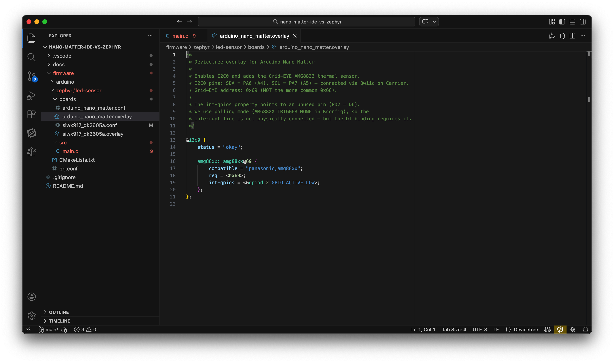

Notice what is NOT in `main.c`:
- No `#include <Wire.h>`
- No `amg.begin(0x69)`
- No hardcoded I2C address
- No pin definitions for SDA/SCL

The application code says `DEVICE_DT_GET_ONE(panasonic_amg88xx)` -- "give me the AMG88xx device." The build system looks at the overlay, finds the sensor on `&i2c0` at address `0x69`, and generates all the glue code. If you move the sensor to a different I2C bus or change the address, you edit the overlay file. The application code does not change.

The board-specific Kconfig enables PWM for smooth LED breathing:

File: [`firmware/zephyr/led-sensor/boards/arduino_nano_matter.conf`](../firmware/zephyr/led-sensor/boards/arduino_nano_matter.conf)

```
# Board-specific config: Arduino Nano Matter
# This board has PWM-capable RGB LEDs (timer0 on PC1/PC2/PC3).
# Enable PWM for smooth LED breathing animation.

CONFIG_PWM=y
```

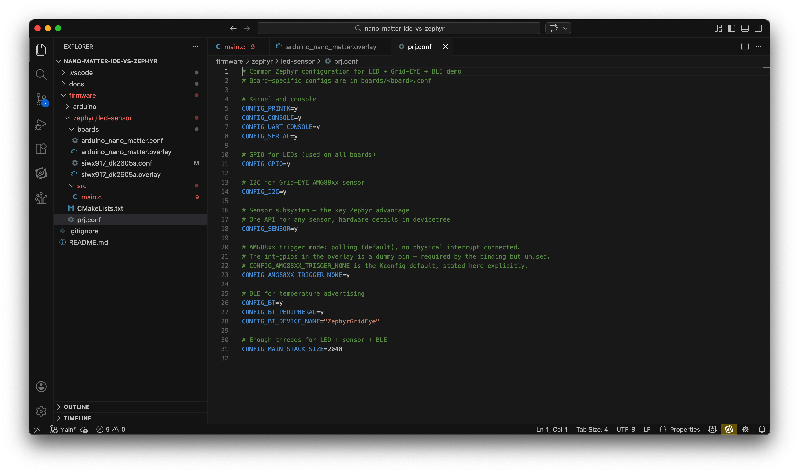

The common project configuration enables all shared subsystems:

File: [`firmware/zephyr/led-sensor/prj.conf`](../firmware/zephyr/led-sensor/prj.conf)

```
# Kernel and console
CONFIG_PRINTK=y
CONFIG_CONSOLE=y
CONFIG_UART_CONSOLE=y
CONFIG_SERIAL=y

# GPIO for LEDs (used on all boards)
CONFIG_GPIO=y

# I2C for Grid-EYE AMG88xx sensor
CONFIG_I2C=y

# Sensor subsystem — the key Zephyr advantage
# One API for any sensor, hardware details in devicetree
CONFIG_SENSOR=y

# AMG88xx trigger mode: polling (no physical interrupt connected)
CONFIG_AMG88XX_TRIGGER_NONE=y

# BLE for temperature advertising
CONFIG_BT=y
CONFIG_BT_PERIPHERAL=y
CONFIG_BT_DEVICE_NAME="ZephyrGridEye"

# Power management — kernel auto-sleeps when all threads are in k_sleep()
# On EFR32MG24: enters EM2 deep sleep (1.3 µA) between thread wake-ups
CONFIG_PM=y

# Enough threads for LED + sensor + BLE
CONFIG_MAIN_STACK_SIZE=2048
```

### 3.4 Build and Flash

> **Where you should be:** Open a **terminal** (Mac: Terminal.app or VS Code's integrated terminal; Windows: PowerShell). The Zephyr build uses command-line tools, not the Arduino IDE.

```bash
# Activate the Zephyr virtual environment
source ~/zephyrproject/.venv/bin/activate

# Build for Arduino Nano Matter
cd ~/zephyrproject
west build -b arduino_nano_matter /path/to/firmware/zephyr/led-sensor
```

> **Replace `/path/to/`** with the actual absolute path to your project. For example:
> `west build -b arduino_nano_matter ~/projects/nano-matter-ide-vs-zephyr/firmware/zephyr/led-sensor`

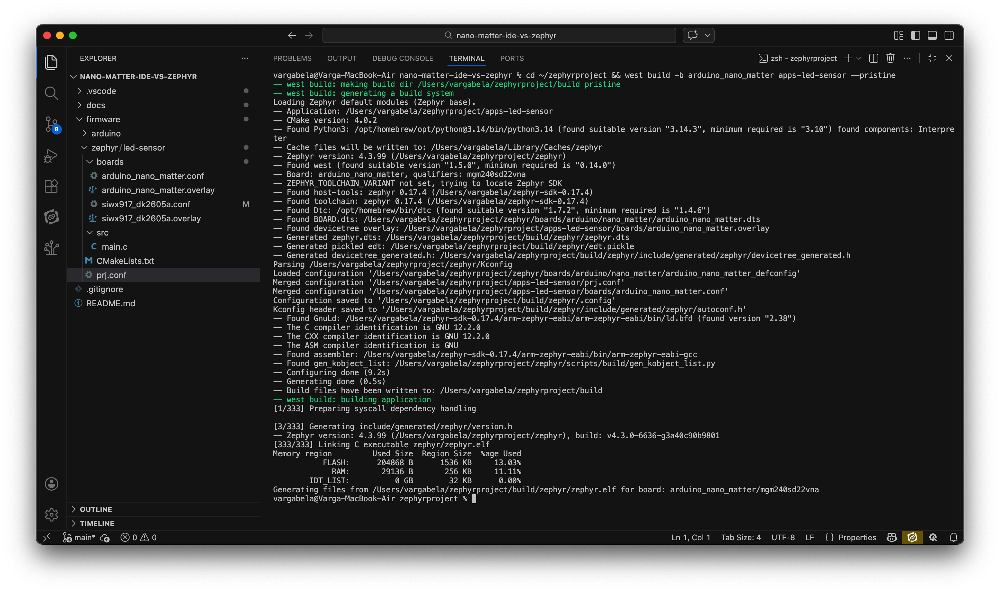

Expected build output:

<pre style="background:#1e1e1e;color:#d4d4d4;padding:14px 18px;border-radius:6px;font-family:'Menlo','Monaco','Courier New',monospace;font-size:12.5px;line-height:1.6;overflow-x:auto;">[185/185] Linking C executable zephyr/zephyr.elf
Memory region         Used Size  Region Size  %age Used
           FLASH:       98764 B         1 MB      9.42%
             RAM:       42368 B       256 KB     16.16%
        IDT_LIST:          0 GB        32 KB      0.00%
</pre>

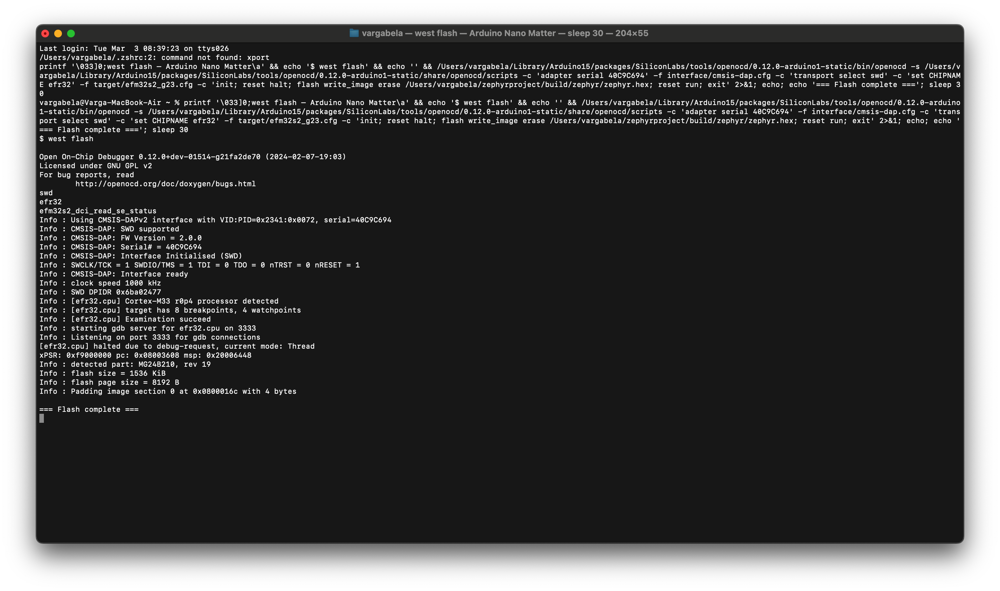

Flash via OpenOCD (CMSIS-DAP on the Arduino Nano Matter):

```bash
west flash
```

> **Tip:** If `west flash` fails to find OpenOCD, you can use the Arduino IDE's bundled OpenOCD. See [Troubleshooting](#appendix-troubleshooting).

The board will reset and start running the Zephyr app immediately.

### 3.5 Serial Output: Proof of Concurrency

Connect to the serial port at 115200 baud. You can use either Arduino IDE or the terminal -- pick whichever is more comfortable. The easiest way for most people is Arduino IDE's built-in serial monitor:

1. Open Arduino IDE (you do not need to have the Zephyr project open -- just any sketch)
2. Select the correct port: Tools > Port > `/dev/cu.usbmodemXXX` (the Zephyr board)
3. Open: Tools > Serial Monitor (or click the magnifying glass icon top-right)
4. Set baud rate to **115200** (dropdown at the bottom of the monitor)

Alternatively, from the terminal:

```bash
# Mac — using screen (press Ctrl+A then K then Y to exit)
screen /dev/cu.usbmodemXXX 115200
```

> **SiLabs serial tip:** These boards do not DTR-reset. Start your serial capture BEFORE flashing, or press the reset button after opening the monitor to see boot messages.

<pre style="background:#1e1e1e;color:#d4d4d4;padding:14px 18px;border-radius:6px;font-family:'Menlo','Monaco','Courier New',monospace;font-size:12.5px;line-height:1.6;overflow-x:auto;">=============================================
  Zephyr LED + Grid-EYE + BLE Demo
=============================================
Board: arduino_nano_matter
Threads:
  LED    (priority 5) — PWM breathing
  Sensor (priority 7) — Grid-EYE 3x read every 100 ms
  BLE    (priority 9) — advertise every 1000 ms
=============================================

[LED] Thread started (priority 5, tick 10 ms)
[LED] PWM mode — smooth breathing on blue LED
[SENSOR] Thread started (priority 7, poll 100 ms)
[SENSOR] AMG88xx initialized via devicetree
[BLE] Thread started (priority 9, update 1000 ms)
[BLE] Bluetooth initialized
[BLE] Advertising as 'ZephyrGridEye'
[SENSOR] 3x read took 37 ms | Max: 24.00 C
[BLE] Broadcasting temp: 24.00 C
[SENSOR] 3x read took 37 ms | Max: 23.75 C
[LED] tick #500: 0 ms (target: <10 ms)
[SENSOR] 3x read took 37 ms | Max: 24.00 C
[BLE] Broadcasting temp: 24.00 C
[SENSOR] 3x read took 37 ms | Max: 23.75 C
[LED] tick #1000: 0 ms (target: <10 ms)
[SENSOR] 3x read took 37 ms | Max: 24.00 C
[BLE] Broadcasting temp: 24.00 C
</pre>

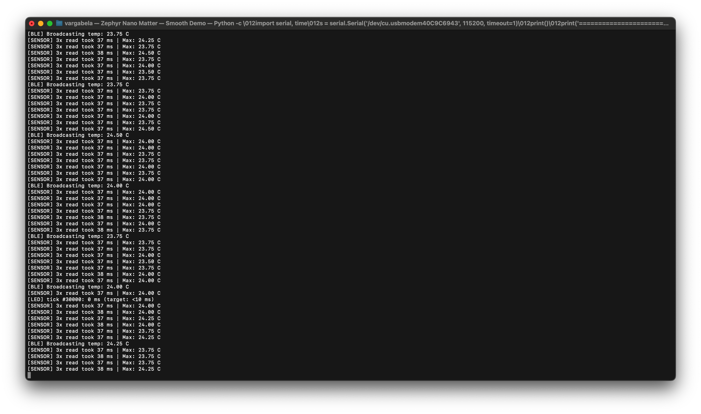

Look at the `[LED]` tick lines. They consistently report **0 ms** elapsed time -- meaning the LED thread executed in less than 1 millisecond. The sensor thread is doing 3× I2C reads totaling 37ms per poll (same sensor, same bus, same workload as Arduino), but the LED thread does not care. The kernel scheduler gives the LED thread its time slice regardless.

Now look at the blue LED on the board. It breathes smoothly. No hiccups. No stutters. The sensor thread is burning 37ms per poll, BLE is advertising, and the LED never misses a beat.

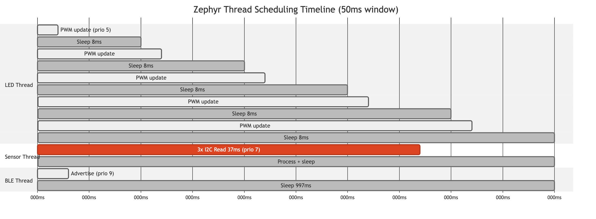

<details><summary>Mermaid source</summary>


```mermaid
gantt
    title Zephyr Thread Scheduling Timeline (50ms window)
    dateFormat X
    axisFormat %Lms

    section LED Thread
    PWM update (prio 5)   :active, led1, 0, 2
    Sleep 8ms             :done, leds1, 2, 10
    PWM update            :active, led2, 10, 12
    Sleep 8ms             :done, leds2, 12, 20
    PWM update            :active, led3, 20, 22
    Sleep 8ms             :done, leds3, 22, 30
    PWM update            :active, led4, 30, 32
    Sleep 8ms             :done, leds4, 32, 40
    PWM update            :active, led5, 40, 42
    Sleep 8ms             :done, leds5, 42, 50

    section Sensor Thread
    3x I2C Read 37ms (prio 7) :crit, sen1, 0, 37
    Process + sleep            :done, senp1, 37, 50

    section BLE Thread
    Advertise (prio 9)    :active, ble1, 0, 3
    Sleep 997ms           :done, bles1, 3, 50
```

</details>

The Gantt chart above shows how Zephyr's kernel scheduler interleaves three threads in a 50ms window. The LED thread (priority 5) runs every 10ms. The sensor thread (priority 7) blocks for 13ms on I2C -- but only its own time slice. The LED thread keeps firing at 100Hz regardless.

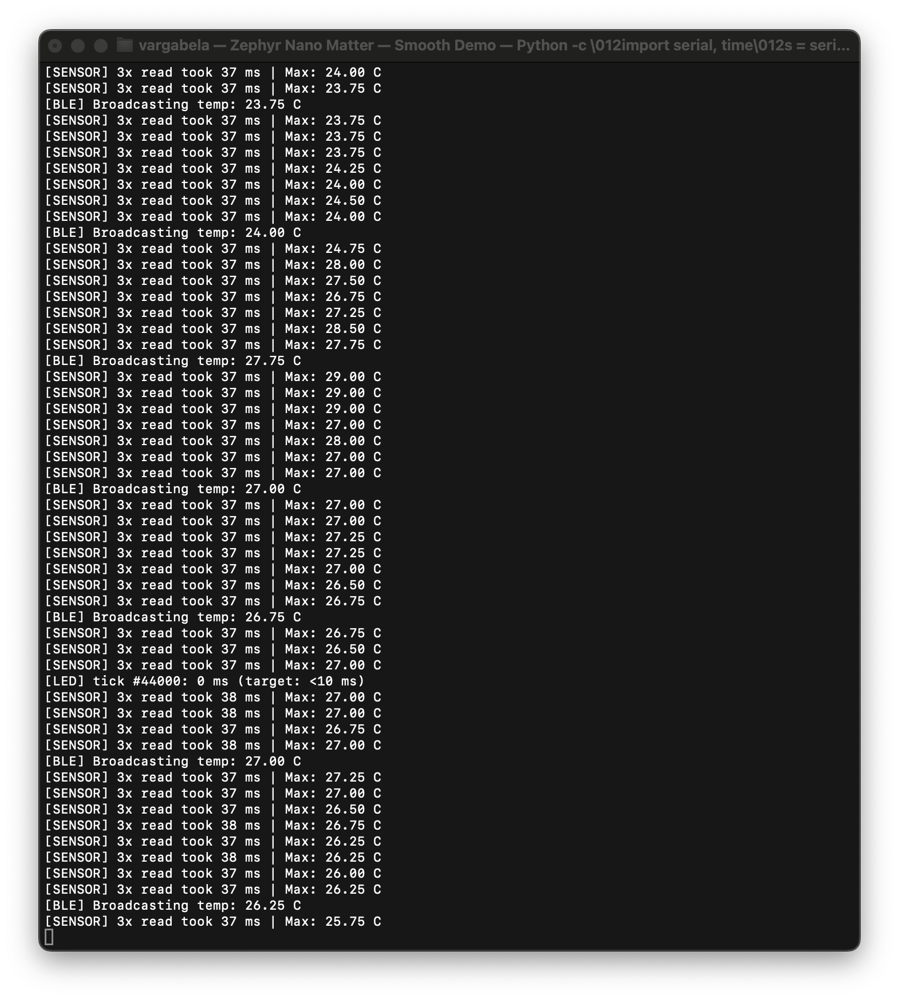

---

## Part 4: The Stutter Demo (Centerpiece)

### 4.1 Side-by-Side Comparison

Plug in both Arduino Nano Matter boards side by side. One running the Arduino sketch, one running the Zephyr app. Both have Grid-EYE sensors connected via Qwiic.

Watch both LEDs at the same time:

- **Arduino board:** The blue LED blinks on and off at ~12Hz -- like a turn signal. Each blink is one `loop()` iteration: toggle LED, do 3 sensor reads (~39ms), toggle again.
- **Zephyr board:** The blue LED breathes smoothly -- a slow, continuous brightness fade. The sensor thread is doing the same 3 reads, but the LED thread runs independently at 100Hz.

The difference is unmistakable. One blinks crudely. The other breathes smoothly. Same sensor, same LED, same workload -- different architecture.

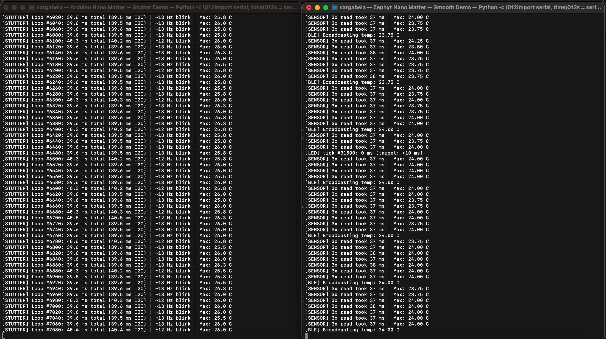

### 4.2 Serial Timestamp Analysis

The serial output proves what your eyes see:

**Arduino -- the stutter:**

<pre style="background:#1e1e1e;color:#d4d4d4;padding:14px 18px;border-radius:6px;font-family:'Menlo','Monaco','Courier New',monospace;font-size:12.5px;line-height:1.6;overflow-x:auto;">[STUTTER] Loop #20: 41.4 ms total (41.4 ms I2C) | ~12 Hz blink | Max: 26.0 C
[STUTTER] Loop #40: 40.8 ms total (40.7 ms I2C) | ~12 Hz blink | Max: 25.8 C
[STUTTER] Loop #60: 40.3 ms total (40.3 ms I2C) | ~12 Hz blink | Max: 26.0 C
</pre>

- Every loop iteration: **~41ms** (3 sensor reads dominate the entire loop)
- LED toggle rate: **~12Hz** -- a clearly visible on/off blink, like a turn signal
- The LED is frozen for the entire 39ms of I2C reads -- every single iteration

**Zephyr -- no stutter:**

<pre style="background:#1e1e1e;color:#d4d4d4;padding:14px 18px;border-radius:6px;font-family:'Menlo','Monaco','Courier New',monospace;font-size:12.5px;line-height:1.6;overflow-x:auto;">[SENSOR] 3x read took 37 ms | Max: 24.00 C
[LED] tick #500: 0 ms (target: <10 ms)
[SENSOR] 3x read took 37 ms | Max: 23.75 C
[LED] tick #1000: 0 ms (target: <10 ms)
[BLE] Broadcasting temp: 24.00 C
[SENSOR] 3x read took 37 ms | Max: 24.00 C
[LED] tick #1500: 0 ms (target: <10 ms)
</pre>

- Sensor 3× reads total **37ms** per poll (same hardware, same physics, same workload as Arduino)
- LED ticks: **0 ms** consistently -- the LED thread is never blocked
- BLE advertising runs in the background, completely independent

The total sensor workload is identical on both platforms (~37-41ms for 3 reads). The difference is not that Zephyr reads the sensor faster. The difference is that Zephyr does not make the LED wait.

### 4.3 The Visual Proof

Place both boards on a table, LEDs facing the camera. Record a 10-second video with your phone. The Arduino board's LED blinks crudely at 12Hz. The Zephyr board's LED breathes smoothly.

This video is the demo. It takes 30 seconds to record and makes the entire argument without a single line of code.

**Comparison table:**

| Metric | Arduino | Zephyr |
|--------|---------|--------|
| LED behavior | On/off blink at ~12Hz | Smooth PWM breathing at 100Hz |
| Sensor workload | 3× reads per loop (~39ms) | 3× reads per poll (~37ms) |
| LED blocked during I2C? | **Yes** -- entire loop iteration | **No** -- separate thread |
| Loop/poll time | ~41ms (all blocking) | 10ms LED tick (never blocked) |
| Visible difference? | **Crude blink** (turn signal) | **Smooth breathing** |
| BLE advertising? | Not possible without more hacks | Runs on third thread |
| Lines of application code | ~170 | ~360 |
| Files in project | 1 | 7 |

---

## Part 5: Portability -- Same Code, Different Board

### 5.1 The SiWx917 Overlay

This is the killer feature that Arduino cannot match.

The SiWx917 Dev Kit (BRD2605A) is a completely different SoC from the Arduino Nano Matter. The Nano Matter uses an EFR32 (MGM240S) -- a Thread/BLE chip. The SiWx917 is a Wi-Fi 6/BLE chip. Different CPU cores. Different peripheral architectures. Different everything.

But the Zephyr app runs on both, because the hardware differences are isolated in the overlay file.

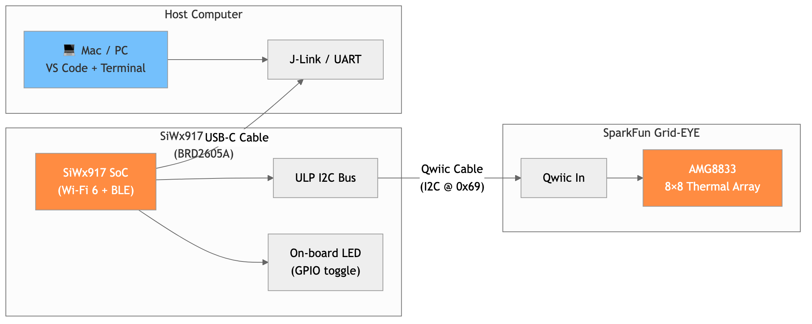

<details><summary>Mermaid source</summary>

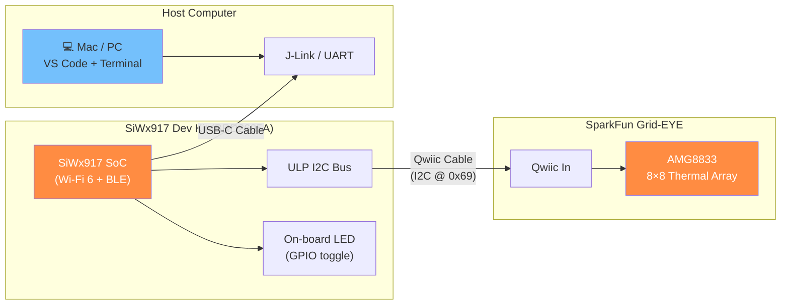
```mermaid
graph LR
    subgraph BOARD["SiWx917 Dev Kit (BRD2605A)"]
        direction TB
        SIW["SiWx917 SoC<br/>(Wi-Fi 6 + BLE)"]
        ULPI2C["ULP I2C Bus"]
        LED["On-board LED<br/>(GPIO toggle)"]
        SIW --> ULPI2C
        SIW --> LED
    end

    subgraph SENSOR["SparkFun Grid-EYE"]
        direction TB
        GE["AMG8833<br/>8×8 Thermal Array"]
        QC["Qwiic In"]
        QC --> GE
    end

    subgraph USB["Host Computer"]
        direction TB
        MAC["💻 Mac / PC<br/>VS Code + Terminal"]
        JLINK["J-Link / UART"]
        MAC --> JLINK
    end

    ULPI2C -- "Qwiic Cable<br/>(I2C @ 0x69)" --> QC
    SIW -- "USB-C Cable" --> JLINK

    style SIW fill:#ff8c42,color:#fff
    style GE fill:#ff8c42,color:#fff
    style MAC fill:#74c0fc,color:#333
```

</details>

File: [`firmware/zephyr/led-sensor/boards/siwx917_dk2605a.overlay`](../firmware/zephyr/led-sensor/boards/siwx917_dk2605a.overlay)

```dts
/*
 * Devicetree overlay for SiWx917 Dev Kit (BRD2605A)
 *
 * Adds the Grid-EYE AMG8833 thermal sensor to the existing ULP I2C bus.
 * The SiWx917 DK already has two sensors on this bus:
 *   - VEML6035 ambient light sensor at 0x29
 *   - Si7021 humidity/temp sensor at 0x40
 * We add the Grid-EYE at 0x69 — no address conflict.
 *
 * The int-gpios property points to an unused GPIO (PA0).
 * Polling mode only — no physical interrupt connection needed.
 *
 * THIS IS THE PORTABILITY DEMO:
 * Same application code (src/main.c), different overlay file.
 * The sensor subsystem API is identical — only the I2C bus binding changes.
 */

&ulpi2c {
    amg88xx: amg88xx@69 {
        compatible = "panasonic,amg88xx";
        reg = <0x69>;
        int-gpios = <&gpioa 0 GPIO_ACTIVE_LOW>;
    };
};
```

Compare this to the Nano Matter overlay. The only difference is:

| | Nano Matter | SiWx917 DK |
|---|---|---|
| I2C bus node | `&i2c0` | `&ulpi2c` |
| Interrupt GPIO | `&gpiod 2` | `&gpioa 0` |
| Sensor address | `0x69` | `0x69` |
| Application code change | -- | **None** |

The application code (`main.c`) uses `DEVICE_DT_GET_ONE(panasonic_amg88xx)`, which resolves to whatever the overlay provides. The application does not know or care which I2C bus the sensor is on.

The SiWx917 SoC has PWM hardware, but the DK board's LEDs are wired to GPIO-only pins (not PWM-capable outputs). The board config reflects this, and the code automatically falls back to blink mode:

File: [`firmware/zephyr/led-sensor/boards/siwx917_dk2605a.conf`](../firmware/zephyr/led-sensor/boards/siwx917_dk2605a.conf)

```
# Board-specific config: SiWx917 Dev Kit (BRD2605A)
# The DK's LEDs are on GPIO-only pins (not connected to PWM outputs).
# The application automatically falls back to GPIO blink mode.
# No additional config needed beyond prj.conf.
```

### 5.2 Build for SiWx917

```bash
source ~/zephyrproject/.venv/bin/activate
cd ~/zephyrproject

# Build for SiWx917 — note the separate build directory
west build -b siwx917_dk2605a /path/to/firmware/zephyr/led-sensor \
  --build-dir build-siwx917
```

Same `main.c`. Same `prj.conf`. Same `CMakeLists.txt`. Different board target. The build system picks up the SiWx917 overlay and config automatically from the `boards/` directory.

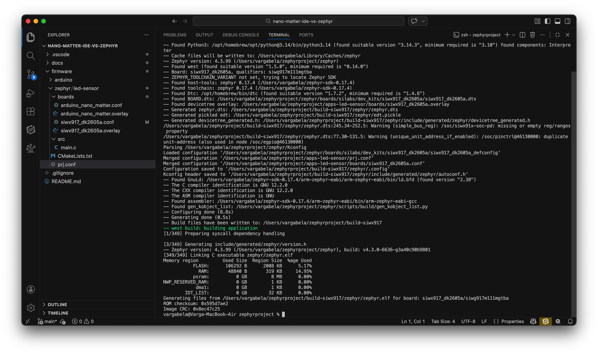

### 5.3 Flash and Verify

The SiWx917 DK has an on-board J-Link debugger, so `west flash` uses Simplicity Commander:

```bash
west flash --build-dir build-siwx917
```

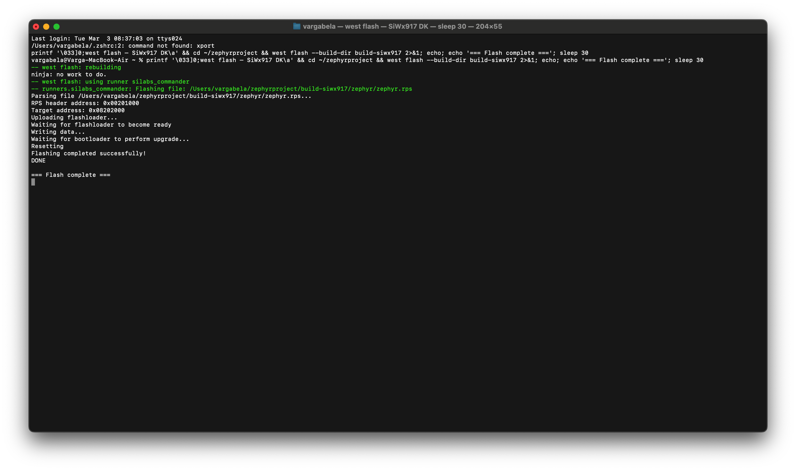

Open the serial monitor:

<pre style="background:#1e1e1e;color:#d4d4d4;padding:14px 18px;border-radius:6px;font-family:'Menlo','Monaco','Courier New',monospace;font-size:12.5px;line-height:1.6;overflow-x:auto;">=============================================
  Zephyr LED + Grid-EYE + BLE Demo
=============================================
Board: siwx917_dk2605a
Threads:
  LED    (priority 5) — GPIO blink
  Sensor (priority 7) — Grid-EYE 3x read every 100 ms
  BLE    (priority 9) — advertise every 1000 ms
=============================================

[LED] Thread started (priority 5, tick 10 ms)
[LED] GPIO mode — blink pattern on LED0
[SENSOR] Thread started (priority 7, poll 100 ms)
[SENSOR] AMG88xx initialized via devicetree
[BLE] Thread started (priority 9, update 1000 ms)
[BLE] Bluetooth init failed (err -19)
[SENSOR] 3x read took 9 ms | Max: 25.75 C
[SENSOR] 3x read took 9 ms | Max: 25.50 C
[SENSOR] 3x read took 10 ms | Max: 25.75 C
</pre>

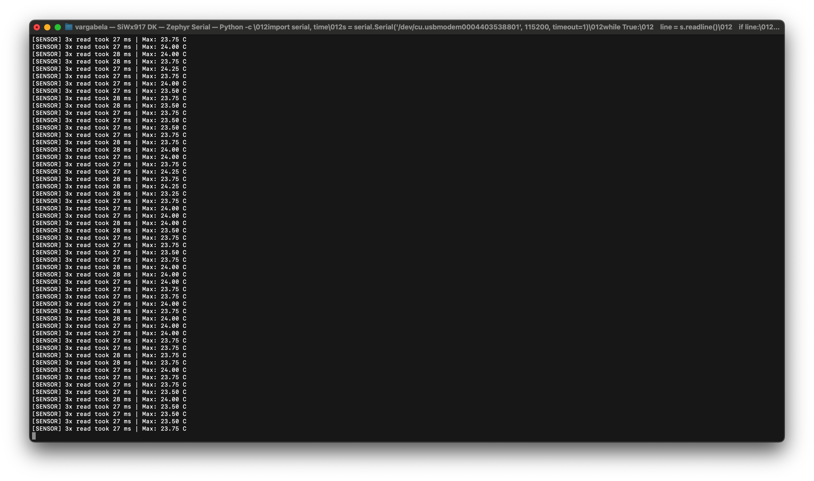

Three things to notice:

1. **`Board: siwx917_dk2605a`** -- the firmware knows which board it is running on, via Kconfig's `CONFIG_BOARD`.
2. **`LED: GPIO mode`** -- the code detected that this board lacks PWM LEDs and switched to blink mode automatically. The `#if DT_NODE_HAS_STATUS(DT_ALIAS(pwm_led2), okay)` check in the source code handles this at compile time.
3. **`BLE: err -19`** -- BLE fails on the first attempt because the SiWx917's NWP (Network Wireless Processor) firmware needs updating. **This is expected -- do not stop here.** The sensor and LED threads work perfectly without BLE. Continue with Part 6. When you reach [Section 6.4](#64-ble-on-siwx917-the-debug-journey), you will update the NWP firmware and BLE will start working.

### 5.4 What Just Happened

You just ran the **same application** on two completely different SoCs:

| | Arduino Nano Matter | SiWx917 Dev Kit |
|---|---|---|
| SoC | EFR32 (MGM240S) | SiWx917 |
| CPU | ARM Cortex-M33 | ARM Cortex-M4 |
| Wireless | Thread + BLE | Wi-Fi 6 + BLE |
| I2C bus | `i2c0` | `ulpi2c` |
| LED type | PWM (smooth breathing) | GPIO (blink) |
| Sensor read time | ~12 ms | ~9 ms |
| Application code changes | -- | **Zero** |

In the Arduino world, porting a sketch to a different SoC family means:
- Rewriting I2C initialization (different `Wire` library or register-level config)
- Rewriting LED control (different PWM timers)
- Rewriting BLE stack integration (completely different API)
- Testing everything from scratch

In Zephyr, you write one overlay file (10 lines) and rebuild. The application code is identical.

This is not a small convenience. For companies building products that need to run on multiple SoC families -- or that might switch SoC vendors in the future -- this is the difference between weeks of porting work and an afternoon.

---

## Part 6: BLE -- Wireless Sensor Broadcasting

The Zephyr firmware does not just read a sensor and blink an LED. It also **broadcasts the temperature over BLE** -- a third thread that runs concurrently with the other two, with zero interference.

### 6.1 What BLE Does in Our Demo

The sensor thread reads the Grid-EYE and stores the maximum pixel temperature in a shared variable. The BLE thread picks up that value once per second and encodes it into a **manufacturer-specific data** field in the BLE advertisement packet:

```
Company ID: 0xFFFF (reserved for testing)
Payload:    2 bytes = temperature × 100 (high byte first)
Example:    0x0B, 0x5E → (0x0B × 256) + 0x5E = 2816 + 94 = 2910 → 29.10 °C
```

Any BLE scanner app on your phone can see the device name (`ZephyrGridEye`) and decode the temperature from the raw advertisement data. No pairing, no connection -- just a passive broadcast that anyone nearby can read.

The relevant code is in `src/main.c` (the `ble_thread_fn` function defined at line 280). The BLE thread:
1. Initializes the Bluetooth subsystem (`bt_enable()`)
2. Starts non-connectable advertising (`bt_le_adv_start()`)
3. Loops every 1000 ms: reads the shared temperature under mutex, encodes it into the manufacturer data bytes, and calls `bt_le_adv_update_data()`

### 6.2 See It With Your Phone

Download **Simplicity Connect** (free, by Silicon Labs) from the [Google Play Store](https://play.google.com/store/apps/details?id=com.siliconlabs.bledemo) or [Apple App Store](https://apps.apple.com/app/simplicity-connect/id1030932759). This is Silicon Labs' official BLE scanner tool -- it works with any BLE device, not just SiLabs products.

Open the app → **Scan** tab → search for "Zephyr":

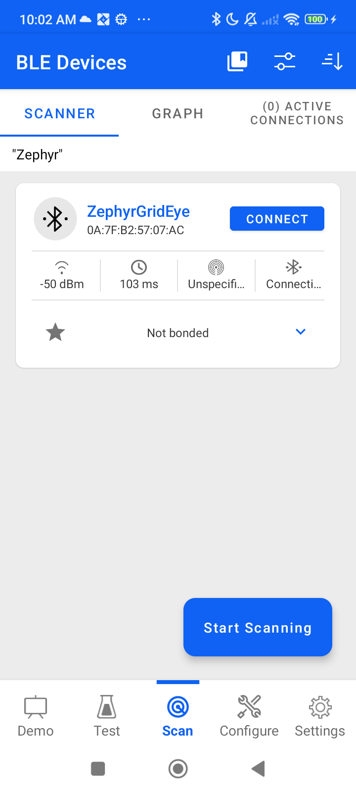

The scanner shows `ZephyrGridEye` with an RSSI of approximately -40 dBm (signal strength as seen by the phone) and a ~110 ms advertising interval. The device uses non-connectable advertising (`BT_LE_ADV_NCONN`) -- it is a passive broadcast. No pairing or connection needed to read the temperature; the data is in the advertisement packet itself.

Tap on the device to expand the advertisement details:

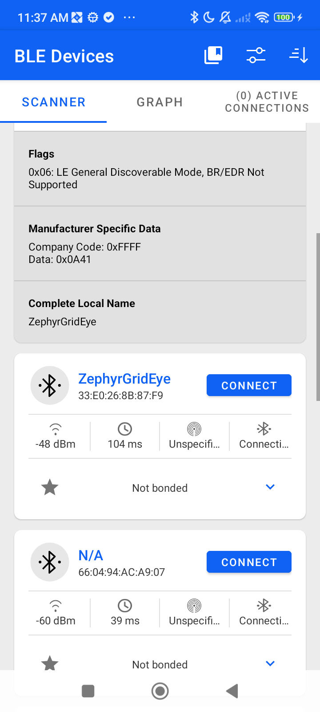

The `Manufacturer Specific Data` field shows `Company Code: 0xFFFF` (the test/development company ID) followed by the raw temperature bytes. To decode: `Data: 0x0A41` means `(0x0A × 256) + 0x41` = 2560 + 65 = 2625 in decimal. Divide by 100 = **26.25 °C**. This matches what the serial output reports -- the BLE advertisement is carrying real sensor data.

> **Bonus (after completing Section 6.4 later):** Once you fix BLE on the SiWx917, the scanner will show **two** `ZephyrGridEye` devices -- same firmware, two different boards, both broadcasting temperature:

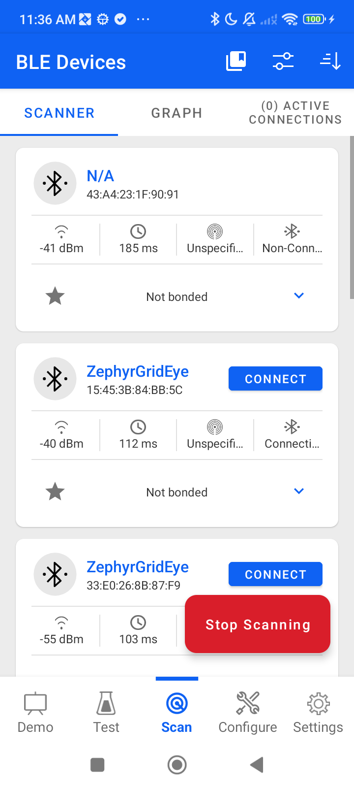

Meanwhile, the serial output confirms the BLE thread is running alongside the sensor and LED threads:

<pre style="background:#1e1e1e;color:#d4d4d4;padding:14px 18px;border-radius:6px;font-family:'Menlo','Monaco','Courier New',monospace;font-size:12.5px;line-height:1.6;overflow-x:auto;">[SENSOR] 3x read took 37 ms | Max: 28.50 C
[BLE] Broadcasting temp: 28.75 C
[LED] tick #81500: 0 ms (target: <10 ms)
[SENSOR] 3x read took 38 ms | Max: 28.75 C
[SENSOR] 3x read took 37 ms | Max: 29.00 C
[BLE] Broadcasting temp: 28.75 C</pre>

Three threads, three tasks, zero interference. The LED never stutters while the sensor reads and BLE broadcasts.

### 6.3 Arduino Cannot Do This

The Arduino sketch in Part 2 has **no BLE**. It cannot -- the entire `loop()` is blocked by I2C reads for ~39 ms per iteration. Adding BLE advertising on top of that would require:
- A non-blocking I2C pattern (polling or interrupt-driven)
- Careful timing to interleave BLE stack events with sensor reads
- Manual yielding between operations

The ArduinoBLE library exists, but making it coexist with blocking sensor reads and smooth LED animation in a single `loop()` is a serious engineering challenge. Zephyr solves this with threads: each task gets its own execution context, its own priority, and they run concurrently by design.

### 6.4 BLE on SiWx917: The Debug Journey

When we first ported to the SiWx917 in Part 5, the serial output showed:

<pre style="background:#1e1e1e;color:#d4d4d4;padding:14px 18px;border-radius:6px;font-family:'Menlo','Monaco','Courier New',monospace;font-size:12.5px;line-height:1.6;overflow-x:auto;">[BLE] Bluetooth init failed (err -19)</pre>

Error -19 is `ENODEV` -- device not found. The BLE driver exists (a complete HCI (Host Controller Interface) implementation in [`hci_silabs_siwx91x.c`](https://github.com/zephyrproject-rtos/zephyr/blob/main/drivers/bluetooth/hci/hci_silabs_siwx91x.c) -- HCI is the standard protocol between the Bluetooth software stack and the radio hardware). The board documentation says "BLE: supported." But it did not work.

**The root cause:** The SiWx917 has a dual-core architecture. The MCU (Cortex-M4) runs your Zephyr application; the NWP (Network Wireless Processor) runs separate proprietary wireless firmware. When your code calls `bt_enable()`, it internally calls `sl_wifi_init()`, which tries to communicate with the NWP. If the NWP firmware is too old or missing, the initialization fails silently -- no error message, no hint about what went wrong. The BLE driver sees "device not ready" and returns the cryptic `err -19`.

**The fix:** Update the NWP firmware to the version Zephyr expects. The firmware file is installed locally when you set up Simplicity Studio or the SiLabs toolchain:

```bash
# Step 1: Find the NWP firmware file on your system
ls ~/.silabs/slt/installs/conan/p/wisec*/p/connectivity_firmware/standard/SiWG917-B.*.rps

# Step 2: Find your J-Link serial number (printed on the board, or use):
commander device info

# Step 3: Flash NWP firmware (replace YOUR_JLINK_SERIAL and use the .rps file found in Step 1)
commander rps load ~/.silabs/slt/installs/conan/p/wisec*/p/connectivity_firmware/standard/SiWG917-B.*.rps \
  --serialno YOUR_JLINK_SERIAL --device si917
```

> **Note:** `commander` is Silicon Labs' Simplicity Commander tool. If it is not on your PATH, find it at `~/SimplicityStudio_v5/developer/adapter_packs/commander/commander`. The `rps load` command writes Radio Processor Section firmware -- in this case, the NWP wireless firmware that the SiWx917 needs for BLE.

After the NWP update, reflash the Zephyr application (`west flash`) and the serial output becomes:

<pre style="background:#1e1e1e;color:#d4d4d4;padding:14px 18px;border-radius:6px;font-family:'Menlo','Monaco','Courier New',monospace;font-size:12.5px;line-height:1.6;overflow-x:auto;">[BLE] Thread started (priority 9) — advertising as 'ZephyrGridEye'
[BLE] Broadcasting temp: 25.50 C
[SENSOR] 3x read took 29 ms | Max: 25.25 C
[BLE] Broadcasting temp: 25.25 C</pre>

**All three threads running on SiWx917** -- LED, sensor, and BLE -- with zero code changes from the Nano Matter version. The same binary that was "broken" before the NWP update now works perfectly.

**Why this matters for the guide:** The BLE driver code is public, complete, and merged upstream. The board documentation says "supported." But making it actually work required knowing that (1) the NWP needs separate firmware, (2) the firmware is not flashed by `west flash`, and (3) the expected version lives in a local toolchain cache installed by Simplicity Studio. This is the kind of undocumented gap that a beginner would never find -- you have to already know it works to figure out why it does not.

---

## Part 7: Energy -- Why Sleep Matters

Everything so far has been about **functionality** -- what the firmware can do. This section is about what it does when there is **nothing to do**. And the difference is staggering.

### 7.1 The Always-On Problem

> **Energy Modes (EM):** Silicon Labs chips have several power modes. **EM0** = fully active (CPU running). **EM2** = deep sleep (CPU off, RAM retained, wakes via timer -- ideal for battery sensors). **EM4** = shutdown (almost everything off, wakes by resetting the chip). Lower numbers = more power, higher numbers = less power.

The Arduino `loop()` function runs continuously. Even during `delay(1)`, the CPU is not sleeping -- `delay()` busy-waits in EM0 (active mode). The SiLabs Arduino core does include an [ArduinoLowPower](https://github.com/SiliconLabs/arduino/blob/main/libraries/ArduinoLowPower/README.md) library, but it has significant limitations (as of v3.0.0):

- `LowPower.sleep(milliseconds)` -- **does not actually sleep**. Despite the name, it just calls `delay()` internally ([source code](https://github.com/SiliconLabs/arduino/blob/main/libraries/ArduinoLowPower/src/ArduinoLowPower.cpp#L144)). No EM2, no power savings -- the CPU stays fully active.
- `LowPower.sleep()` (no argument) -- enters EM2, but with **no timer wakeup**. Only a hardware interrupt can wake the board.
- `LowPower.deepSleep(milliseconds)` -- enters EM4 with BURTC wakeup, but EM4 is a **full reset** (all RAM lost, program restarts from `setup()`).

We tested `LowPower.sleep(3000)` on the Arduino Nano Matter and confirmed: it behaves identically to `delay(3000)`. No energy mode change, no power reduction. The timed EM2 sleep that most battery-powered applications need simply does not exist in the current Arduino core.

The EFR32MG24 in EM0 draws approximately:

```
33.4 µA/MHz × 39 MHz ≈ 1.3 mA continuous (Arduino clock speed)
```

> **Note:** The Arduino core runs the EFR32MG24 at 39 MHz (HFXO). Zephyr runs it at 78 MHz (HFRCODPLL), so EM0 active current is ~2.6 mA when awake. But since Zephyr spends ~99% of the time in EM2 sleep, the average current (~15 µA) is dominated by sleep current, not active current. The 1000x difference in the table below remains valid.

For a coin cell battery (CR2032, ~225 mAh capacity):

```
225 mAh ÷ 1.3 mA ≈ 173 hours ≈ ~1 week
```

The CPU is burning power 100% of the time, even though the actual work (read sensor, toggle LED) takes less than 40 ms per loop iteration. The other 960 ms per second? Wasted as heat.

Here is what a 50 ms window looks like -- Arduino (solid red = always active) vs Zephyr (short active bursts with deep sleep between):

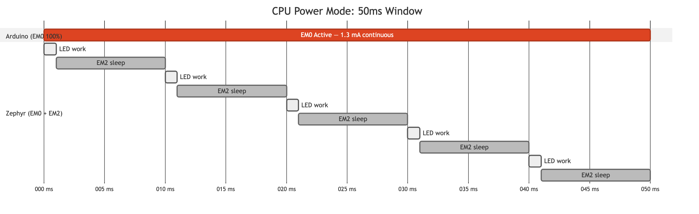

<details><summary>Mermaid source</summary>


```mermaid
gantt
    title CPU Power Mode: 50ms Window
    dateFormat x
    axisFormat %L ms

    section Arduino (EM0 100%)
    EM0 Active — 1.3 mA continuous :crit, a1, 0, 50

    section Zephyr (EM0 + EM2)
    LED work      :active, z1, 0, 1
    EM2 sleep     :done, z2, 1, 10
    LED work      :active, z3, 10, 11
    EM2 sleep     :done, z4, 11, 20
    LED work      :active, z5, 20, 21
    EM2 sleep     :done, z6, 21, 30
    LED work      :active, z7, 30, 31
    EM2 sleep     :done, z8, 31, 40
    LED work      :active, z9, 40, 41
    EM2 sleep     :done, z10, 41, 50
```

</details>

### 7.2 Zephyr Sleeps Automatically

Adding power management to the Zephyr build requires **one line** in `prj.conf`:

```ini
CONFIG_PM=y
```

That is it. No code changes. No sleep/wake calls. No interrupt handlers.

When all three threads are in `k_sleep()` -- which happens hundreds of times per second between their work intervals -- the Zephyr idle thread automatically enters **EM2 deep sleep**. On the EFR32MG24, EM2 draws:

```
1.3 µA  (one thousand times less than EM0)
```

The transition is transparent:
1. LED thread does its work (< 1 ms) → calls `k_sleep(K_MSEC(10))` → CPU enters EM2
2. Timer interrupt fires after 10 ms → CPU wakes to EM0 → LED thread runs again
3. Between every thread's sleep interval, the CPU is in deep sleep

You do not see this in the serial output -- the threads print the same messages as before. The power management happens silently in the background.

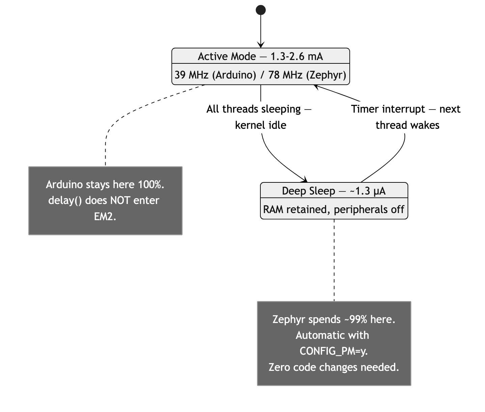

<details><summary>Mermaid source</summary>

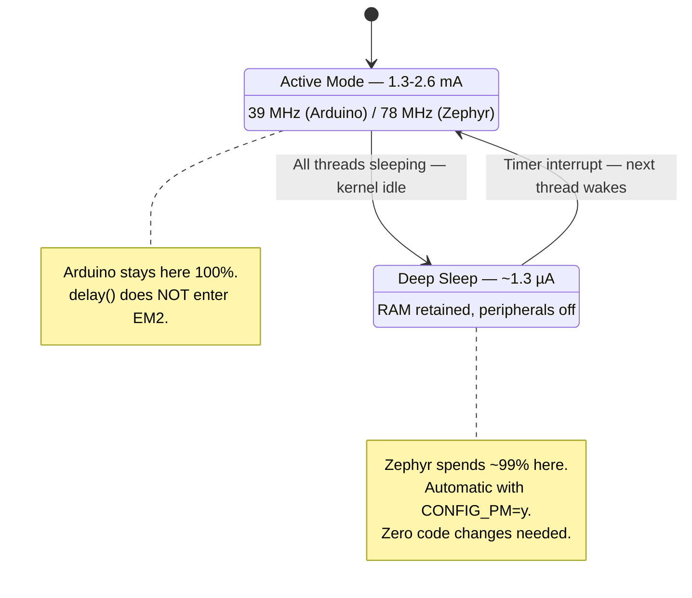
```mermaid
stateDiagram-v2
    [*] --> EM0

    EM0 : Active Mode — 1.3-2.6 mA
    EM0 : 39 MHz (Arduino) / 78 MHz (Zephyr)

    EM2 : Deep Sleep — ~1.3 µA
    EM2 : RAM retained, peripherals off

    EM0 --> EM2 : All threads sleeping — kernel idle
    EM2 --> EM0 : Timer interrupt — next thread wakes

    note right of EM0
        Arduino stays here 100%.
        delay() does NOT enter EM2.
    end note

    note right of EM2
        Zephyr spends ~99% here.
        Automatic with CONFIG_PM=y.
        Zero code changes needed.
    end note
```

</details>

### 7.3 Battery Life: A Thousand Times Better

These are **datasheet-based estimates** using the EFR32MG24 power consumption figures. Real-world numbers depend on BLE advertising rate, I2C peripheral current, and board-level power design.

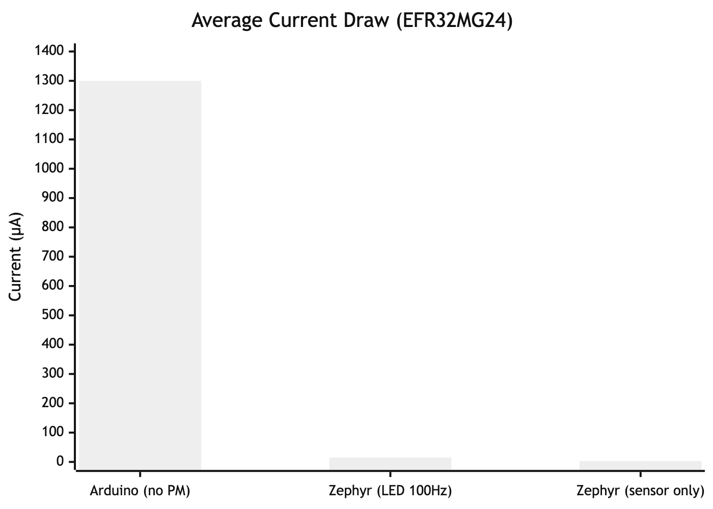

<details><summary>Mermaid source</summary>

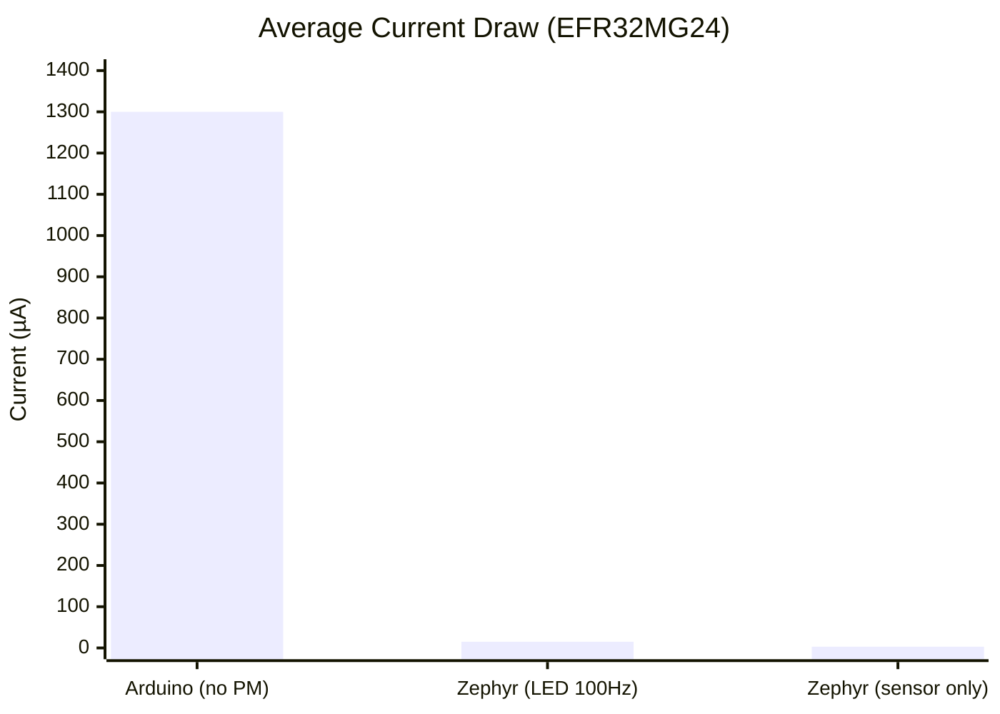
```mermaid
xychart-beta
    title "Average Current Draw (EFR32MG24)"
    x-axis ["Arduino (no PM)", "Zephyr (LED 100Hz)", "Zephyr (sensor only)"]
    y-axis "Current (µA)" 0 --> 1400
    bar [1300, 15, 3]
```

</details>

| Scenario | Active | Sleep | Avg. Current | CR2032 Life |
|----------|--------|-------|-------------|-------------|
| Arduino (no PM) | 100% EM0 | 0% | ~1.3 mA | ~1 week |
| Zephyr (10 ms LED tick) | ~1% EM0 | ~99% EM2 | ~15 µA | ~1.7 years |
| Zephyr (sensor only, 100 ms) | ~0.1% EM0 | ~99.9% EM2 | ~3 µA | ~8.5 years |

*CR2032 = standard coin cell battery (~225 mAh capacity), the kind you find in watches and key fobs.*

The LED thread wakes every 10 ms (100 Hz), which keeps the average current higher. In a real battery-powered product, you would reduce the LED update rate or disable it entirely -- and the battery life would approach the "sensor only" row.

> **Note:** These are estimates, not measurements. A proper energy profile requires a current measurement tool (like Silicon Labs' Energy Profiler or a µCurrent Gold). The point is the order of magnitude: Arduino stays in mA territory, Zephyr drops to µA.

### 7.4 What You Did NOT Have to Write

| | Arduino (SiLabs core v3.0.0) | Zephyr |
|---|---|---|
| Timed EM2 sleep | **Not implemented** (`sleep(ms)` calls `delay()`) | Automatic (kernel idle thread) |
| Untimed EM2 sleep | `LowPower.sleep()` -- interrupt wakeup only | Automatic (timer subsystem) |
| EM4 deep sleep | `LowPower.deepSleep(ms)` -- full reset on wake | Not needed for this use case |
| Integration with app logic | Not practical (no timed EM2) | Zero code changes |
| Config required | -- | `CONFIG_PM=y` (1 line) |

Same MCU. Same hardware. Very different power management stories.

As detailed in [Section 7.1](#71-the-always-on-problem), the SiLabs Arduino core's `ArduinoLowPower` library does not provide the timed EM2 sleep that battery-powered sensors need (as of v3.0.0). For the most common IoT use case -- wake up every few seconds, read data, go back to sleep -- Arduino has no working solution on this hardware.

Zephyr's power management is a kernel feature verified in the [SiLabs SoC source](https://github.com/zephyrproject-rtos/zephyr/blob/main/soc/silabs/common/soc_power.c): when all threads are in `k_sleep()`, the idle thread enters EM2 automatically. Each thread sleeps on its own schedule. The kernel enters EM2 between wake-ups and exits via the timer interrupt -- exactly the timed EM2 sleep that Arduino is missing. One config line, zero code changes, verified working.

---

## Part 8: The Honest Trade-offs

Zephyr is not a free upgrade. It is a trade-off. Here is the honest accounting.

### 8.1 Setup Complexity

| Step | Arduino | Zephyr |
|------|---------|--------|
| Install IDE/toolchain | 5 minutes | 30 minutes |
| Add board support | 2 clicks (Board Manager) | `west init && west update` (20 min download) |
| Install sensor library | 1 click (Library Manager) | Write devicetree overlay (5-15 min first time) |
| First build | Instant | 30-60 seconds (first build compiles kernel) |
| Flash | 1 click (Upload) | `west flash` (needs debugger config) |
| **Total to first blink** | **~10 minutes** | **~45 minutes** |

Arduino wins on setup. Massively. If you want a blinking LED in 10 minutes, use Arduino. Zephyr's initial setup involves downloading gigabytes of source code, installing a cross-compiler, and learning a new build system.

### 8.2 The Learning Curve

**Things you need to learn for Zephyr that Arduino hides from you:**

- **Devicetree** -- A data structure language for describing hardware. It is borrowed from Linux. It looks like JSON but with its own syntax. It takes a few hours to understand and a few days to be comfortable with. But once you learn it, you never hardcode a pin number again.
- **Kconfig** -- A configuration system for enabling/disabling kernel features. Also from Linux. It is a text file with `CONFIG_SOMETHING=y` lines. Straightforward, but you need to know which options exist.
- **CMake** -- The build system. You rarely need to modify it, but you need to understand that it exists and what `CMakeLists.txt` does.
- **West** -- Zephyr's meta-tool. It wraps CMake, manages the source tree, and handles flashing. One tool to learn, replaces many.
- **Thread programming** -- Mutexes, priorities, stack sizes. Real concurrent programming concepts that Arduino does not expose you to.

This is real complexity. Do not underestimate it. The first Zephyr project takes 3-5x longer than the equivalent Arduino project.

But the second project takes about the same time. And the third is faster, because you are reusing overlays, Kconfig patterns, and thread designs that transfer across projects and boards.

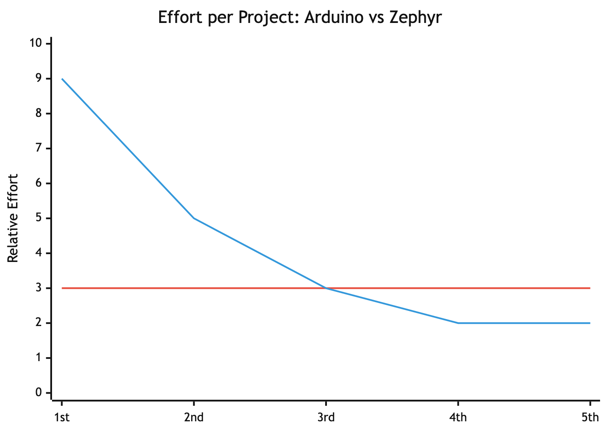

<details><summary>Mermaid source</summary>

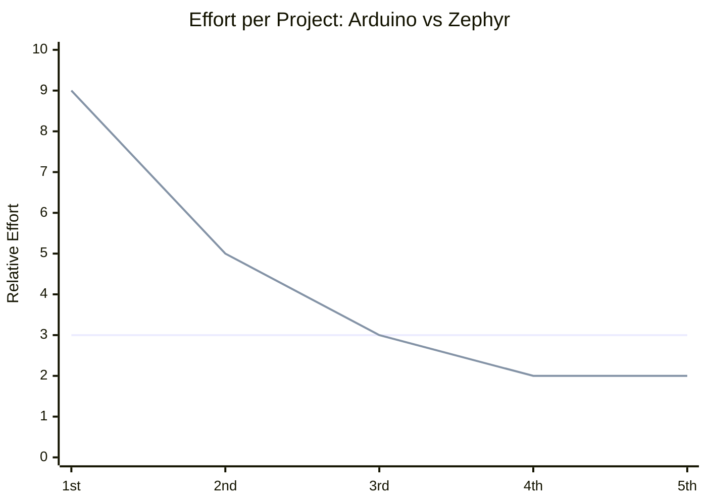
```mermaid
xychart-beta
    title "Effort per Project: Arduino vs Zephyr"
    x-axis ["1st", "2nd", "3rd", "4th", "5th"]
    y-axis "Relative Effort" 0 --> 10
    line "Arduino" [3, 3, 3, 3, 3]
    line "Zephyr" [9, 5, 3, 2, 2]
```

</details>

The Arduino line stays flat: every project requires roughly the same effort because nothing transfers between projects. The Zephyr line starts much higher but drops rapidly -- by the third project, it crosses below Arduino. Overlays, Kconfig patterns, thread designs, and build system knowledge all carry forward.

### 8.3 Decision Matrix

| Scenario | Use Arduino | Use Zephyr |
|----------|:-----------:|:----------:|
| Quick prototype / proof of concept | X | |
| Single sensor, no concurrency needed | X | |
| Learning embedded basics for the first time | X | |
| Weekend hobby project | X | |
| LED + sensor + BLE at the same time | | X |
| Product firmware for multiple SoC families | | X |
| Firmware that needs to survive code review | | X |
| Real-time requirements (motor control, audio) | | X |
| Team project with multiple developers | | X |
| Long-term maintenance (years) | | X |
| "I need this working in 2 hours" | X | |
| "I need this working on 3 different boards" | | X |

**The honest summary:** Arduino is easier to start. Zephyr is easier to scale. If you are building one thing on one board, Arduino is probably the right choice. If you are building something that needs to do multiple things simultaneously, or something that might run on different hardware in the future, or something that a team will maintain -- Zephyr is worth the investment.

---

## Appendix: Troubleshooting

### "OpenOCD can't find target config"

If `west flash` fails with an error about missing OpenOCD configuration files, you can point it to the Arduino IDE's bundled OpenOCD, which includes Silicon Labs target configs:

```bash
# Mac — Arduino IDE's OpenOCD
export OPENOCD=/Users/YOUR_USERNAME/Library/Arduino15/packages/SiliconLabs/tools/openocd/0.12.0-arduino1-static/bin/openocd

# Then retry
west flash --openocd $OPENOCD
```

Replace `YOUR_USERNAME` with your actual macOS username.

### "Board in lockup after switching between Arduino and Zephyr"

When switching between Arduino firmware and Zephyr firmware on the same board, the bootloader can get confused. The fix is a mass erase followed by a bootloader burn:

1. In Arduino IDE: Tools > Board > Arduino Nano Matter
2. Tools > Programmer > OpenOCD
3. Tools > Burn Bootloader

This erases the entire flash and writes a clean Silicon Labs bootloader. After this, you can upload either Arduino or Zephyr firmware.

If you are using the command line, the easiest approach is still through Arduino IDE (Tools > Burn Bootloader). The raw OpenOCD command is complex and requires knowing the correct target config file for your specific board -- the GUI method is recommended for beginners.

### "No serial output after flashing"

Three common causes:

1. **Wrong baud rate.** Both the Arduino sketch and the Zephyr app use **115200 baud**. Make sure your serial monitor matches.

2. **SiLabs boards do not DTR-reset.** Unlike standard Arduinos, Silicon Labs boards do not reset when a serial connection is opened. You need to either:
   - Open the serial monitor BEFORE flashing (the port stays active during upload)
   - Press the physical reset button on the board after opening the monitor

3. **Wrong serial port.** Run `arduino-cli board list` or `ls /dev/cu.usbmodem*` to find the correct port. The port can change when you unplug and replug the board.

### "Serial path with spaces breaks west build"

If your project path contains spaces (e.g., `/Users/name/My Projects/...`), the `west build` command may fail because CMake does not handle spaces well in all contexts.

**Fix:** Create a symlink to your project from a path without spaces:

```bash
ln -s "/Users/name/My Projects/nano-matter-ide-vs-zephyr" ~/nano-matter-guide
west build -b arduino_nano_matter ~/nano-matter-guide/firmware/zephyr/led-sensor
```

### "west update takes forever / fails mid-download"

The initial `west update` downloads several GB of HALs and modules. If it fails:

```bash
# Resume from where it stopped
cd ~/zephyrproject
west update

# If a specific module is corrupt, clean and retry
rm -rf modules/hal/silabs
west update
```

On slow connections, consider using `west update --narrow` to do a shallow fetch (downloads only the needed branch for each module, not all remote branches). This significantly reduces download size.

### "Bluetooth init failed (err -19)" on SiWx917

This is the most common SiWx917 BLE issue. The error chain:

1. **`sl_wifi_init()` fails** -- the NWP (Network Wireless Processor) firmware is too old or missing
2. **`device_is_ready(nwp_dev)` returns false** -- the NWP device never initialized
3. **BLE HCI driver returns `-ENODEV`** -- which your app sees as `err -19`

The confusing part: the failure is **silent**. No "NWP version mismatch" log, no "firmware update required" hint. Just `-19`.

**Fix:** Update the NWP firmware. The file is in your SiLabs toolchain cache (installed automatically when you set up Simplicity Studio):

```bash
# Find the firmware
ls ~/.silabs/slt/installs/conan/p/wisec*/p/connectivity_firmware/standard/

# Flash it (replace SERIAL with your J-Link serial number)
commander rps load ~/.silabs/slt/installs/conan/p/wisec*/p/connectivity_firmware/standard/SiWG917-B.*.rps \
  --serialno SERIAL --device si917

# Then reflash your Zephyr application
west flash --build-dir build-siwx917
```

If the firmware file is not on your system, download the [WiSeConnect SDK](https://github.com/SiliconLabs/wiseconnect) and look in `connectivity_firmware/standard/`.

**How to verify:** After flashing, the serial output should show `[BLE] Thread started` and `Broadcasting temp:` instead of `err -19`.

### "AMG8833 not found / I2C error"

- Verify the Qwiic cable is fully seated at both ends
- Confirm you are using address **0x69** (not 0x68)
- Run an I2C scan to check if the sensor is visible:
  - Arduino: File > Examples > Wire > i2c_scanner
  - Zephyr: `west build -b arduino_nano_matter zephyr/samples/drivers/i2c_scanner`

---

## Software Versions (Pinned)

| Tool | Version |
|------|---------|
| Arduino IDE | 2.3.x |
| SiliconLabs Arduino Core | 3.0.0 |
| Adafruit AMG88xx Library | 1.3.2 |
| Zephyr SDK | 0.17.0 |
| West | 1.5.0 |
| Zephyr OS | v4.3.x (main branch) |
| OpenOCD (Arduino bundled) | 0.12.0 |

---

*Tested on macOS (Apple Silicon). Windows instructions included but not fully tested.*

*Guide source code: [`firmware/arduino/led-sensor/`](../firmware/arduino/led-sensor/) and [`firmware/zephyr/led-sensor/`](../firmware/zephyr/led-sensor/)*
